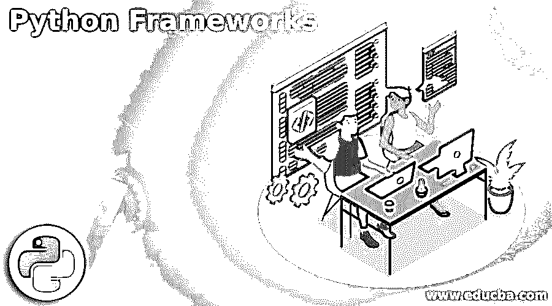

# Python 框架

> 原文：<https://www.educba.com/python-frameworks/>

## Python 框架简介

Python 框架基本上是帮助创建 web 应用程序的模块或包的集合，并使某些所需解决方案的常见实现自动化，从而扩大用户的范围，使他们能够更加灵活地关注应用程序的逻辑，而不是例程中涉及的基本过程，最终通过为 web 开发爱好者提供适当的应用程序开发结构，并提供 web 应用程序中常用的模式，使事情变得更加容易，这些模式在技术性能方面是最佳的。

### 为什么是 Python？

1)程序员友好，易于理解。

<small>网页开发、编程语言、软件测试&其他</small>

2)广泛的支持库。

3)良好的灵活性和组件集成性。(可以与应用程序和工具轻松结合)

4)平台的可移植性。(能够跨任何平台扩展)

5)开源可用性。

5)等等。

### 什么是 python 框架？

*   web 框架是一个软件实体，用于构建 [web 应用](https://www.educba.com/what-is-web-application/)。web 框架包含客户端和服务器端的编程内容。
*   服务器端接收数据库及其特定的控件。而客户端接收 GUI 元素。web 框架意味着开发网站的标准过程。
*   API 充当信使，将用户的请求传递给数据库，接收系统收集这些信息并向用户返回响应。

### Python 的框架

python 的一些最著名的 web 框架如下:

#### 1.姜戈

使用最广泛的 python 框架之一是一个鼓励简洁高效设计的高级框架。Django 可能的各种开发工作有:

1.创建和部署 RESTapi。

2.web 应用程序部署。

3.通过 web 应用程序缓存提高性能。

4.使用 Django 的应用测试。

Django 的主要特点是:

1.URL 路由。

2.ORM 映射。(程序中的对象和数据库中的关系之间的映射)

3.模板引擎。

Django 支持的主要数据库有 PostgreSQL、MySQL、SQLite 和 Oracle，

#### 2)金字塔

金字塔是一个高速 python web 框架，并且是开源的。该框架的一个缺点是其提供的文档不够清晰，金字塔的主要特征如下

*   可扩展配置。
*   包罗万象的模板和资产规范。
*   灵活的身份验证和授权。
*   测试、支持和全面的数据文档。
*   视图谓词和许多每路由视图。
*   功能装饰者。
*   谓词。
*   渲染器。

#### 3)电路

*   这些电路的框架在很大程度上被认可用于构建独立的应用程序，并且也与构建多个进程兼容。
*   它在很大程度上是一个事件驱动的框架，在并发、异步 IO 组件中提供了最大的延迟。

#### 4)沃森框架

另一个高效的框架是为应用程序开发而构建的，而不是在框架本身中辛苦工作。

#### 5)比重瓶

在开发 [JSON](https://www.educba.com/what-is-json/) 的情况下，面向 API 的 Pycnic 被认为是 Python 有史以来最好的 web 框架。这些是专门为 JSON API 优化的，并且是面向对象的。由于其处理基于 JSON 的 API 的能力，与其他 API 相比，它是独立的，并且有很强的目的性。

#### 6)涡轮齿轮

再次是 python 的[全栈 web 应用开发](https://www.educba.com/full-stack-web-developer/)框架。它也是一个开源框架。涡轮齿轮的主要特征如下:

*   多数据库支持。
*   Formencode 用于验证。
*   来自 PasteScript 的模板。
*   支持 SQLAlchemy 和 SQLObject。
*   这里使用 ToscaWidgets 应用程序库来协调服务器端和前端。
*   MochiKit JavaScript 库集成。

#### 7) Web2py

与自己的编程 IDE 相关联的开源全栈框架几乎可以执行任何类型的操作系统。这里错误记录和标签用于错误跟踪。这里也更加支持国际化。

#### 8)烧瓶

Flask 属于 BSD 许可。如果一个软件持有 BSD 许可证，它对软件的分发有最小的限制。Flask 依赖于 Jinja2template 和 Werkzeug WSGI 工具包。该烧瓶的主要特征是，

*   它拥有一个非常快速的调试器环境。
*   通过 REST 请求调度。
*   安全 cookie 和测试支持。

#### 9)瓶子

微框架是专门为设计应用程序编程接口而构建的。与 to bottle 框架相关的默认特性是 Routing，一个内置的 HTTP 服务器，一个超快的模板引擎。

#### 10)樱桃派

一个简单的 web 框架，与 python 中的其他 web 框架更加相关。cherrypy 的主要特点是，

*   基于 WSGI 的线程池服务器。
*   一次执行多个 HTTP 服务器的能力。
*   灵活和非常强大的配置和插件系统。
*   用于分析和测试的内置实用程序。

#### 11)音速

为异步 HTTP 请求-响应处理而构建的 web 框架。它运行在 python 3.5 上，能够一次性处理大量请求。我们进行了一次基准测试来确定其能力，结果发现 Sanic 能够在一个并行时间上处理大约 33000 多个请求。

#### 12)龙卷风

另一个异步工作的 python web 框架。它能够通过非阻塞 IO 解决 C10K 问题。

*   它提供用户认证和实时服务。
*   高质量的性能。
*   HTTP 客户端，从不被屏蔽。

#### 13)拥抱

hug 是另一个基于 Python 的 web 框架，它使开发人员能够灵活地开发 API。这里逐层引入多个接口，以简化 API 构建过程。它是构建 API 最快的框架。

#### 14) aiohttp

在前 20 个 Python 框架中，aiohttp 再次出现，这是一个异步 web 框架，它深刻地涉及了 Python 3.5+的特性，如 waities 和 async。它同时充当客户端和服务器 web 框架。

#### 咆哮者

Growler，它非常类似于 aiohttp，而这个框架是建立在 aysncio 之上的，在这里它连接了对象关系映射(ORM)、Node.js 和模板化等 express 框架。

#### 16)更多路径

它是一个非常强大的框架，确保了像在 RESTful web 服务中引入 python 数据结构一样的非常少的设置占用空间；这个框架可以启动许多关键用例。MorePath 拥有的最大的独有特性之一是，它经常使用最干净的 URL 将框架路径扭曲到应用程序链接。

#### 猎鹰

一个 WSGI 库，帮助在很短的时间内构建一个应用程序编程接口。它基本上消除了所有的依赖性，并允许我们为 HTTP 目的建立一个透明的设计。

#### Reahl

一个框架纯粹是用 python 写的。Reahl 使用概念、小部件和事件。在这里，用户可以定制一些小部件。此外，另一个强大的框架已经存在。

#### 19)夏娃

一个允许工作更快更容易开始的框架。非常适合 API 开发的初学者。它使用 flash 作为 web 设置框架；它可以毫无困难地插入 SQL Alchemy、Neo4js、MongoDB 等数据库。

#### 20)黄油网

ButterfylNet 是另一个适合异步设置的 web 框架，也以同样的方式得到了很大程度的保护。

### 结论

这些框架使 web 应用程序开发成为一个非常复杂和有组织的过程，并有助于构建可伸缩和高效的应用程序。此外，它们能够保存客户端和服务器端的编程内容。

### 推荐文章

这是 Python 框架的指南。在这里，我们以描述性的方式讨论什么是 Python 以及 Python 最重要的基本框架。您也可以浏览我们推荐的其他文章，了解更多信息——

1.  [Python 是什么](https://www.educba.com/what-is-python/)
2.  [如何安装 Python](https://www.educba.com/install-python/)
3.  [Python 职业生涯](https://www.educba.com/careers-in-python/)
4.  [Python 集合](https://www.educba.com/python-collections/)

