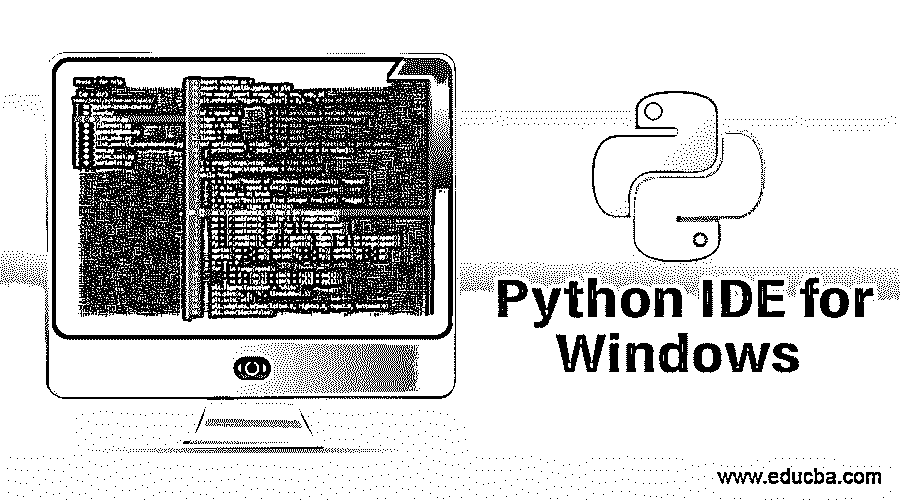

# Python IDE for Windows

> 原文：<https://www.educba.com/python-ide-for-windows/>

## Python IDE for Windows 简介

[Python](https://www.educba.com/what-is-python/) 是一种广泛使用的应用程序开发编程语言，用于网站和基于 web 的应用程序，这些应用程序是基于面向对象的概念编写和实现的。在 python 中，IDE 可以扩展为集成开发环境，它是开发人员创建、编辑、更新、执行和调试源代码的典型工作空间。Python 提供了许多 windows 操作系统支持的集成开发环境(IDE)。分别是'崇高文本 3 '、' pycharm '、'与 pydev 一起的 eclipse '、' spyder '、' wing '、' Eric '和' idle '。

### Python IDE for Windows

下面是市场上一些常见的 Python IDEs:

<small>网页开发、编程语言、软件测试&其他</small>

#### 1.崇高文本 3

Sublime Text 是 Python 编程中最常用的代码编辑器之一。除了 Python 之外，它还支持多种语言。此外，它还内置了对 Python 的支持，并允许扩展使用调试和编码林挺包。使用 Sublime Text 进行 Python 编程的一个优点是，它速度快、高度可定制，并且拥有大量的支持者。虽然评估版可以使用很长时间，但需要购买付费版才能使用高级功能。

#### 2.皮查姆

PyCharm 被认为是专业 Python 开发人员使用的最好的 IDE 之一，因为它可以帮助他们提高工作效率，编写整洁且易于维护的代码。它具有智能特性，如内置调试器、在线代码编辑器、自动代码完成、错误检测等。因此开发人员不需要做任何其他事情；它可以简单地开始在新文件中编写 Python 代码。它允许应用程序的跨平台开发，这对开发人员来说非常有帮助。它允许定制界面，这反过来有助于提高整体生产力。PyCharm 是一个轻量级 IDE，拥有大量的社区支持。唯一的缺点是，这是相当昂贵的，有时会挂起，如果系统内存较少。

#### 3.Pydev 的 Eclipse

如果你是一名程序员，那么你一定听说过很多关于 Eclipse 的事情。Eclipse IDE 基本上用于 Java 开发，但是它提供了添加多个附加组件和扩展的特殊功能。Pydev 也是 Eclipse 中用于 [Python](https://www.educba.com/python-sets/) 开发的一个扩展，它提供了一个交互式控制台、简单的调试、自动代码完成等。它提供了提示、代码分析和代码重构的特殊功能。一旦安装在 Eclipse 中，它允许更快更快地执行代码，并具有一些强大的语法突出显示和解析错误的功能。使用 Eclipse 在 PyCharm 中工作的一个缺点是，对于大型应用程序，需要处理大量插件，有时很难在单个项目中处理所有插件，IDE 有时也会挂起。

#### 4.Spyder

就 Python 开发而言，Spyder 是市场上最著名的 IDE 之一。它是一种高级的 ide，主要由数据科学家和工程师使用，因为它除了提供与大多数 ide 类似的常规功能(如代码编辑器、调试器和语法高亮显示)之外，还提供了一些特殊的数据探索功能。它与多语言编辑器一起工作，并提供了与 iPython 控制台的强大集成。它允许使用扩展插件，以便有更多的特殊和非凡的功能。它支持一个非常好的调试器，甚至可以跟踪代码中的一个步骤。Syder 的一个缺点是，当同时添加和调用多个插件时，它们的性能会降低。

#### 5.翼

wing 也是当今流行的 ide 之一，因为它提供了一些特殊的特性，使得代码运行更快，Python 编程更容易和准确。它有助于与 Django、pytest 等强大框架集成的测试驱动开发。，这是最近的趋势。它提供了一些额外的特性，比如一个额外的异常处理标签，这有助于程序员轻松调试代码，浏览器在一个位置显示所有变量，等等。使用 Wing 的一个缺点是它只提供 30 天的试用期，而且付费版本相当昂贵。

#### 6.闲置的

IDLE 被认为是 Python 初学者的最佳 IDE。它是用 Python 本身和一个跨平台的 IDE 编写的，使得开发变得简单灵活。它的调试器非常强大，有连续的断点。它支持多窗口文本编辑器、自动代码完成、语法高亮显示等。IDLE 有一些特殊的功能，比如它允许程序员在多个文件和任何窗口中进行搜索。IDLE 唯一的缺点是不适合高级程序员，缺少一些接口问题，这些在一个 IDE 中是非常基础的。

#### 7.埃里克

Eric 是 Python 开发人员的强大 IDE。它是一个开源的、跨平台的、全功能的 IDE，开发者可以每天使用。Eric IDE 的开发方式使得学生、初学者和专业人员都可以使用它。它支持一些高级功能，如错误检测、语法高亮显示和代码自动完成。它还支持内置调试器、[代码覆盖率](https://www.educba.com/code-coverage/)和任务管理。它允许集成单元测试、版本控制和多语言用户界面。它有一个插件系统，允许扩展到 IDE 的最新功能。使用 Eric 的一个缺点是，当涉及到有很多插件的非常大的项目时，有时会变得难以管理。

### 结论

上面的解释描述了市场上一些最强大和最流行的 Python ide。每个 IDE 都有一些优点和缺点。根据项目需求，选择一个符合 IDE、公司政策和项目预算的偶像是至关重要的。记住各种参数，在完成分析之后，团队应该选择一个 IDE 来开始任何项目。

### 推荐文章

这是 Python IDE for Windows 的指南。在这里，我们讨论市场上最流行的 Python ide 的基本概念。您也可以浏览我们的其他相关文章，了解更多信息——

1.  [最佳 Java IDE](https://www.educba.com/best-java-ide/)
2.  [什么是 IDE？](https://www.educba.com/what-is-ide/)
3.  [在 Windows 上安装 Python](https://www.educba.com/install-python-on-windows/)
4.  [Python 特性](https://www.educba.com/python-features/)

