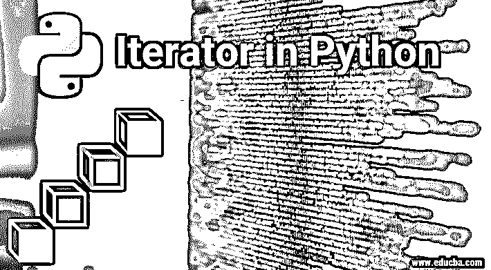
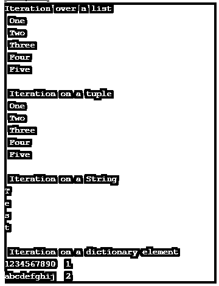
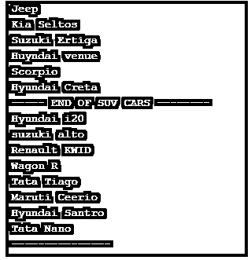
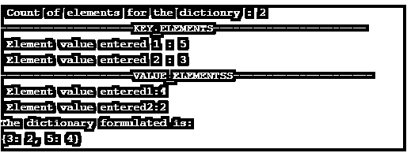

# Python 中的迭代器

> 原文：<https://www.educba.com/iterator-in-python/>




## Python 中迭代器的介绍

python 中的迭代器是一种通过迭代器协议循环程序的方法。这个概念由两个关键元素组成，迭代器和可迭代对象。迭代器迭代的对象称为 iterable。

迭代器协议由以下三部分组成:

<small>网页开发、编程语言、软件测试&其他</small>

*   构造函数是使用 init 函数实现的，迭代的最大值在这里赋值。
*   特殊的 __iter__ 函数用于指定初始值。
*   特殊的 __next__ 函数用于遍历迭代器的每个值。

### Python 迭代器的例子

下面是 Python 中迭代器的不同例子:

#### 示例#1

样本迭代器协议。

**代码:**

```
class sample:
# Constructor 
    def __init__(self, limit_value): 
        self.limit_value = limit_value 

    # Called when iteration is initialized 
    def __iter__(self): 
        self.iterator = 0
        return self

    # To move to next element. 
    def __next__(self): 

        # Store current value ofx 
        x = self.iterator 

        # Stop iteration if limit is reached 
        if x > self.limit_value: 
            raise StopIteration 

        # Else increment and return old value 
        self.iterator = iterator + 1; 
        return iterator 
```

#### 实施例 2

手动驱动迭代程序。

在下面的程序中，迭代器的进程是通过静态调用迭代器初始化和迭代器排序方法在程序中手动驱动的。

**代码:**

```
class sample:
# Constructor 
  def __init__(self, lastelement): 
        self.lastelement = lastelement 

  def __limit__(self): 
        return self.lastelement          

    # initialization of iteration
  def __iter__(self): 
        self.iterator_value = 1
        return self.iterator_value

    # move to next value or element. 
  def __next__(self): 

   # ofx current value stopped
    iterator_value = self.iterator_value 
   # iteration stopped on limit reached
    if iterator_value > self.lastelement: 
       raise StopIteration 

        # Else increment and return old value 
    self.iterator_value = iterator_value + 1; 
    return iterator_value 

# declaration of object
# processed count
var1=int(input( " Enter the limit : " ) )
Object = sample(var1)
iterator = Object.__iter__()
loopcount = Object.__limit__()

while(iterator < loopcount):
     print("The value of iterator now is : ",iterator)
     iterator = Object.__next__() 
```

#### 实施例 3

内置迭代器。

下面的程序意味着在内置的 python 实体上使用迭代器，比如列表、元组、字符串、字典。

**代码:**

```
# A list value is been iterated
print("Iteration over a list") 
l = [ " One " , " Two " , " Three " , " Four " , " Five " ] 
for iterator_element in l: 
    print(iterator_element) 

# A tuple value is being iterated
print("\n Iteration on a tuple ") 
t = ( " One " , " Two " , " Three " , " Four " , " Five " ) 
for iterator_element in t: 
    print(iterator_element) 

# A string value is been iterated 
print("\n Iteration on a String")     
s = "Test"
for iterator_element in s : 
    print(iterator_element) 

# A dictionary value is been iterated
print("\n Iteration on a dictionary element")    
d = dict()  
d[ '1234567890' ] = 1
d[ 'abcdefghij' ] = 2
for iterator_element in d : 
    print("%s  %d" %(iterator_element, d[iterator_element])) 
```

**说明:**

*   该程序使用迭代器“I”遍历四个不同的可迭代对象，如列表、元组、字符串和字典。

**输出:****T3】**




#### 实施例 4

循环控制语句。

这个程序遍历一组给定的汽车类型，并打印出市场上每种类型下的相应汽车。这个过程是通过两个循环实例 while 实现的，一个 for 循环嵌套在 while 中。需要注意的关键元素是，for 循环是通过特定的迭代器值在列表上执行的。

使用循环控制语句的 Python 程序:

**代码:**

```
var_a = 1
var_b = 2
while var_a < var_b:
      var_c = [ " SUV " , " sedan " , " hatchback " , " End " ]
      for iterator in var_c:
           if iterator == " SUV ":
              print( " Jeep " )
              print( " Kia Seltos " )
              print( " Suzuki Ertiga " )
              print( " Huyndai venue " )
              print( " Scorpio " )
              print( " Hyundai Creta " )
              print( " ----- END OF SUV CARS -------- " )
           if iterator == " sedan " :
              pass
           if iterator == " hatchback " :
              print( " Hyundai i20 " )
              print( " suzuki alto " )
              print( " Renault KWID" )
              print( " Wagon R " )
              print( " Tata Tiago " )
              print( " Maruti Ceerio " )
              print( " Hyundai Santro " )
              print( " Tata Nano " )
              print( " --------------- " )  
           if iterator == "End":
              break
      var_a = var_a+1 
```

**输出:**




#### 实施例 5

For 循环。

这个程序使用面向循环技术的迭代器来设计字典集合数据类型。这个集合数据类型由两个独立的列表元素组成。

**代码:**

```
# Program for list to dictionary concatenation    #
#Variable declaration
Key_elements=[]
value_elements=[]

# Total nuumber of elements to be processed
var1=int(input( " Count of elements for the dictionry : " ) )

print("--------------------KEY_ELEMENTS-----------------------")
for x in range(0,var1):
    element= int ( input ( " Element value entered " + str(x+1) + " : " ) )
    Key_elements.append(element)
print("--------------------VALUE_ELEMENTSS---------------------")
for x in range(0,var1):
    element= int ( input (" Element value entered" + str(x+1) + ":"))
    value_elements.append(element)

d= dict ( zip ( Key_elements , value_elements ) )

#Print Section
print("The dictionary formulated is:")
print(d) 
```

**输出:**




### Python 循环的好处

下面是提到的好处:

*   代码缩减。
*   极大地解决了代码冗余。
*   降低代码复杂性。
*   它给编码带来了更多的稳定性。

### 结论 Python 中的迭代器

任何编程语言所表现出的优势取决于编码功能的分类集合。在这种情况下，python 编程的迭代资源基本上是稳定的，并且易于编码，这使得它成为这种语言统治市场的主要原因之一。类似迭代器的概念使 python 成为最复杂的程序开发语言之一，此外，这种语言在软件开发环境中具有重要意义。

### 推荐文章

这是 Python 中迭代器的指南。为了更好地理解，我们在这里讨论介绍、示例和好处。您也可以看看以下文章，了解更多信息–

1.  [Python 中的字符串数组](https://www.educba.com/string-array-in-python/)
2.  [Python 异常处理](https://www.educba.com/python-exception-handling/)
3.  [Python 中的阶乘](https://www.educba.com/factorial-in-python/)
4.  [Python 中的循环](https://www.educba.com/loops-in-python/)


