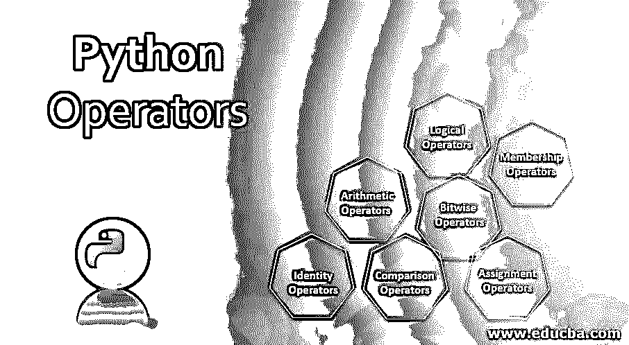
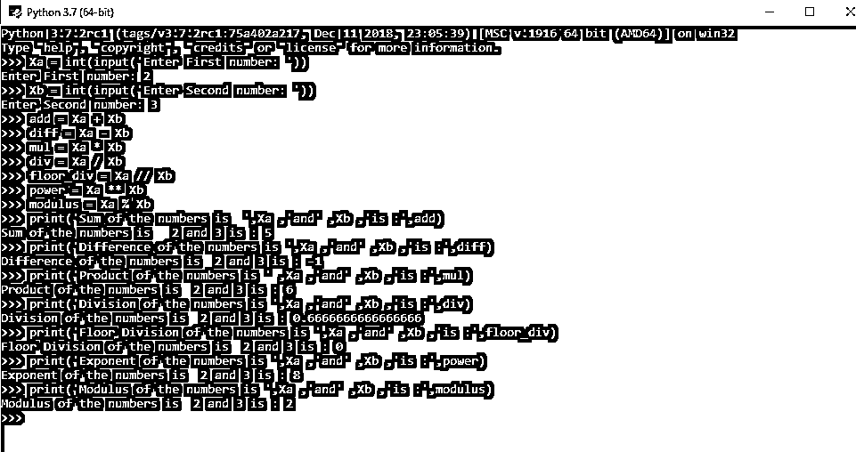

# Python 运算符

> 原文：<https://www.educba.com/python-operators/>




## Python 运算符简介

python 编程语言中指示解释器执行涉及两个或多个变量的特定函数的构造称为 Python 运算符。虽然实际上没有被看作函数，但它们有自己的概念身份，因为它们在语法和语义上不同于函数。它执行各种性质的任务，包括算术、按位、成员、身份、比较、赋值和逻辑等。，其中存在一定的执行顺序。

### Python 运算符

python 中的运算符是 Python 中的构造，它指示解释器执行某个功能；然而，这些传统上不被定义为函数；相反，它们在语法和语义上不同于函数。运算符习惯于根据变量和值的用途对它们执行运算。

<small>网页开发、编程语言、软件测试&其他</small>

Python 语言支持以下类型的运算符。

1.  算术运算符
2.  按位运算符
3.  成员运算符
4.  标识运算符
5.  比较运算符
6.  赋值运算符
7.  逻辑运算符

#### 1.算术运算符

算术运算符用于执行数学运算

| **操作员** | **描述** | **语法** | **输出** |
| + | 添加 | a+b | 返回操作数的总和 |
| – | 减法 | a-b | 返回操作数的差值 |
| / | 分开 | a/b | 返回操作数的商 |
| * | 增加 | a*b | 返回操作数的乘积 |
| ** | 指数运算 | a**b | 返回 a 的指数的 b 次幂 |
| % | 系数 | a%b | 返回除法的余数 |
| // | 楼层划分 | a//b | 返回一个实数值，忽略小数部分 |

让我们考虑一个用于执行上述算术运算的示例程序。

让我们考虑两个整数 Xa=2 和 Xb=3

**程序**

```
Xa = int(input('Enter First number: '))
Xb = int(input('Enter Second number: '))
add = Xa + Xb
diff = Xa - Xb
mul = Xa * Xb
div = Xa / Xb
floor_div = Xa // Xb
power = Xa ** Xb
modulus = Xa % Xb
print('Sum of the numbers is',Xa ,'and' ,Xb ,'is :',add)
print('Difference of the numbers is ',Xa ,'and' ,Xb ,'is :',diff)
print('Product of the numbers is ' ,Xa ,'and' ,Xb ,'is :',mul)
print('Division of the numbers is ',Xa ,'and' ,Xb ,'is :',div)
print('Floor Division of the numbers is ',Xa ,'and' ,Xb ,'is :',floor_div)
print('Exponent of the numbers is ',Xa ,'and' ,Xb ,'is :',power)
print('Modulus of the numbers is ',Xa ,'and' ,Xb ,'is :',modulus)
```

**输出**




#### 2.按位运算符

指对一个位进行操作的运算符，即它们将操作数视为一串位；例如，在按位运算中，5 将被视为 0101。

下面的方框提供了 python 中的按位运算符

| **操作员** | **描述** | **语法** | **输出** |
| “&”号 | 二进制与 | a&b | 如果一个位同时存在于两个操作数中，则将它复制到结果中 |
| &#124; | 二元或 | a&#124;b | 如果某个位存在于任一操作数中，则复制该位。 |
| ^ | 二元异或 | a^b | 如果在一个操作数而不是两个操作数中设置了该位，则复制该位。 |
| ~ | 二进制一补码 | 甲~乙 | 翻转比特的一元运算 |
| << | 二进制左移 | a< | 左操作数值左移右操作数指定的位数。 |
| >> | 二进制右移 | a>>b | 左操作数的值向右移动右操作数指定的位数。 |

#### 3.成员运算符

指用于序列中操作数测试成员资格验证的运算符，如字符串、列表或元组。python 中有两种类型的成员运算符

| **操作员** | **语法** | **输出** |
| 在 | if(x 中的 a): | 如果在指定序列中找到变量，则计算为 true，否则为 false。 |
| 不在 | 如果(b 不在 x 中): | 如果在指定序列中找不到变量，则计算为 true，否则为 false。 |

#### 4.标识运算符

用于比较操作数的内存位置，它们通常用于确定操作数是否属于特定类型；python 中有两种类型的[标识操作符。](https://www.educba.com/identity-operators-in-python/)

| **操作员** | **语法** | **输出** |
| 是 | x 是 y | 如果 y 中值的类型指向 x 中的相同类型，则返回 True。 |
| 不是 | x 不是 y | 如果 y 中值的类型指向不同于 x 中值的类型，则返回 True |

#### 5.比较运算符

也称为关系运算符，这些运算符用于确定运算符两边的操作数之间的关系。

| **操作员** | **语法** | **输出** |
| == | (a == b) | 如果 a 和 b 的值相等，则条件为真。 |
| != | (答！= b) | 如果 a 和 b 的值不相等，则条件为真。 |
| <> | (a <> b) | 如果 a 和 b 的值不相等，则条件为真。 |
| > | (甲>乙) | 如果 a 的值大于 b 的值，则条件为真。 |
| < | (a < b) | 如果 a 的值小于 b 的值，则条件为真。 |
| >= | (a >= b) | 如果 a 的值大于或等于 b 的值，则条件为真。 |
| <= | (a <= b) | 如果 b 的值小于或等于 b 的值，则条件为真。 |

#### 6.赋值运算符

顾名思义，它用于声明对操作数的赋值；以下是 python 中[赋值运算符的类型。](https://www.educba.com/assignment-operators-in-python/)

| **操作员** | **描述** | **语法** | **输出** |
| = | 等于 | c = a + b | 将 a + b 的值赋给 c |
| += | 添加和 | c += a | 相当于 c = c + a |
| -= | 减去和 | c -= a | 相当于 c = c–a |
| *= | 乘法和 | c *= a | 相当于 c = c * a |
| /= | 划分和 | c /= a | 相当于 c = c / ac /= a 相当于 c = c / a |
| %= | 模数和 | c %= a | 相当于 c = c % a |
| **= | 指数和 | c **= a | 相当于 c = c ** a |
| //= | 楼层划分 | c //= a | 相当于 c = c // a |

#### 7.逻辑运算符

这些运算符用于执行与逻辑门类似的运算；python 中有 3 种类型的逻辑运算符。

| **操作员** | **描述** | **语法** | **输出** |
| 和 | 逻辑与 | a 和 b | 如果 a 和 b 都为真，则条件为真 |
| 或者 | 逻辑或 | a 还是 b | 如果 a 和 b 都为真，则条件为真 |
| 不 | 逻辑非 | 一个也不 | 对操作数求补 |

Python 操作符是编程环境中任何操作和功能的支柱。

### 推荐文章

这是 Python 操作者的指南。这里我们讨论各种 Python 操作符，如逻辑、比较、算术等。您也可以阅读以下文章了解更多信息:

1.  [Python 3 命令](https://www.educba.com/python-3-commands/)
2.  [Python 是脚本语言吗？](https://www.educba.com/python-scripting-language/)
3.  [Python 框架](https://www.educba.com/python-frameworks/)
4.  [Python 中的赋值运算符](https://www.educba.com/assignment-operators-in-python/)


