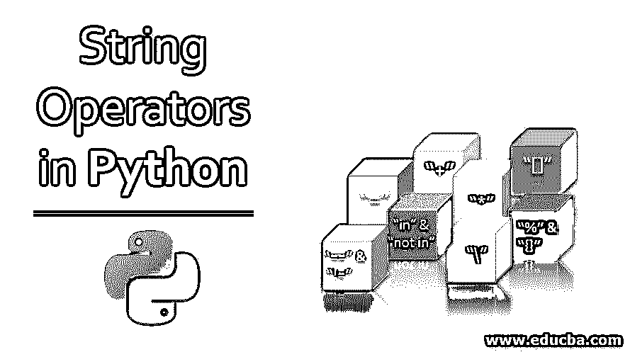
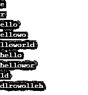
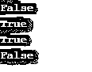
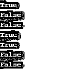
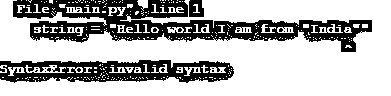
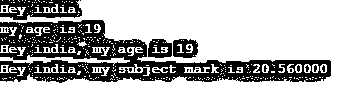

# Python 中的字符串运算符

> 原文：<https://www.educba.com/string-operators-in-python/>




## Python 中的字符串运算符简介

 **在 python 中，字符串操作符代表了可以在程序的字符串类型变量上使用的不同类型的操作。Python 允许对 python 字符串应用以下几种字符串运算符:

*   赋值运算符:" = "
*   串联运算符:"+"
*   字符串重复运算符:" * "
*   字符串切片运算符:“[]”
*   字符串比较运算符:" ==" & "！="
*   成员运算符:“in”和“not in”
*   转义序列运算符:" \ "
*   字符串格式运算符:" %" & "{} "

### **Python 中字符串运算符的例子**

 **在下面的文章中，我们将学习如何在 Python 中对字符串执行操作，并附有示例。

<small>网页开发、编程语言、软件测试&其他</small>

#### **示例 1–赋值运算符" =。"**

 **Python 字符串可以用赋值运算符“=”赋给任何变量。Python 字符串可以用单引号[' ']、双引号[" "]或三引号[''' ''']来定义。var_name = "string "将" string "赋给变量 var_name。

****代号:****

```
string1 = "hello"
string2 = 'hello'
string3 = '''hello'''
print(string1)
print(string2)
print(string3)
```

****输出:****


#### **示例 2–连接运算符“+”**

 **在 python 中，可以使用“+”运算符连接或联接两个字符串，如以下示例代码中所述:

****代号:****

```
string1 = "hello"
string2 = "world "
string_combined = string1+string2
print(string_combined)
```

****输出:****


#### **示例# 3–字符串重复运算符“*”**

 **使用 string*n，同一个字符串可以在 python 中重复 n 次，如下例所示。

****代号:****

```
string1 = "helloworld "
print(string1*2)
print(string1*3)
print(string1*4)
print(string1*5)
```

**输出:**


#### **示例 4–字符串切片操作符“[]”**

 **可以使用 string[index]运算符访问字符串中特定索引的字符。该索引被解释为从左侧 0 开始的正索引和从右侧-1 开始的负索引。

| **字符串** | **H** | **E** | **L** | **L** | **O** | **W** | **O** | **R** | **L** | **D** |
| **正指数** | Zero | One | Two | Three | Four | Five | Six | Seven | Eight | Nine |
| **负指数** | -10 | -9 | -8 | -7 | -6 | -5 | -4 | -3 | -2 | -1 |

*   **string[a]:** 从左侧返回字符串的正索引 a 中的一个字符，如上面的索引图所示。
*   **string[-a]:** 从右侧返回字符串的负索引 a 中的一个字符，如上面的索引图所示。
*   **string[a:b]:** 返回从正索引 a 到正索引 b 的字符，如上面的索引图所示。
*   **string[a:-b]:** 返回从字符串的正索引 a 到负索引 b 的字符，如上面的索引图所示。
*   **string[a:]:** 返回从正索引 a 到字符串末尾的字符。
*   **string[:b]** 返回从字符串开头到正索引 b 的字符。
*   **string[-a:]:** 返回从负索引 a 到字符串末尾的字符。
*   **string[:-b]:** 返回从字符串开头到负索引 b 的字符
*   **string[::-1]:** 返回顺序相反的字符串。

****代号:****

```
string1 = "helloworld"
print(string1[1])
print(string1[-3])
print(string1[1:5])
print(string1[1:-3])
print(string1[2:])
print(string1[:5])
print(string1[:-2])
print(string1[-2:])
print(string1[::-1])
```

**输出:**




#### **示例# 5–字符串比较运算符" ==" &"！="**

 **python 中的字符串比较运算符用于比较两个字符串。

*   " == "如果两个字符串相同，则运算符返回布尔值 True，如果两个字符串不同，则返回布尔值 False。
*   "!= "如果两个字符串不同，运算符返回布尔值 True，如果两个字符串相同，则返回布尔值 False。

这些运算符主要与 if 条件一起使用，用于比较两个字符串，根据字符串比较做出决定。

****代号:****

```
string1 = "hello"
string2 = "hello, world"
string3 = "hello, world"
string4 = "world"
print(string1==string4)
print(string2==string3)
print(string1!=string4)
print(string2!=string3)
```

**输出:**




#### **示例# 6–成员运算符“in”&“not in”**

 **成员运算符用于搜索特定字符是否是给定输入 python 字符串的一部分/成员。

*   ****【a】在字符串中:**** 如果“a”在字符串中则返回布尔值 True，如果“a”不在字符串中则返回 False。
*   ****【a】不在字符串中:**** 如果“a”不在字符串中则返回布尔值 True，如果“a”在字符串中则返回 False。

成员资格运算符对于查找特定子字符串是否是给定字符串的一部分也很有用。

****代号:****

```
string1 = "helloworld"
print("w" in string1)
print("W" in string1)
print("t" in string1)
print("t" not in string1)
print("hello" in string1)
print("Hello" in string1)
print("hello" not in string1)
```

**输出:**




#### **示例 7–转义序列运算符“\”**

 **要在给定的输入字符串中插入不允许的字符，需要使用转义字符。转义字符是“\”或“反斜杠”运算符后跟一个不允许的字符。python 字符串中不允许的字符的一个例子是在双引号包围的字符串中插入双引号。

1.python 字符串中不允许的双引号示例:

****代号:****

```
string = "Hello world I am from "India""
print(string)
```

****输出:****




2.带有[转义序列](https://www.educba.com/escape-sequence-in-c/)运算符的不允许双引号示例:

****代号:****

```
string = "Hello world I am from \"India\""
print(string)
```

****输出:****


#### **示例 8–字符串格式运算符“%”**

 **字符串格式化运算符用于根据需要格式化字符串。要将另一种类型的变量与字符串一起插入，可以将“%”运算符与 python 字符串一起使用。“%”是另一个字符的前缀，表示我们要随 python 字符串一起插入的值的类型。请参考下表，了解一些常用的不同字符串格式说明符:

| ****操作员**** | ****描述**** |
| %d | 有符号十进制整数 |
| %u | 无符号十进制整数 |
| %c | 字符 |
| %s | 线 |
| %f | 浮点实数 |

****代号:****

```
name = "india"
age = 19
marks = 20.56
string1 = 'Hey %s' % (name)
print(string1)
string2 = 'my age is %d' % (age)
print(string2)
string3= 'Hey %s, my age is %d' % (name, age)
print(string3)
string3= 'Hey %s, my subject mark is %f' % (name, marks)
print(string3)
```

**输出:**




### **结论**

 **本教程提供了对 python 中使用的不同字符串操作符的深入理解，包括字符串赋值、字符串重复、字符串切片、[字符串连接](https://www.educba.com/string-concatenation-in-c/)、字符串比较、字符串格式化、成员资格、转义序列等。这些章节中讨论的概念对于在任何真实的 python 应用程序项目中处理与字符串相关的事情都是有用的。

### 推荐文章

这是 Python 中字符串操作符的指南。这里我们讨论 python 中字符串操作符的介绍和例子，以及它的代码实现。您也可以阅读以下文章，了解更多信息——

1.  [Python 中的类型转换](https://www.educba.com/type-casting-in-python/)
2.  [用 Python 复制列表](https://www.educba.com/copy-list-in-python/)
3.  [Python 子串](https://www.educba.com/python-substring/)
4.  [SQL 字符串运算符](https://www.educba.com/sql-string-operators/)


**********************