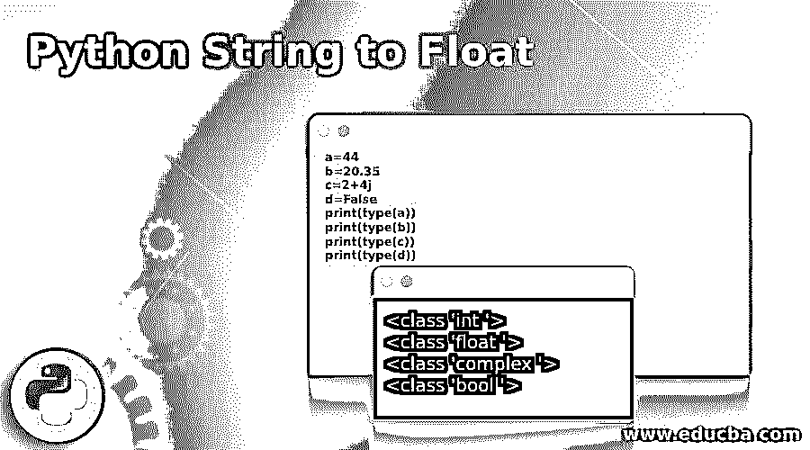
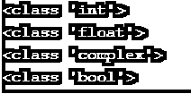
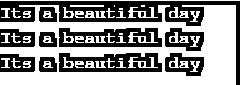
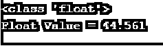
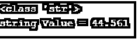
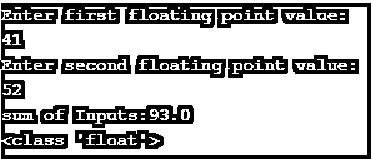
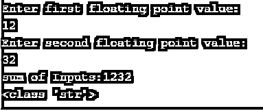
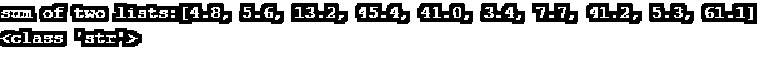

# 要浮动的 Python 字符串

> 原文：<https://www.educba.com/python-string-to-float/>




## 要浮动的 Python 字符串的定义

在 Python 中，我们作为变量使用或存储的所有值都有唯一的数据类型。它解释了值的性质，并依赖于 Python 自动为该值分配数据类型，它有助于定义允许执行的操作类型，并存储在特定的结构中，绕过编译器。数据类型是可变的，对于特定的操作，用户可以将数据类型从 float 改为 int 或 string，反之亦然。

### 句法

Python 对于不同的值集有不同的数据类型，Integers 处理数字，float 处理十进制和数字字符，Boolean 处理二进制值(真或假),还有可以接受字母数字值的字符串，python 允许不同的数据结构，如 list、Tuple、Dictionary & sets，用于处理不同的问题。在下面的例子中，我们声明了 4 个不同的值，并检查了这些值的数据类型，以给出 python 数据类型的概念。

<small>网页开发、编程语言、软件测试&其他</small>

```
a=44
b=20.35
c=2+4j
d=False
print(type(a))
print(type(b))
print(type(c))
print(type(d))
```

**输出:**




### 如何在 Python 中将 String 转换成 Float？

让我们看看字符串到浮点转换中使用的函数，反之亦然。

```
float() function
```

该函数从字符串或数字中返回一个浮点值。

**语法:**

```
float(argument)
```

此方法中只能使用一个参数，并且是可选的。此函数中可以使用两种类型的参数。

*   Number:数字可以是任何浮点数或整数。
*   字符串:字符串必须包含任何类型的数字。

此方法忽略任何右边或左边的空格

可以使用 Nan 或 inf

我们也可以使用数学运算符。

### 要浮动的 Python 字符串示例

下面是要浮动的 python 字符串的示例，如下所示:

让我们看一个简单的例子，打印给定变量的字符串值。

```
#code to print string value
print("Its a beautiful day")
print('Its a beautiful day')
a = 'Its a beautiful day'
print(a)
```

**输出:**




在上面的代码中，我们打印了语句“Its a beautiful day ”,它本身是一个字符串，我们还将它赋给了一个变量“a ”,它也是一个字符串，还有许多操作，如切片、替换、连接等。可以用字符串数据类型来完成。

#### 实施例 2

让我们讨论另一个例子，如下所示。

```
#code to print string value
a = 'Its a beautiful day'
print(a[1])
print(a[2:7])
```

**输出:**


在上面的代码中，我们将字符串‘it ' s a beautiful day to’声明为变量 a.
在下一行中，我们打印了该字符串的第一个切片位置，它也是一个字符串。
在下一行中，我们将字符串中的第 2 和第 7 个位置切片并打印出来。字符串数据类型具有多种功能，并且易于使用。

#### 实施例 3

在下一个例子中，我们将看到如何使用字符串数据类型将它们转换成浮点值

**代码:**

```
#type conversion from string to float
x = '44.5610'
f = float(x)
print(type(f))
print('Float Value =', f)
```

**输出:**




在上面的例子中，我们已经给变量 x 赋值，并在引号内给它一个 float 值，以便编译器将它识别为一个字符串值，在变量 f 中，我们已经使用 python float()函数将字符串“x”转换为 float。

#### 实施例 4

在这个例子中，我们将看到如何将浮点值转换成字符串值。

**代码:**

```
#code to convert float to string value
x = 44.5610
s = str(x)
print(type(s))
print('string Value =', s)
```

**输出:**




在上面的代码中，我们使用了与上面相同的示例，并删除了引号，使变量“x”成为浮点型，因为它有小数点。编译器将其识别为浮点值，并将其传递给变量“s ”,以使用 python str()函数将其转换为字符串。

#### 实施例 5

在下面的例子中，我们得到了两个字符串值作为输入，进行了加法运算，并打印了结果值的数据类型。

**代码:**

```
#code to sum of two input strings and convert it to float value
x = input('Enter first floating point value:\n')
x=float(x)
y = input('Enter second floating point value:\n')
y=float(y)
sum_inputs=x+y
print('sum of Inputs:{}'.format(sum_inputs))
print(type(sum_inputs))
```

**输出:**




在上面的代码中，我们将两个输入 x 和 y 声明为字符串，并执行求和操作，将它们转换为浮点值，得到的和作为输出打印出来。如果我们不将值转换成浮点型并执行加法运算，我们将得到结果输出。




在上面的输出中，我们声明了两个字符串值并执行了一个求和运算，因为它们是字符串值，所以输出只是两个字符串的组合。因为它是字符串值，所以不执行数学运算。

#### 实施例 6

在这个例子中，我们将看到对两个浮点值列表的算术求和操作，这两个列表已经被转换为字符串值

**代码:**

```
#code to add two list of float values and convert it to string value
x = [4.8, 5.6, 13.2, 45.4, 41.0]
y = [3.4, 7.7, 41.2, 5.3, 61.1]
sum_input=str(x+y)
print('sum of two lists:{}'.format(sum_input))
print(type(sum_input))
```

**输出:**




正如上一个示例中所做的，我们声明了两个浮点值列表，执行了求和操作，并使用 python str()函数将列表转换为字符串，我们可以将输出视为两个列表的连接。我们还可以使用 python join()函数来获得相同的输出。

### 结论

在本文中，我们通过各种例子讨论了 python 字符串到浮点的转换。在 python 中，数据类型转换被认为是非常重要的，因为它被用于各种实时场景。当在数据科学领域使用不同种类的算法时，我们需要转换数据类型。

### 推荐文章

这是一个关于 Python 字符串浮动的指南。这里我们也讨论一下定义以及如何在 python 中将 string 转换成 float？以及不同的示例及其代码实现。您也可以看看以下文章，了解更多信息–

1.  [Python 名称错误](https://www.educba.com/python-nameerror/)
2.  [Python Unicode Error](https://www.educba.com/python-unicode-error/)
3.  [Python 输入函数](https://www.educba.com/python-input-function/)
4.  [Python 时区](https://www.educba.com/python-timezone/)


