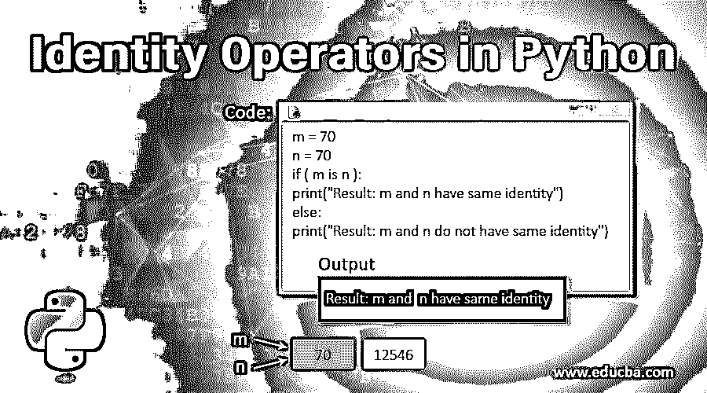
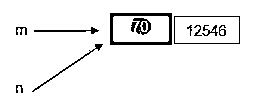
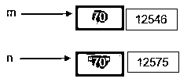
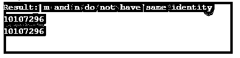
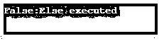

# Python 中的标识运算符

> 原文：<https://www.educba.com/identity-operators-in-python/>




## Python 中的标识运算符简介

顾名思义，恒等运算符用于定位对象的存储单元，尤其是当两个对象具有相同的名称并且只能通过其存储位置来区分时。有两种类型的相同操作符，即“是”操作符和“不是”操作符，其中“是”操作符用于比较对象是否在相同的位置，同时返回“真”或“假”值作为结果，而“不是”操作符用于比较对象是否执行具有相似返回值的相反操作。

### Python 中标识运算符的类型

python 中有两种类型的标识运算符:

<small>网页开发、编程语言、软件测试&其他</small>

*   是
*   不是

#### 1.Is 运算符

Is 运算符帮助用户知道两个对象是否相同？如果两个对象引用同一个内存位置，那么 Is 运算符返回“True”。但是，如果两个对象引用不同的内存位置，“Is”操作符将返回“False”。

##### Is 运算符的示例

以下是一些例子:

**例#1**

```
m = 70
n = 70
if ( m is n ):
   print("Result: m and n have same identity")
else:
   print("Result: m and n do not have same identity")
```

**输出:**


这里 m 和 n 都引用对象，因此 if 计算为 true(在上面的代码中)，并打印“结果:m 和 n 有相同的标识”。

下面是它的图示。




这里 m 和 n 指的是值“70”，它的存储单元是 12546。

**例 2**

```
m = 70
n = "70"
if ( m is n ):
   print("Result: m and n have same identity")
else:
   print("Result: m and n do not have same identity")
```

**输出:**





这里，虽然值看起来相同，但数据类型不同，因此它们存储在不同的内存位置。对于“m”，它是一个整数，而对于“n”，它是一个字符串。整数 70 存储在存储器位置 12546，而字符串“70”存储在存储器位置 12575。因此，else 得到计算并导致打印“结果:m 和 n 没有相同的标识”。

**例 3**

现在我们来比较一下对象的内存位置。

```
m = 70
n = 70
if ( id(m) is id(n) ):
   print("Result: m and n have same identity")
else:
   print("Result: m and n do not have same identity")

print(id(m))
print(id(n))
```

**输出:**




我们可以使用 id()函数来查看内存位置，它显示了 m 和 n 两个不同的标识符。

**例#4**

让我们通过类实现来看看 identity 运算符的用法:

```
class AA(object):
   def foo(self):
     pass 
a = AA()
if id(a.foo) is id(a.foo):
    print("True")
else:
    print("False")
```

**输出:**


**例#5**

除了通过同一运算符比较两个对象之外，还可以测试变量的数据类型。

```
x = 50
if (type(x) is int): 
    print ("True:If executed") 
else: 
    print ("False:Else executed")
```

**输出:**


在这里，如果 x 被执行，检查它是否是一个整数。然而，如果它不是一个整数，否则该语句将被执行。

同样，也可以为其他数据类型实现它。

```
x = "50"
if (type(x) is str): 
    print ("True:If executed") 
else: 
    print ("False:Else executed")
```

**输出:**


#### 2.不是运算符

“非”运算符的工作方式与“是”运算符相反。如果两个对象的内存位置不同，则返回 true。如果两个对象的内存位置相同，则返回 False。

##### Is Not 运算符的示例

以下是 Is Not 运算符的示例:

**例#1**

```
m = 70
n = 70
if ( m is not n ):
   print("Result: m and n have same identity")
else:
   print("Result: m and n do not have same identity")
```

**输出:**


如上图。运算符的行为不是正好与 Is 运算符相反吗？因此，打印“结果:m 和 n 没有相同的身份”，因为 m 和 n 拥有相同的值。

**例 2**

```
m = 70
n = "70"
if ( m is not n ):
   print("Result: m and n have same identity")
else:
   print("Result: m and n do not have same identity")
```

**输出:**


这里整数 70 和字符串“70”是不同的。那么运算符打印的不就是“结果:m 和 n 有相同的标识”吗？整数 70 和字符串 70 的存储位置不同，即“m 不是 n”。

**例 3**

```
x = 50
if (type(x) is not int): 
    print ("True:If executed") 
else: 
    print ("False:Else executed")
```

**输出:**


可以注意到，x 的值是一个整数。但是没有应用运算符，因此该值会打印在控制台上。

**例#4**

```
x = "50"
if (type(x) is not str): 
    print ("True:If executed") 
else: 
    print ("False:Else executed")
```

**输出:**




可以注意到，x 的值是一个字符串。但是，没有应用运算符，因此该值会打印在控制台上。

### 结论

正如我们在上面看到的，identity 操作符如何在 Python 中扮演重要角色是决定类类型或者比较两个对象值。有大量的操作符可以帮助您简化 python 中的任务。一个人应该通过这些身份，然后到其他运营商，以获得对它的充分理解和把握。

### 推荐文章

这是 Python 中标识操作符的指南。这里我们讨论 python 中的标识操作符的介绍、类型和例子。您也可以看看以下文章，了解更多信息–

1.  [Python 中的算术运算符](https://www.educba.com/arithmetic-operators-in-python/)
2.  [Python 中的缩进错误](https://www.educba.com/indentation-error-in-python/)
3.  [Python 中的队列](https://www.educba.com/queue-in-python/)
4.  [Python 中的控制语句](https://www.educba.com/control-statements-in-python/)


