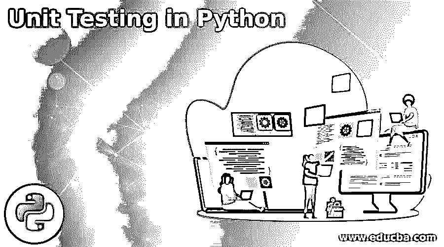
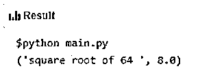
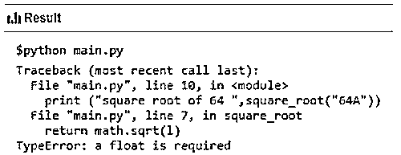
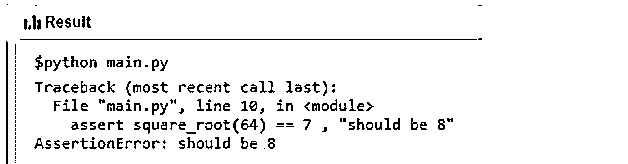
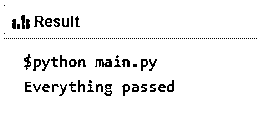
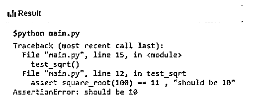
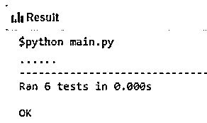
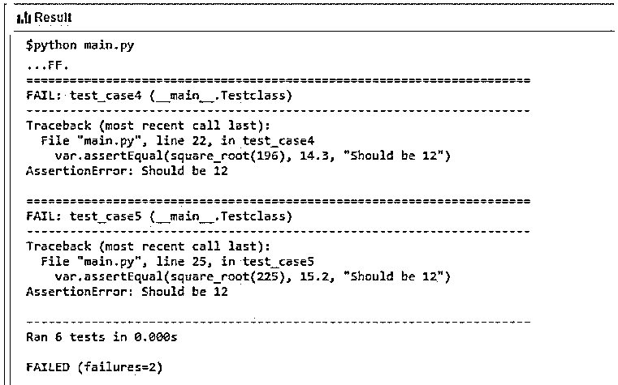

# Python 中的单元测试

> 原文：<https://www.educba.com/unit-testing-in-python/>




## Python 中的单元测试简介

Python 中的单元测试是一种确定软件单元是否按照设计的方式执行预期功能的方法。软件单元可以是模块或功能或与另一模块的接口。这种测试大部分是在开发人员的层次上完成的，在他开发的代码被传递到下一个层次的集成测试之前。Python 便于开发人员在实时执行期间创建涵盖程序中所有可能场景的测试用例，并记录所有测试用例及其结果。这将使测试过程自动化，并使开发人员能够在短时间内进行任意次数的测试。

### Python 中的单元测试是如何工作的？

在 Python 中完成一个代码单元后，开发人员应该测试编码单元以确保:

<small>网页开发、编程语言、软件测试&其他</small>

*   程序中没有错误，并且在所有可能的测试条件下都能正常工作。
*   它从上游软件单元正确地获取输入，并将结果正确地传递给下游单元。

Python 开发人员可以求助于手动测试方法来验证代码，但是它:

*   是一项耗时的任务。
*   留下疲劳。
*   不要以结构化的方式记录测试数据和结果。
*   不可重复，并且会使维护工作变得繁琐。

因此，Python 开发人员必须在程序维护期间创建可用于未来测试的脚本。Python 为开发人员提供了一个单元测试框架单元测试来自动化测试过程。

### 带有示例的各种测试案例

下面给出了各种测试案例和示例:

#### 1.使用简单的 python 代码

假设开发者正在创建一个软件单元来确定一个数的平方根和这个函数的代码，

**代码:**

```
# function to compute square root of a number

import math                                                 # importing Mathematics module

def square_root(l):                                     # Function beginning
    return math.sqrt(l)                                 # Returning results 
```

手工测试的一个简单方法是编写代码。

**代码:**

```
print ("square root of 64 ",square_root(64)
```

**输出:**




**另一个测试用例是:**

```
print ("square root of 64A ",square_root("64A"))
```

**失败结果为:**




在这里，用户必须保存测试代码，以备将来测试之用。

#### 2.在 python 中使用 assert 命令

Assert 命令将结果与给定值进行比较，如果不满足条件，则返回错误。

**代码:**

```
assert square_root(64) == 8 , "should be 8"  Code will not result in any error

assert square_root(64) == 7 , "should be 8"  will return error condition 
```

`assert square_root(64) == 7 , "should be 8" will return error condition`

**输出:**




开发人员可以编写多个测试用例，但是执行会在第一个错误时停止。

#### 3.使用断言的多个测试用例

**代码:**

```
def test_sqrt():
    assert square_root(64) == 8 , "should be 8"
    assert square_root(81) == 9 , "should be 9"
    assert square_root(100) == 10 , "should be 10"

if __name__ == "__main__":
    test_sqrt()
    print("Everything passed") 
```

所有的测试用例都放在一个 python 函数中，并在 __name__ == " __main__ "条件下执行。这实际上意味着模块直接在代码中以独立模式运行，而不是从外部存储库中导入。

**输出:**




**代码:**

```
import math

def square_root(l):
    return math.sqrt(l)

def test_sqrt():
    assert square_root(64) == 8 , "should be 8"
    assert square_root(81) == 9 , "should be 9"
    assert square_root(100) == 11 , "should be 10"

if __name__ == "__main__":
    test_sqrt()
    print("Everything passed") 
```

**输出:**




尽管在这种方法中，多测试用例的一点点自动化是可能的，但是它不能提供全面的测试结果，即有多少个用例失败了，有多少个通过了。我们只能用这种方法处理简单的案件。测试运行者提供了一个特殊的应用程序来方便地执行测试用例，并发布一个清晰的通过和失败案例的结果。

### 用 Python 测试跑步者

单元测试是 Python 内置的测试运行器。

这款试车跑道的独特之处在于:

*   测试条件被编码为一个类中的方法。
*   允许 unittest 库中的各种 assert 方法，而不是前面示例中的简单 assert 语句。

**步骤:**

*   应该导入单元测试库。
*   应该从 unittest 库中继承 Testcase 类来创建类 Testclass。
*   将 var 添加为测试函数中所有方法的第一个参数。
*   在 Testcase 类中用 var . assert . equal 方法替换 assert。
*   Unittest.main()是入口点。

**代码:**

```
import math
import unittest

def square_root(l):
    return math.sqrt(l)

class Testclass(unittest.TestCase):

    def test_case1(var):
        var.assertEqual(square_root(121), 11, "Should be 11")

    def test_case2(var):
        var.assertEqual(square_root(144), 12, "Should be 12")

    def test_case3(var):
        var.assertEqual(square_root(169), 13, "Should be 12")

    def test_case4(var):
        var.assertEqual(square_root(196), 14, "Should be 12")

    def test_case5(var):
        var.assertEqual(square_root(225), 15, "Should be 12")

    def test_case6(var):
        var.assertEqual(square_root(256), 16, "Should be 12")

if __name__ == "__main__":
    unittest.main() 
```

**输出:**

结果是(6 例全部正确):




When the code is changed as:

**代码:**

`import math
import unittest
def square_root(l):
return math.sqrt(l)
class Testclass(unittest.TestCase):
def test_case1(var):
var.assertEqual(square_root(121), 11, "Should be 11")
def test_case2(var):
var.assertEqual(square_root(144), 12, "Should be 12")
def test_case3(var):
var.assertEqual(square_root(169), 13, "Should be 12")
def test_case4(var):
var.assertEqual(square_root(196), 14.3, "Should be 12")
def test_case5(var):
var.assertEqual(square_root(225), 15.2, "Should be 12")
def test_case6(var):
var.assertEqual(square_root(256), 16, "Should be 12")
if __name__ == "__main__":
unittest.main()`

**输出:**

结果(有 2 个错误):




结果清楚地显示了测试的案例数和失败的案例数。

**python 中可用的其他断言方法:**

*   **AssertAlmostEqual:** 四舍五入到第五位小数，比较完成。
*   **AssertTrue(x):** 布尔表达式 x 求值时为真。
*   **AssetFalse(x):** 布尔表达式 x 求值时为假。
*   **Assertequal(a，b):** a = b
*   **AssertIn(a，b):** a 中的 b
*   **AssertIs(a，b):** a 是 b
*   **阿松酮(a):** a 为空

**其他试车员:**

除了内置的工具单元测试之外，还有一些测试运行程序。

*   Nose 被认为是单元测试的扩展。
*   Pytest 向后兼容最少的代码。
*   假设有一个快速的开始，并涵盖边缘情况。
*   模仿具有生成对测试有用的人工数据的能力。
*   作证类似于 pytest。

### 结论

Python 提供了一个广泛的工具来执行单元测试并使之自动化，以便于开发人员维护代码。

### 推荐文章

这是 Python 中单元测试的指南。在这里，我们讨论 Python 中的介绍、工作、各种测试用例以及测试运行程序。您也可以看看以下文章，了解更多信息–

1.  [BFS 算法 Python](https://www.educba.com/bfs-algorithm-python/)
2.  [树遍历 Python](https://www.educba.com/tree-traversal-python/)
3.  [Python 中的 DFS 算法](https://www.educba.com/dfs-algorithm-in-python/)
4.  [Python 中的链表](https://www.educba.com/linked-list-in-python/)


