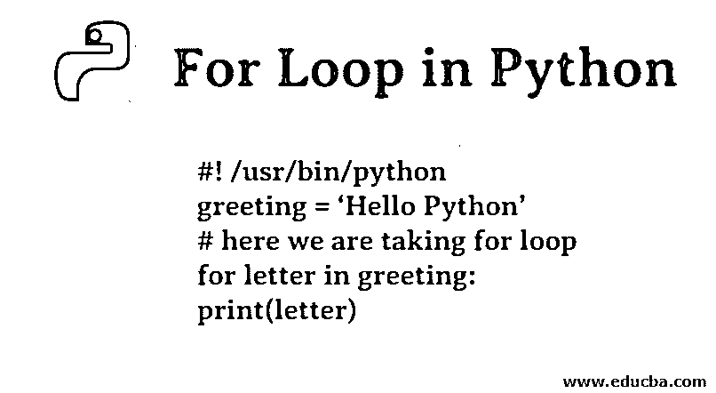
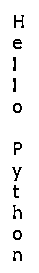
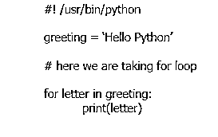
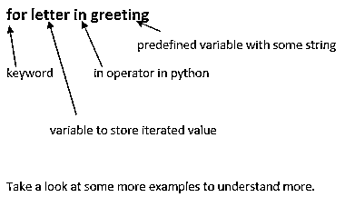
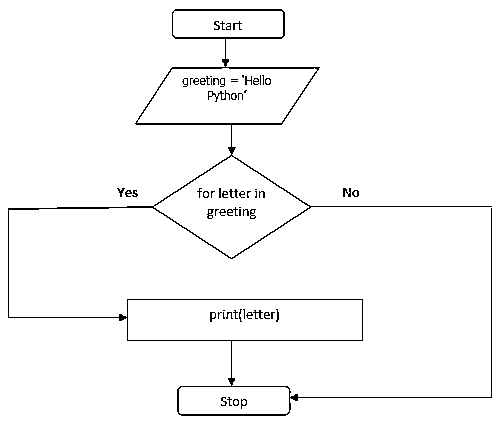
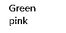
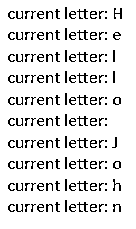
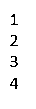
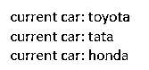
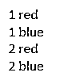

# Python 中的 For 循环

> 原文：<https://www.educba.com/for-loop-in-python/>




## Python 中 For 循环的介绍

在 Python 中的 article For Loop 中，任何编程语言都从相同的规则集开始。语法可能有所不同。Python 也有条件语句和循环。今天我们将集中讨论 python 中的循环。要想在任何语言中做到完美，你必须从基本概念开始。For 循环就是其中之一。对于程序员来说，理解这一点非常重要。大多数时候，我们忽略了温习语言中这些小而重要的部分。

在[学习任何编程语言](https://www.educba.com/what-is-a-programming-language/)的同时，我们必须开始并肩练习。主要的事情适用于学习循环。For 循环令许多程序员感到困惑。如果你在学习代码的时候尝试一下，这是一个很好的实践。多接触代码，这样理解概念的概率更快。所以，打开你的 [Python IDE](https://www.educba.com/python-ide-for-windows/) (集成开发环境)开始做吧。如果你[知道 python](https://www.educba.com/what-is-python/) 的基础知识——比如[关键词](https://www.educba.com/python-keywords/)，数据类型等等。，为了更好地理解，您将使用 for 循环。首先让我告诉你为什么这些循环在任何编程语言中都是必不可少的。

<small>网页开发、编程语言、软件测试&其他</small>

### Python 程序中的 For 循环

假设我们必须打印句子中的每个字母。

**代码:**

```
#! /usr/bin/python
greeting = ‘Hello Python’
#if I wanted to print each letter in greeting sentence without using for loop then we may be #doing something below code
print(greeting[o])
print(greeting[1])
print(greeting[2])
print(greeting[3])
print(greeting[4])
print(greeting[5])
print(greeting[6])
print(greeting[7])
print(greeting[8])
print(greeting[9])
print(greeting[10])
print(greeting[11])
```

**输出:**


如果你看看上面的程序，它似乎更重复我们有。它体积庞大。我们现在只有 11 个角色要穿。假设如果我们必须打印整个段落或文章的字母，这可能有几千个单词。我们要写一个无限制的打印语句。作为一个人，处理这些是一件非常繁琐的事情。

所以，解决方法是迭代它。现在，我们将集中精力减少具有所需输出的代码。现在是时候改进我们的代码了。让我们看看下面的代码片段，它与我们为问候语编写的代码相同。

**代码:**

```
#! /usr/bin/python

greeting = ‘Hello Python’

# here we are taking for loop

for letter in greeting:
	print(letter) 
```

**输出:**




看看代码的区别。 [For 循环帮助](https://www.educba.com/for-loop-in-c/)我们用更简单的方式编写代码，用更少的代码迭代。这最大限度地减少了混乱，减少了代码行，更好地理解和运行更快。现在，您已经了解了为什么对于编码来说 [for 循环是必要的](https://www.educba.com/for-loop-in-powershell/)，以及如果我们不得不迭代庞大的数据，它如何减少我们的头痛。然后，是时候看看 Python 中 for 循环的语法了。

**语法:**

如果您已经观察过，您可能会发现 java 或其他语言中的 for 循环与上面写的有不同的语法。以上面同样的例子为例，我们会发现这到底是如何工作的。




如您所见，我们有一个变量 greeting，这个变量存储在字符串“Hello Python”中。For 是 python 中的一个关键字。写了 for 之后，我们有了一个变量名字母。python 中的 operator 中的 anywhere 之前没有定义字母，它一次取一个问候语的值。并把它保存在一封信里。

**问候中的字母示例**




### Python 中 For 循环的流程图

下面的流程图说明了在 python 中使用 for 循环时如何思考。流程图显示了程序的逻辑。建议在编写实际程序之前先试用一下流程图。

**

** 

### Python 中的循环是如何工作的？

python 中的 For 循环被设计为在任何序列上循环，如列表、元组、[字典](https://www.educba.com/dictionary-in-python/)、集合和字符串。我们已经看到了 python 中 for 循环的工作原理。

现在是时候看看如何用 break 语句在某一点中止执行了。

**代码:**

```
color = ["green", "pink", "red"]
for c in color:
  print(c) 
  if c == "pink":
    break 
```

**输出:**




在上面的程序中，我们在循环中给出了一个条件，如果我们得到的值是 pink，那么就停止迭代。这样，我们可以得出一个特定的结果。我们可以在很多场景中使用这个逻辑。

### 例子

python 中 for 循环的例子如下:

#### 示例#1

**代码:**

```
#! /usr/bin/python

for letter in ‘Hello John':
  print ('current letter :',letter) 
```

**输出:**




#### **例 2**

在这个例子中，我们使用了 python 中的 [range 函数。这是 python 中使用 for 循环时最常用的函数之一。这个函数有以下语法。](https://www.educba.com/python-range-function/)

**代码:**

```
range(starting value, ending value, increment by)

ex:

#! /usr/bin/python
for r in range(1,5,1):
    print(r) 
```

**输出:**




#### 实施例 3

**代码:**

```
#! /usr/bin/python

fruits =['banana','apple','mango']
for index in range(len(fruits)):
    print ("current fruit:",fruits[index]) 
```

**输出:**




#### 实施例 4

嵌套循环。我们可以如下嵌套一个循环。我们在这里迭代两个数组。

**代码:**

```
#! /usr/bin/python
no = [1, 2]
color = ["red", "blue"]

for x in no:
  for y in color:
    print(x, y) 
```

**输出:**




### 结论

Python for loops 非常容易编码和理解。在玩文本的时候用 python 循环是一个非常必须的基本技能，因为现在没有多少库可以处理世界各地不同应用程序生成的大量数据。你知道，从健壮的 python 编程开始是最基本的。

### 推荐文章

这是 Python 中 For 循环的指南。这里我们讨论基本概念和流程图以及例子。您也可以浏览我们推荐的其他文章，了解更多信息——

1.  [Python 中的二分搜索法](https://www.educba.com/binary-search-in-python/)
2.  [Python 中的 ordered dict](https://www.educba.com/ordereddict-in-python/)
3.  [Python 连接列表](https://www.educba.com/python-join-list/)
4.  [Python Reduce](https://www.educba.com/python-reduce/)


