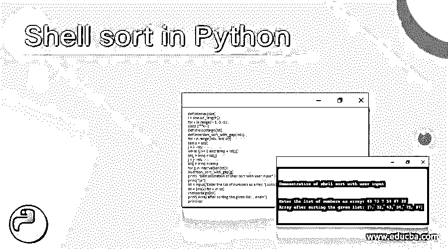
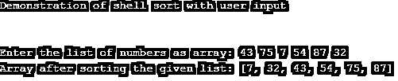

# Python 中的 Shell 排序

> 原文：<https://www.educba.com/shell-sort-in-python/>




## Python 中 Shell 排序的介绍

壳排序被定义为插入排序的变型，插入排序是一种用于排序元素的算法，其方法是对远离每个元素的元素进行排序，然后继续推导出给定用于排序的每个元素之间的间隔率。一般来说，shell sort 是 Python 或任何其他编程语言中的一种算法，用于首先对远离每个元素的元素进行排序，然后以每个元素之间的特定或特定间隔率减少每个连续元素，因此这被称为插入排序的通用版本。

**语法:**

<small>网页开发、编程语言、软件测试&其他</small>

Shell sort 是一种算法，它使用一个公式来计算元素之间的间隔，这个公式被称为“Knut 公式”。在这里，我们将看到用于给定元素排序的算法和公式。算法如下:

**步骤 1:** 首先，我们需要初始化任何变量，这些变量稍后将在计算区间的公式中使用。我们用的是“k”。

**第二步:**然后给定的列表被分成子列表，其中每个列表由计算的区间(k)分隔。

**第三步:**然后我们用插入排序法对得到的子列表进行排序。

**步骤 4:** 然后继续以上 3 个步骤，直到按排序顺序得到给定的列表。

如上所述，我们使用 Knuth 公式计算区间，公式如下:
k = k * 3 +1

这里，k 是获得区间的值，其初始值从 1 开始，n 是第 n 个增量。

### shell sort 在 Python 中是如何工作的，有例子吗？

shell 排序是一种算法，它的工作在所有编程语言中都很简单，让我们看看在 shell 算法的给定原始序列(其他这样的序列是 Knuth 序列、Sedgewick 序列、Hibbard 序列)中，以(n/2、n/4、n/8、…)为间隔的“n”个数字的给定数组上的工作。1)然后是包含“n”个元素的给定数组，这些元素在第一个循环的给定间隔中，间隔速率在第二个循环中开始于 n/2，n/4，等等，其中如果给定元素不按顺序，则这些元素被比较和交换， 这意味着给定数组中的第 0 个元素与第 n/2 个元素的数字进行比较，该元素存储在一个名为“temp”的变量中，第 0 个元素将存储在第 n/2 个元素中，存储在 temp 变量中的元素将存储在第 0 个位置。 这就是数字如何被交换和按顺序排列，并且对剩余的元素继续这一过程，直到这些元素被完全排序。下面给出了算法，其中的例子基于下面给出的算法工作。

区间 t <的 Shellsortalgo( arr，size)
-1 size/2n 直到 arr
中每个区间 t 的 1
对给定区间“t”
的所有元素进行排序 end Shellsortalgo

### 例子

让我们考虑一下 Python 中 shell 排序的例子:

#### 示例#1

```
def shellSortalgo(arr):
n = len(arr)
intv = n/2
while intv > 0:
for i in range(intv,n):
temp = arr[i]
j = i
while j >= intv and arr[j-intv] >temp:
arr[j] = arr[j-intv]
j -= intv
arr[j] = temp
intv /= 2
print("Demonstration of shell sort algorithm in Python is as follows:")
print("\n")
arr = [ 49, 15, 98, 7, 23]
n = len(arr) # len() method gives the total elements present in the
# specified array.
print ( "The given array before sorting is as follows:" )
for i in range(n):
print(arr[i]),
shellSortalgo(arr)
print("\n")
print ( "The Array after sorting is as follows:" )
for i in range(n):
print(arr[i]),
```

**输出:**


在上面的程序中，我们可以看到，首先我们声明了一个函数，其中包含了 shell sort 如何处理给定的数字数组的逻辑，函数名为“shellsortalgo()”，我们将一个数组作为参数传递给这个函数。在这个函数中，首先我们将声明一个变量，我们将在其中存储给定数组的长度，如数组的“n”大小，然后我们将声明区间变量，我们将在其中声明区间，我们从区间 1 开始，直到数组的长度为“n”为止。我们将检查所有的元素，然后从给定的区间开始，我们将通过减少区间来交换元素，直到它变为 1。在上面的程序中，我们已经用 5 个元素将数组指定为“arr”。这里，间隔将开始使用 shell 原始序列 n/2，n/4，…因为这里的 n 值是 5，那么间隔是 n/2，即 5/2 = 2，因此，它比较第 0 个和第 2 个元素，并使用 temp 变量交换这些数字，如果第 0 个元素大于第 2 个元素，那么数字将被交换，这些步骤将继续，直到所有元素都被排序，输出如上面的屏幕截图所示。

#### 实施例 2

现在我们将看到另一个例子，用户自己可以输入数字数组，使用 shell 排序算法对元素进行排序。

```
def interval(size):
l = size.bit_length()
for k in range(l - 1, 0, -1):
yield 2**k - 1
def shellsortalgo(lst):
def insertion_sort_with_gap(intv):
for i in range(intv, len(lst)):
temp = lst[i]
j = i - intv
while (j >= 0 and temp < lst[j]):
lst[j + intv] = lst[j]
j = j - intv
lst[j + intv] = temp
for g in interval(len(lst)):
insertion_sort_with_gap(g)
print( "Demonstration of shell sort with user input" )
print("\n")
lst = input('Enter the list of numbers as array: ').split()
lst = [int(x) for x in lst]
shellsortalgo(lst)
print('Array after sorting the given list: ', end='')
print(lst)
```

**输出:**




在上面的程序中，它与上面的示例相似，工作方式与上面的示例相同，但这里唯一的区别是数组是由用户指定的，这意味着这里我们让用户输入数组元素，它采用相同的逻辑，使用 shell 排序算法对元素进行排序，输出如上面的程序所示。

### 结论

在本文中，我们得出结论，Python 中的 shell 排序算法与另一种编程语言中的相同。外壳排序是一种基于插入排序的算法，该算法用于以升序对数组中的给定元素进行排序，该算法还使用 Knuth 公式来计算间隔率，这将有助于通过减少这些间隔进行排序，并对元素进行排序。

### 推荐文章

这是 Python 中 Shell 排序的指南。在这里，我们讨论定义、语法和参数，外壳排序在 Python 中是如何工作的，以及代码实现的例子。您也可以看看以下文章，了解更多信息–

1.  [在 Java 中排序字符串数组](https://www.educba.com/sort-string-array-in-java/)
2.  [Python 中的排序字符串](https://www.educba.com/sort-string-in-python/)
3.  [排序字符串 PHP](https://www.educba.com/sort-string-php/)
4.  [C++快速排序](https://www.educba.com/c-plus-plus-quicksort/)


