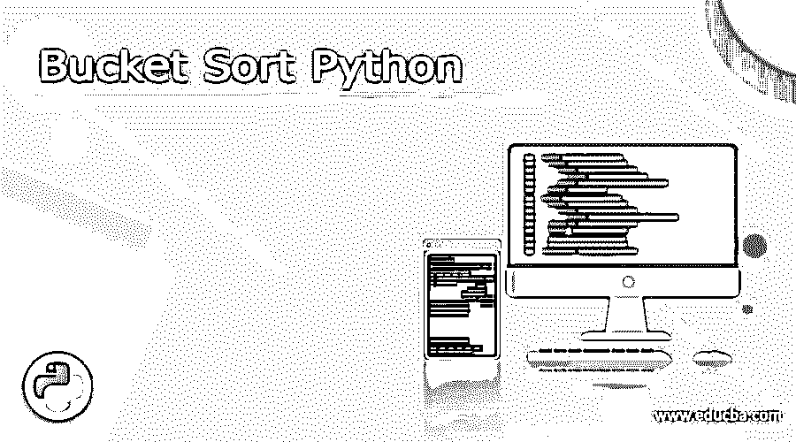
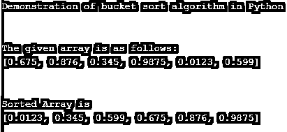
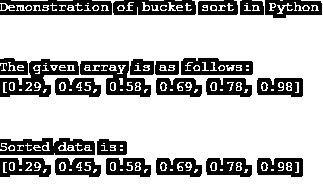

# 桶排序 Python

> 原文：<https://www.educba.com/bucket-sort-python/>




## 桶排序 Python 简介

Python 中的桶排序被定义为一种比较类型的算法，其用于对以一定范围均匀分布的数据或元素进行排序，其中数组或列表的给定元素被分配在桶或箱中，随后桶中的这些元素被按顺序排序，并且给定元素的这种排列被称为桶排序，也称为箱排序。一般而言，桶排序算法被定义为将分配到桶中的分散元素以特定顺序排序，然后将这些分散元素聚集并排序，从而产生新的列表。

**语法:**

<small>网页开发、编程语言、软件测试&其他</small>

由于桶排序是一种算法，因此它在任何编程语言中都有一种算法而不是语法。因此，让我们看看下面的算法:

**算法:**

**步骤 1:** 给定一个输入元素列表或元素数组或创建空桶

**步骤 2:** 声明数组的大小，数组的每个槽被认为是存储元素的桶。

**步骤 3:** 然后根据桶中给定或指定的范围将元素插入这些桶中。

**步骤 4:** 一旦元素被插入到桶中，这些元素就使用任何稳定的排序技术进行排序。

**第五步:**继续上述第四步，直到元素排序完毕。然后通过遍历桶列表并将每个元素插入列表或数组来组装这些元素。这将产生一个有序的元素列表。

上述算法可以重写如下:

```
Func_bucket_sort()
Start
First, n buckets each holding the range of values is created.
For loop (traverse all buckets)
Initialize 0 value to each new bucket.
For loop (traverse all buckets)
Elements are inserted into bucket with suitable matching range
For loop (traverse all buckets)
Elements in each bucket are sorted
Elements are concatenated or gathered from each element.
End Func_bucket_sort()
```

Python 或任何编程语言中的桶排序使用任何排序技术来对桶中的元素进行排序，例如快速排序、冒泡排序等，因此这种桶排序主要用于对分布在一定范围内的数据进行排序，其中桶排序也称为 bin 排序。请注意，创建的桶的数量等于给定的数组或列表的长度

### Python 中的桶排序是如何工作的？

在 Python 中，桶排序主要用于分布式或分散格式的数据，然后使用这种排序为给定列表或数组的每个元素创建桶，也称为 bin 排序。其中在创建存储桶之后首先分发数据，然后使用任何排序技术对存储桶中的每个元素进行排序，以通过对存储桶中的每个元素进行排序来按特定顺序进行排序，并且在排序之后，所有元素或数据被连接并被添加到原始列表中，并且该列表被返回。大多数情况下，这种排序技术使用浮点值作为列表或桶列表中的元素。

让我们在下一节中用 Python 代码看一个简单的例子。

#### 示例#1

```
print("Demonstration of bucket sort algorithm in Python ")
print("\n")
def func_insertion_sort(a):
       for i in range(1, len(a)):
                r = a[i]
                j = i - 1
                while j >= 0 and a[j] > r:
                        a[j + 1] = a[j]
                        j -= 1
                a[j + 1] = r
       return a
def func_bucket_sort(b):
       arr = []
       bucket_slot_num = 10
       for i in range(bucket_slot_num):
                arr.append([])
       for j in b:
                index_b = int(bucket_slot_num * j)
                arr[index_b].append(j)
      for i in range(bucket_slot_num):
               arr[i] = func_insertion_sort(arr[i])
      k = 0
      for i in range(bucket_slot_num):
               for j in range(len(arr[i])):
                        b[k] = arr[i][j]
                        k += 1
     return b
arr1 = [0.675, 0.876, 0.345, 0.9875, 0.0123, 0.599]
print("The given array is as follows: ")
print(arr1)
print("\n")
print("Sorted Array is")
print(func_bucket_sort(arr1))
```

**输出:**




在上面的例子中，我们可以看到，我们首先在函数“func_insertion_sort()”中声明并定义了插入排序算法的逻辑，稍后它将用于对收集的桶中的元素进行排序。然后，我们定义另一个函数，在该函数中，我们定义用于创建桶的逻辑，并将每个槽的每个元素分配为桶，并将元素插入到这些槽中，这些槽在添加元素后被视为桶。桶中的每个元素在这里被排序。它使用函数“func_insertion_sort()”，该函数使用插入排序对桶进行排序，最后所有排序的元素被连接。因此，将使用函数“func_bucket_sort()”对 main 中定义的数组进行排序，以对 bucket 中的元素进行排序，该函数从插入排序函数中收集所有已排序的元素，并根据给定的范围(此处为 10)对元素进行排序。因此，它在上面给出的屏幕截图中显示了排序后的数组。现在我们将看到另一个例子，它直接使用 sort()函数，而不是桶排序算法中的任何其他排序技术。

#### 实施例 2

```
print("Demonstration of bucket sort in Python")
print("\n")
arr1=[0.78,0.58,0.98,0.45,0.29,0.69]
a=[]
for i in range(len(arr1)):
    a.append([])
r=len(arr1)
for i in range(0,r):
b=int(arr1[i]*r)
a[b].append(arr1[i])
for j in range(0,r):
    a[j].sort()
index=0
for i in range(0,r):
    for j in range(0,len(a[i])):
        arr1[index]=a[i][j]
        index+=1
print("The given array is as follows:" )
print(arr1)
print("\n")
print("Sorted data is:")
print(arr1)
```

**输出:**




在上面的例子中，它类似于前面的例子，使用插入排序对桶中的元素进行排序，但是在这个例子中，我们只使用 sort()函数对元素进行排序。因此，该范围是给定数组的大小，因此它将首先使用 sort 函数对元素进行排序，然后我们使用 bucket sort 逻辑收集并排序所有元素，排序后的数组如上面的屏幕截图所示。

### 结论

在本文中，我们得出结论，Python 中的桶排序算法也是一种对给定数组进行排序的比较算法。在本文中，我们可以看到，在使用桶排序时，桶排序中还使用了另一种排序技术，如插入排序、快速排序等。我们还可以在桶排序中使用 direct sort()函数。这完全取决于开发者选择这些排序技术或者根据桶排序算法中可以使用的算法的速度和效率。

### 推荐文章

这是一个桶排序 Python 的指南。这里我们讨论简介、语法和参数，Python 中的桶排序是如何工作的？代码实现示例。您也可以看看以下文章，了解更多信息–

1.  [Python 测试框架](https://www.educba.com/python-testing-framework/)
2.  [Python 中的排序字符串](https://www.educba.com/sort-string-in-python/)
3.  [Python 字符串包含](https://www.educba.com/python-string-contains/)
4.  [Python 列表扩展](https://www.educba.com/python-list-extend/)


