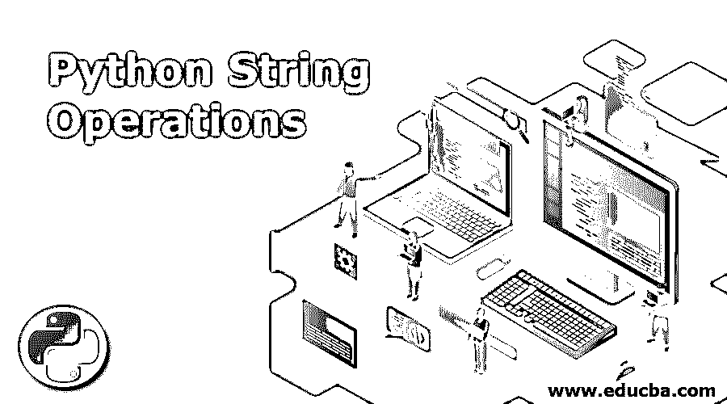
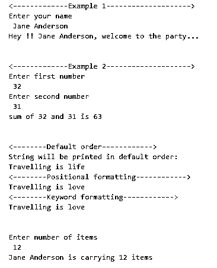
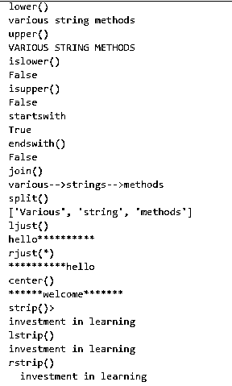
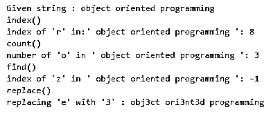

# Python 字符串操作

> 原文：<https://www.educba.com/python-string-operations/>




## Python 字符串操作简介

Python 字符串是一系列字符。Python 字符串是不可变的，这意味着一旦我们声明了一个字符串，我们就不能修改它。Python 提供了一个用于处理文本的内置类“str ”,因为文本是 Python 程序处理的最常见的数据形式。以下是可以在 Python 中执行的常见字符串操作:

*   两个或多个字符串的连接。
*   从字符串值中提取或切分部分字符串。
*   添加或删除空格。
*   转换成小写或大写。
*   使用字符串格式化程序格式化字符串。
*   在给定的字符串中查找和/或替换一个文本。

而操作的清单更是数不胜数。Python 提供了几个内置方法，让我们可以灵活地对字符串执行操作。

<small>网页开发、编程语言、软件测试&其他</small>

### Python 中字符串操作的示例

字符串操作有三种方式:

1.  使用 f 弦
2.  By format()方法
3.  使用%运算符

#### 示例#1

```
# String formatters in Python
# String formatting using f-strings
print("")
print("Enter your name")
name = input()
print(f"Hey !! {name}, welcome to the party...")
print('\n')
print("")
print("Enter first number")
a = int(input())
print("Enter second number")
b = int(input())
print(f"sum of {a} and {b} is {a+b}")
print('\n')
# String formatting using format() method
print("")
str1 = "{} {} {}".format("Travelling", 'is', 'life')
print("String will be printed in
default order:")
print(str1)
print("")
str2 = "{1} {2} {0}".format("love", "Travelling", "is")
print(str2)
print("")
str3 = "{T} {i} {l}".format(T='Travelling', l='love', i='is')
print(str3)
print('\n')
# String formatting using % operator
print("Enter number of items")
item = int(input())
print("%s is carrying %d items"%(name, item)) 
```

**输出:**




**说明:**

**1。f-string:** 字母“f”放在字符串开头的前面，花括号中提到的变量将指上面声明的变量。例如，{name}是指上面定义的名称变量。类似地,{a}和{b}分别指变量 a 和 b。

**2。format()方法:**在 string 对象上调用 format()方法。在字符串内部，我们使用花括号{}来引用 format()方法参数。{}的数量应与 format()中的参数数量相匹配

*   在默认格式中，{}将按照参数放置的顺序引用 format()参数。
*   在位置格式中，顺序显示在{}内。上面的示例“{1} {2} {0}”。format("love "、" traveling "、" is ")声明位于 format()内索引 1(" traveling ")的参数将排在第一位，位于索引 2(" is ")的参数排在第二位，位于索引 0("love ")的参数排在最后。
*   在关键字格式中，某些关键字用在{}内，它们将被映射到相应的 format()参数。

**3。% operator:**“%”运算符将被括号/元组中定义的变量替换。%s 表示一个字符串变量会到这个地方，%d 是整数，%f 是浮点值。

#### 实施例 2

```
# String methods Part 1
string = "Various string methods"
string2 = " investment in learning "
print("lower()")
print(string.lower())
print("upper()")
print(string.upper())
print("islower()")
print(string.islower())
print("isupper()")
print(string.isupper())
print("startswith")
print(string.startswith("Var"))
print("endswith()")
print(string.endswith("el"))
print("join()")
print('-->'.join(['various', 'strings', 'methods']))
print("split()")
print(string.split())
print("ljust()")
print("hello".ljust(15, '*'))
print("rjust(*)")
print("hello".rjust(15, '*'))
print("center()")
print("welcome".center(20, '*'))
print("strip()>")
print(string2.strip())
print("lstrip()")
print(string2.lstrip())
print("rstrip()")
print(string2.rstrip()) 
```

**输出:**




**说明:**

*   **lower():** 将字符串转换为小写字母。
*   **upper():** 将字符串转换为大写字母。
*   **islower() / isupper():** 检查整个字符串是小写还是大写，并分别返回 bool 值。
*   **startswith():** 返回一个布尔值。检查给定字符串是否以特定文本开头。
*   **endswith():** 返回一个布尔值。检查给定字符串是否以特定文本结尾。
*   **join():** 将不同的字符串连接成一个连接在一起的字符串。字符串列表被连接成一个字符串。
*   **split():**join()的反向。它将一个大的字符串分割成更小的字符串。默认情况下，字符串会在出现空格、制表符或换行符等字符的地方被拆分。但是，分隔符可以在 split()内部传递。当遇到此分隔符时，字符串将被拆分。
*   **ljust()/rjust()/center():**这三种方法都是为了对文本进行调整。第一个参数是对齐字符串的整数长度，第二个参数是填充字符。ljust()填充左侧的填充字符，rjust()填充右侧的填充字符，center()将文本居中对齐，填充左侧和右侧的填充字符。
*   **strip()/lstrip()/strip():**从左侧(lstrip())、右侧(rstrip())和两侧(strip())删除空格(空格、制表符和换行符)。

#### 实施例 3

```
# String methods--> Part 2
string = "object oriented programming"
print("Given string :", string)
print('index()')
print("index of 'r' in:'", string, "':", string.index('r'))
print('count()')
print("number of 'o' in '", string, "':", string.count('o'))
print('find()')
print("index of 'z'in '", string, "':", string.find('z'))
print('replace()')
print("replacing 'e' with '3' :", string.replace('e', '3')) 
```

**输出:**




**说明:**

*   **index():** index()方法查找给定字符串中第一个出现的特定字符或文本。在本例中，打印第一次出现“r”的索引位置。
*   **count():** 统计一个字符在给定字符串中出现的总次数。字符“o”在字符串“面向对象编程”中出现了三次
*   **find():** find()方法类似于 index()方法。它还返回第一个匹配项的索引。但是主要的区别是，如果要查找其索引的字符不存在，index()将抛出一个错误，而 find()返回-1(如输出所示)
*   **replace():** 它用给定字符串中的另一个文本替换一个文本。在本例中，“e”将被“3”替换。

### 结论

文本是 Python 程序必须操作的最常见的数据形式。因此，Python 提供了一个完整的字符串方法列表，帮助用户以一种非常灵活的方式对字符串(文本位)执行各种操作，而无需编写大量代码。

### 推荐文章

这是一个 Python 字符串操作的指南。在这里，我们讨论在 python 中对字符串执行各种操作的不同字符串方法，以及一个示例及其代码实现。您也可以浏览我们的其他相关文章，了解更多信息——

1.  [Python 比较字符串](https://www.educba.com/python-compare-strings/)
2.  [Python 列表函数](https://www.educba.com/python-list-functions/)
3.  [Python 修剪字符串](https://www.educba.com/python-trim-string/)
4.  [Python 生成器](https://www.educba.com/python-generators/)