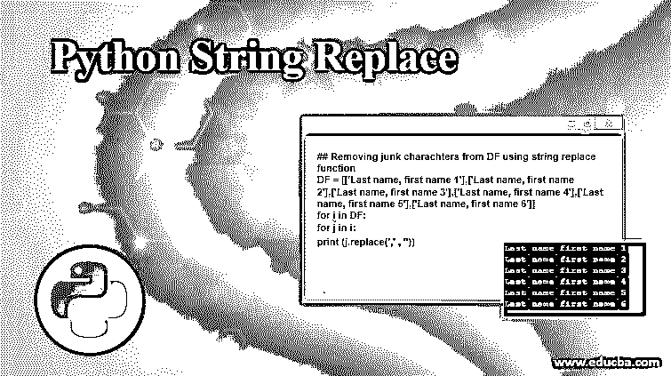
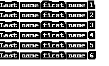
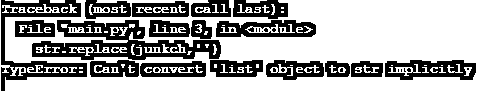

# Python 字符串替换

> 原文：<https://www.educba.com/python-string-replace/>




## Python 字符串替换简介

有时，我们会遇到某些需要最小但有效的解决方案的问题。如果您想要将短语中的某些文本替换为其他文本，请说。在 Python 的例子中，replace()函数对您来说非常有用。replace()是 Python 中的一个内置函数，它返回一个字符串的副本，其中包含我们希望用指定的字符串替换的所有“字符串”。

**语法:**

<small>网页开发、编程语言、软件测试&其他</small>

`str.replace(old_string, new_string, count)`

replace()函数可以传递多个参数，下面会提到:

*   **old_string:** 是指我们要替换的子串
*   **new_string:** 它是指我们要用来替换 old_string 的子串
*   **count:** 它是指我们要用 new_string 替换的 old_string 出现的次数

**Note:** Here, the count is an optional argument. If you do not pass the third argument, that is count with the replace() function. Then, in that case, all of the occurrences of the old_string will be replaced by the new_string within str

在这种情况下，语法将是:

`str.replace(old_string, new_string)`

### Python 字符串替换的示例和函数

让我们举一个例子来理解这是如何工作的:

#### 示例#1

**代码:**

```
# Python3 program to demonstrate the
# usage of replace() function
str = "Let's go to a place, from where we can go to another. But where exactly do we want to go"
# Prints the string by replacing go by GO
print(str.replace("go", "#GO"))
# Prints the string by replacing only 2 occurrence of go
print(str.replace("go", "#GO", 2)) 
```

**输出:**


**Note: **In record one, As we have not passed on the optional argument count, which specified how many occurrences of the substring “go” should be replaced with “#GO”, then all of the occurrences will be replaced. And in the record second, Here only the first two occurrences of”go” are being replaced with “#GO”, as we have explicitly specified the count as 2 in the second print statement.

这就是 python 中字符串 replace()函数的工作方式

#### 实施例 2

**代码:**

```
## Removing junk charachters from DF using string replace function
DF = [['Last name, first name 1'],['Last name, first name 2'],['Last name, first name 3'],['Last name,first name 4'],['Last name, first name 5'],['Last name, first name 6']]
for i in DF:
 for j in i:
  print (j.replace(',' , '')) 
```

**输出:**


如果我们希望清除已知垃圾字符的数据，那么，在这种情况下，可以使用上述替换功能。这里，我们用空格替换了姓名列表中姓氏和名字之间的逗号。

*   如果我们希望清除已知垃圾字符的数据，那么，在这种情况下，可以使用上述替换功能。
*   这里，我们用空格替换了姓名列表中姓氏和名字之间的逗号。
*   使用 for 循环遍历列表中出现的每个值，然后对该特定字符串使用 replace 函数将“，”替换为“，”。
*   我们不需要在这里显式指定可选变量“count ”,因为在一个名称中只出现过一次“，”。

#### 实施例 3

如果在应用了 replace()函数的字符串中找不到 old_substring，会发生什么情况？.有线索吗？

**代码:**

```
## Removing junk charachters from DF using string replace function
DF = [['Last name first name 1'],['Last name first name 2'],['Last name, first name 3'],['Last name,first name 4'],['Last name, first name 5'],['Last name, first name 6']]
for i in DF:
 for j in i:
  print (j.replace(',' , '')) 
```

**输出:**




*   在这种情况下，前两个字符串甚至没有'，'，我们希望使用 replace 函数()替换它。
*   所以我们可以看到，replace 函数仍然在返回原字符串，即使没有找到要替换的子串。
*   如果我们使用一个循环对多个字符串应用 replace()函数，那么，在这种情况下，我们会遇到这种情况。

然而，如果我们试图清理数据集的多种类型的垃圾字符，我们可能需要另一个循环来遍历垃圾字符列表。

#### 实施例 4

或者，我们不能将列表传递给替换函数。在这种情况下，它将抛出一个错误。让我们试试同样的方法。

```
unkch = [['/'],['$'],['&']]
str = 'abcdef $ gh@#'
str.replace(junkch,'') 
```

**输出:**




### 推荐文章

这是一个 Python 字符串替换的指南。这里我们讨论 python 字符串替换的介绍和工作原理，以及不同的例子和它的代码实现。您也可以看看以下文章，了解更多信息–

1.  [Python 修剪字符串](https://www.educba.com/python-trim-string/)
2.  [Python 循环函数](https://www.educba.com/python-round-function/)
3.  [Python 线程池](https://www.educba.com/python-threadpool/)
4.  [Python PEP8](https://www.educba.com/python-pep8/)