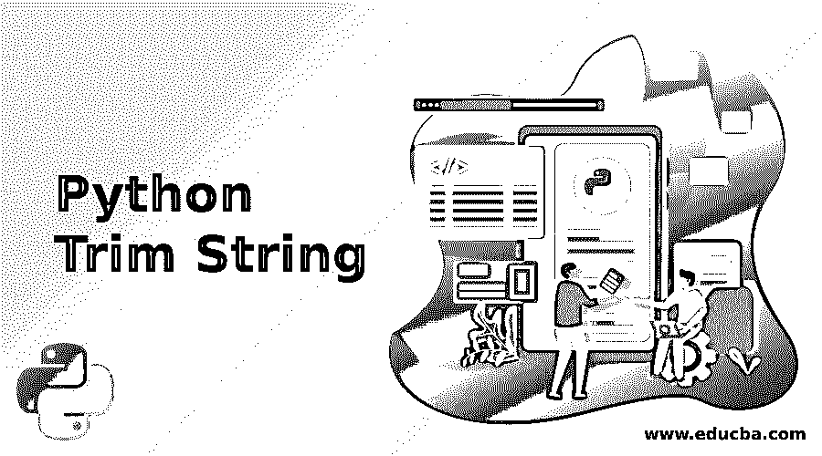
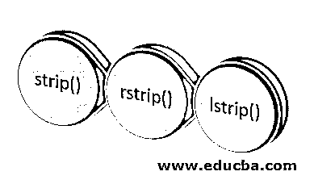
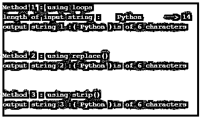
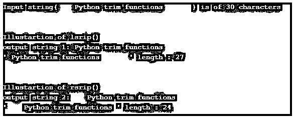
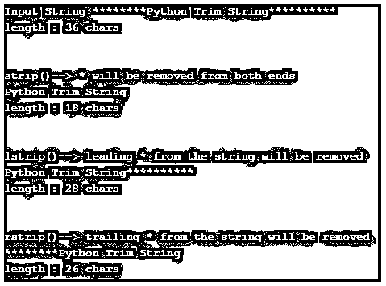
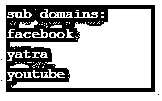

# Python 修剪字符串

> 原文：<https://www.educba.com/python-trim-string/>




## Python 修剪字符串简介

字符串是一系列字符。该字符可以是任何字母、数字、空白字符或任何特殊符号。Python 中的字符串是不可变的，这意味着一旦创建，就不能修改。但是，我们可以复制字符串，并对其执行各种操作。为此，Python 提供了一个单独的类“str ”,用于字符串处理和操作。一种这样的操作是从称为 Trim 的字符串的开头和/或结尾删除空白字符。我们可以使用循环来删除空白字符，但是 Python 提供了一个内置函数来简化这个任务。

Python 提供了三种不同的修剪函数:

<small>网页开发、编程语言、软件测试&其他</small>




*   条状()
*   rstrip()
*   lstrip()

**语法:**

**1。strip():** strip()函数在删除了字符串左右两边的空格后返回一个字符串的副本，即删除了前导空格和尾随空格。

```
string_object.strip([chars])
```

**2。lstrip():** lstrip()函数返回删除前导空格后的字符串副本，即从字符串的左边开始。

```
string_object.lstrip([chars])
```

**3。rstrip():** rstrip()函数返回删除尾部空格后的字符串副本，即从字符串的右边开始。

```
string_object.rstrip([chars])
```

在上面提到的三种语法中，[char]是可选参数。如果没有提供，那么默认情况下，空白字符(空格、制表符、换行符)将被删除。但是如果在函数中提供了可选参数[char],那么匹配的字符将从字符串中删除。

**Python 中为什么要使用 Trim 字符串？**

*   我们并不总是能获得干净的数据，因为数据是从不同的来源收集的。
*   数据通常是有噪声的，字符串修整是清理数据的方法之一，以便可以有效地操作数据。

### Python 修剪字符串的示例

以下是 Python 修剪字符串的示例:

#### 示例#1

说明 strip()功能的 Python 程序。

**代码:**

```
# Traditional way to remove whitespaces from the given string
print("-------------- Method 1 : using loops-------------->")
string = '   Python     '
print("length of input string :", string, '-->', len(string))
# output string
out_str1 = ""
# for loop to remove whitespaces
for i in string:
    if i==' ':
        pass
    else :
        out_str1 += i
print("output string 1 :(", out_str1, ")is of", len(out_str1), "characters")
print('\n')
print("-------------- Method 2 : using replace()-------------->")
def remove_spaces(s):
    return s.replace(' ' , '')
out_str2 = remove_spaces(string)
print("output string 2 :(", out_str2, ")is of", len(out_str2), "characters" )
print('\n')
# removing whitesspaces using built-in function
print("-------------- Method 3 : using strip()-------------->")
out_str3 = string.strip()
print("output string 3 :(", out_str3, ")is of", len(out_str3), "characters" )
```

**输出:**




**说明:**

在本例中，使用了三种方法来移除输入字符串“python”中的空格。

*   **使用 for 循环:**打印输入字符串的长度，也包括空格。然后使用 for 循环遍历输入字符串。对于每个字符，如果找到空格“”，我们传递一个空语句，即遇到空格，什么都不会发生。但是如果字符不在空格中，那么它将被连接到输出字符串“out_str1”。最后，输出字符串的长度。
*   **使用字符串内置函数 replace():** 这里，我们定义了一个函数，它将一个字符串作为其参数，并使用内置函数 replace()将一个空格“”替换为一个空字符串，从而返回该字符串的副本
*   **使用 strip()函数:**最后使用 strip()函数。它在没有任何参数的情况下对输入字符串进行调用。因此，默认情况下，前导空格和尾随空格都被删除。

#### 实施例 2

Python 程序演示了 lstrip()和 rstrip()函数的工作原理。

**代码:**

```
string = " Python trim functions    "
print("Input string(", string, ") is of", len(string), "characters")
# lsrtip() removes leading spaces
print('\n')
print("Illustartion of lsrip()")
ostring1 = string.lstrip()
print("output string 1:", ostring1)
print("'", ostring1, "'", "length :", len(ostring1))
print('\n')
# rstrip() removes trailing spaces
print("Illustartion of rsrip()")
ostring2 = string.rstrip()
print("output string 2:", ostring2)
print("'", ostring2, "'", "length :", len(ostring2))
```

**输出:**




**说明:**

*   在上面的例子中，lstrip()和 rstrip()函数在输入字符串上被调用，而没有指定任何可选参数。因此默认情况下，空格将被删除。
*   打印原始字符串和修剪后的字符串的总长度(字符数)。

#### 实施例 3

指定可选参数[char]时 strip([chars])、lstrip([char])和 rstrip([char])的图示

**代码:**

```
# strip([chars]), lstrip([char]) and rstrip([char]) when optiona parameter [char] is specified
string = '********Python Trim String**********'
print('Input String', string)
print('length :', len(string), 'chars')
print('\n')
print("strip()--> * will be removed from both ends")
str1 = string.strip('*')
print(str1)
print('length :', len(str1), 'chars')
print('\n')
print("lstrip()--> leading * from the string will be removed")
str2 = string.lstrip('*')
print(str2)
print('length :', len(str2), 'chars')
print('\n')
print("rstrip()--> trailing * from the string will be removed")
str3 = string.rstrip('*')
print(str3)
print('length :', len(str3), 'chars')
```

**输出:**




**说明:**

*   在上面的例子中，所有三个修整过的函数 strip()、lstrip()和 rstrip()都带有一个可选参数' * '。strip(*)从给定的输入字符串中删除前导和尾随的' * '。
*   而 lstrip()和 rstrip()分别删除了前导和尾随的' * '。
*   然后打印输入字符串的长度和修剪后的字符串。

#### 实施例 4

使用 strip()函数从给定的 URL 列表中提取子域名

**代码:**

```
# Program to extract sub domain name from a list of URLs using strip() function
# Input list containing different URLs
urls = ['www.facebook.com', 'www.yatra.com', 'www.youtube.com']
print("sub domains:")
for url in urls:
    print(url.strip('w.com'))
```

**输出:**




**说明:**

*   定义了包含不同 URL 的输入列表
*   for 循环用于遍历列表。在每个列表项(即 url)上，调用 strip()，这将删除“www。”还有。com '的一部分，如上所示。

### 结论

String trim 对于清理数据很有用，因为数据是从不同的来源收集的，并且总是杂乱无章。strip()、lstrip()和 rstrip()是 Python“str”类提供的三个内置函数，有助于字符串修整。虽然这可以通过各种传统方式实现，但这些功能使这项任务变得容易得多。

### 推荐文章

这是一个 Python 修剪字符串的指南。这里我们讨论一下简介，例子，以及为什么在 Python 中使用 Trim String？您也可以看看以下文章，了解更多信息–

1.  [Python 字符串操作](https://www.educba.com/python-string-operations/)
2.  [Python 列表函数](https://www.educba.com/python-list-functions/)
3.  [Python 输入字符串](https://www.educba.com/python-input-string/)
4.  [Python 中的队列](https://www.educba.com/queue-in-python/)