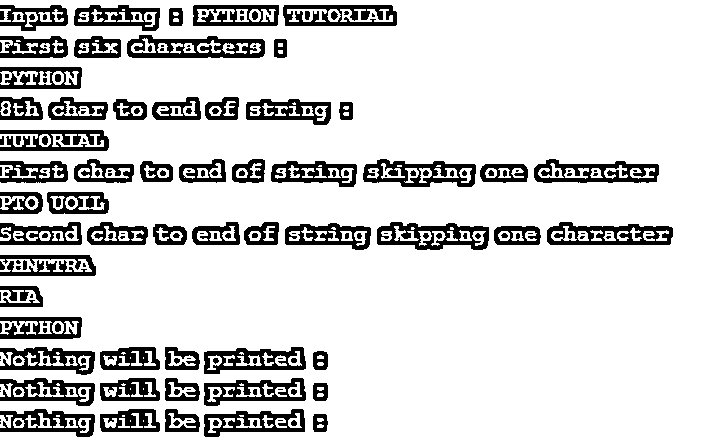
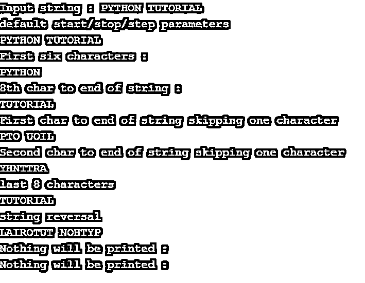
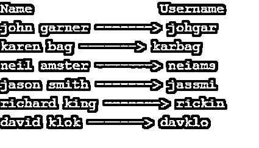

# Python 切片字符串

> 原文：<https://www.educba.com/python-slice-string/>


## Python 切片字符串介绍

字符串是一个字符序列。该字符可以是任何字母、数字、空白字符或任何特殊符号。Python 中的字符串是不可变的，这意味着一旦创建，就不能修改。我们只能从原字符串中提取一个叫做子串的部分，但原字符串保持不变。

Python 提供了两种从给定字符串访问文本的方法:

<small>网页开发、编程语言、软件测试&其他</small>

*   **索引:**从字符串中只提取单个字符。
*   **切片:**可以从原字符串中提取一定范围的字符。从原始字符串中提取字符序列(子串)的过程称为切片。

**语法:**

python 中的切片有两种方式:

1.使用 python slice()函数

```
slice(start, stop, step)
```

2.使用索引进行切片

```
String_object[start: stop: step]
```

**参数:**

1.  **start:** 从切片开始的地方开始索引。该索引是包含性的，并且是可选参数。
2.  **停止:**停止切片的结束索引。这个索引是排他的，这意味着切片将在(stop-1)索引处停止，并且是一个强制参数。
3.  **步骤:**要跳过的索引数。这也是一个可选参数

### 为什么我们使用 Python 切片字符串？

要理解 Python 切片，需要对索引有一个基本的了解。

**索引:**由于字符串是一种顺序数据类型，它可以被索引为其他顺序数据类型，如列表、元组等。索引从 0 开始。

Python 支持正索引和负索引，如下图所示:

|  | 英语字母表中第十六个字母 | 英语字母表中第二十五个字母 | 英语字母表中第二十个字母 | 英语字母表中第八个字母 | 英语字母表中第十五个字母 | 英语字母表中第十四个字母 |  | 英语字母表的第 19 个字母 | 英语字母表中第二十个字母 | 英语字母表中第十八个字母 | 英语字母表中第九个字母 | 英语字母表中第十四个字母 | 英语字母表第七个字母 |
| 正索引 | Zero | One | Two | Three | Four | Five | Six | Seven | Eight | Nine | Ten | Eleven | Twelve |
| 负索引 | -13 | -12 | -11 | -10 | -9 | -8 | -7 | -6 | -5 | -4 | -3 | -2 | -1 |

但是有了索引，我们可以一次提取一个字符。

**举例:**

```
string = "PYTHON STRING"
string[2]
'T'
```

但是有些情况下我们需要一系列字符。在这种情况下，切片很方便，因为切片允许我们从原始字符串中提取子串。

**举例:**

```
string[0:6]
'PYTHON'
```

### Python 切片示例

python 切片示例如下:

#### 示例#1

使用 slice()函数的 Python 字符串切片

**代码:**

```
string = "PYTHON TUTORIAL"
print("Input string :",string)
# Positive indexing
print("First six characters :")
print(string[slice(6)])
print("8th char to end of string :")
print(string[slice(7, len(string))])
# Extracting alternate odd chars using step parameter
print("First char to end of string skipping one character")
print(string[slice(0,len(string),2)])
# Extracting alternate even chars using step parameter
print("Second char to end of string skipping one character")
print(string[slice(1, len(string), 2)])
# Negative indexing
print(string[slice(-4,-1)])
print(string[slice(-8)])
# Stop parameter should be greater than start parameter
print("Nothing will be printed :",string[slice(-4,0)])
print("Nothing will be printed :",string[slice(-1,-1)])
print("Nothing will be printed :",string[slice(-2,-4)])
```

**输出:**




**说明:**

输入字符串:

|  | 英语字母表中第十六个字母 | 英语字母表中第二十五个字母 | 英语字母表中第二十个字母 | 英语字母表中第八个字母 | 英语字母表中第十五个字母 | 英语字母表中第十四个字母 |  | 英语字母表中第二十个字母 | 英语字母表中第二十一个字母 | 英语字母表中第二十个字母 | 英语字母表中第十五个字母 | 英语字母表中第十八个字母 | 英语字母表中第九个字母 | 英语字母表中第一个字母 | 英语字母表中第十二个字母 |
| 正索引 | Zero | One | Two | Three | Four | Five | Six | Seven | Eight | Nine | Ten | Eleven | Twelve | Thirteen | Fourteen |
| 负索引 | -15 | -14 | -13 | -12 | -11 | -10 | -9 | -8 | -7 | -6 | -5 | -4 | -3 | -2 | -1 |

**正向分度:**

*   **字符串【切片(6)】**→开始索引:0，停止索引:6，步长值:1

将打印前 6 个字符(“PYTHON”)

*   **string[slice(7，len(string))]** →开始索引:7，停止索引:15 (len(string))，步长值:1

将打印字符串末尾 7 个位置的字符索引，即教程

*   **string[slice(0，len(string)，2)]** →开始索引:0，停止索引:15，步长值:2

替代字符将从第一个字符开始打印

*   **string[slice(1，len(string)，2)]** →开始索引:1，停止索引:15，步长值:2

替代字符将从第二个字符开始打印

**负索引:**

*   **string[slice(-4，-1)]** →开始索引:-4，停止索引:-1，步长值:1

| 英语字母表中第十八个字母 | 英语字母表中第九个字母 | 英语字母表中第一个字母 |
| -4 | -3 | -2 |

*   **string[slice(-8)] →** 开始索引:0，停止索引:-8，步长值:1

**Note:** Stop index > start index; otherwise, nothing will be printed as shown in the output (last 3 print statements)

#### 实施例 2

使用索引的 Python 切片字符串

**代码:**

```
# Python slicing using indexing
string = "PYTHON TUTORIAL"
print("Input string :",string)
print("default start/stop/step parameters")
print(string[::])
# Positive indexing
print("First six characters :")
print(string[:6])
print("8th char to end of string :")
print(string[7:])
# Extracting alternate odd chars using step parameter
print("First char to end of string skipping one character")
print(string[::2])
# Extracting alternate even chars using step parameter
print("Second char to end of string skipping one character")
print(string[1::2])
# Negative indexing
print("last 8 characters")
print(string[-8:])
print("string reversal")
print(string[::-1])
# Stop parameter should be greater than start parameter
print("Nothing will be printed :",string[3:1])
print("Nothing will be printed :",string[-1:-8:1])
```

**输出:**




#### 实施例 3

使用 Python 子字符串创建用户名

**代码:**

```
# creating username from user's first and last name
# list containing users name
names = ['john garner',  'karen bag', 'neil amster', 'jason smith', 'richard king', 'david klok']
# empty list which will contain usernames
username = []
# defining function for creating username
def uname(names):
    for i in names:
        full_name=i.split()  # split the name on occurrence of whitespace chars
        fname = full_name[0] 
        lname = full_name[1]
        #concatenating first 3 chars of first name with first 3 chars of last name to create username
        uname = fname[:3]+lname[:3]     # extracting substrings from fname and lname
        username.append(uname)
# calling function uname() taking list “names” as input argument
uname(names)
# printing name of the user along with username
print("Name                Username")
for name,uname in zip(names, username):
    print(name, '------->', uname)
```

**输出:**




### 结论

字符串是一种基于序列的数据类型，对字符串进行切片可以更灵活地处理字符串数据，因为索引只便于提取单个字符，而使用切片，可以访问一系列字符或子字符串。

### 推荐文章

这是一个 Python 切片字符串的指南。这里我们讨论介绍，为什么我们使用 Python 片段字符串和参数以及语法、例子和输出。您也可以阅读以下文章，了解更多信息——

1.  [Python 数据类型](https://www.educba.com/python-data-types/)
2.  [Python 中的序列](https://www.educba.com/sequences-in-python/)
3.  [Python 中的元组](https://www.educba.com/tuples-in-python/)
4.  [Python 查找字符串](https://www.educba.com/python-find-string/)