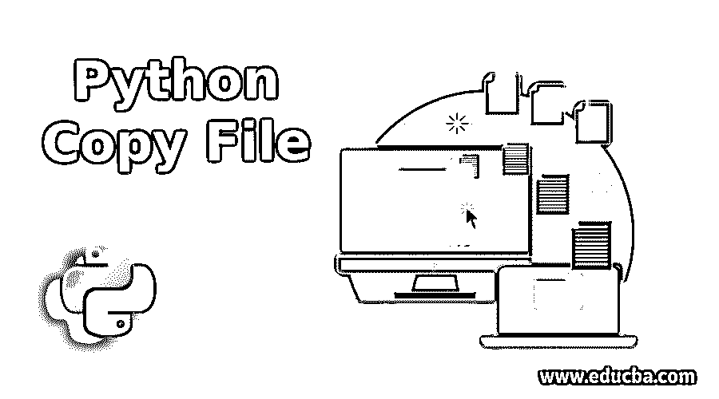
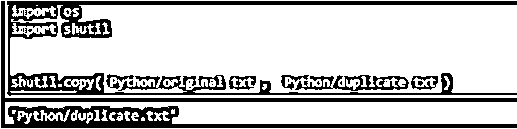

# Python 复制文件

> 原文：<https://www.educba.com/python-copy-file/>

## Python 复制文件简介

Python 复制文件函数是 python 中的高级操作。它用于将文件从一个位置复制到另一个位置。Python 与操作系统交互执行这个操作，在进行这个操作之前，我们需要导入 os 模块和 shutil 模块；没有这些模块，这个操作就无法完成。我们可以复制目录中的单个文件和多个文件。尽管这些函数是高级操作，但它们仍然不复制元数据、所有者信息、ACL 和备用数据流。源路径和目标路径类似于对象或字符串。

目标文件路径名应该正确，并符合复制功能的规则。例如，源文件和目标文件路径不应相同；否则，python 将生成相同的文件错误。

<small>网页开发、编程语言、软件测试&其他</small>

**语法**

`shutil.copyfile(src, dst, *, follow_symlinks=True)`

*   **src:** 完整的源文件，应该是字符串格式。该参数是必需的。
*   **dst:** 目标文件路径，也应该是字符串格式，不能与源文件相同。该参数是必需的。
*   **follow_symlinks:** 这是可选参数，默认值为 true。如果该值为 false 并且是符号链接，那么该文件将不会被复制；相反，会创建一个新的符号链接。

目标文件路径应该是可写的；如果目录没有写权限，那么 python 将返回 OSError。此功能不允许复制特殊文件，如管道、字符或块设备。

### Python 复制文件的示例

以下是 Python 复制文件的示例:

#### 示例#1

**代码:**

`import os
import shutil
shutil.copy('Python/original.txt', 'Python/duplicate.txt')`

**输出:**

这是一个非常基本的 shutil.copy 函数的例子。我们已经导入了 os 和 shutil 库。在 shutil.copy 函数中，我们将第一个参数指定为源文件，第二个参数是目标文件。在这种情况下，源文件夹和目标文件夹是相同的，但文件名不同，因此它们将被成功复制。

#### 实施例 2

**代码:**

`import os
import shutil
dir = '/Users\Big Data Cluster\Documents\Python\Testing'
Source = '/Users\Big Data Cluster\Documents\Python\Testing\Sample.txt'
Destination = '/Users\Big Data Cluster\Documents\Python\Testing\Test.txt'
print(os.listdir(dir))
shutil.copy(Source,Destination)
print(os.listdir(dir))`

**输出:**

在上面的程序中，我们已经导入了所需的库。我们已经在 dir 变量中指定了目录路径。我们将源文件路径存储在源变量中，将目标文件路径存储在目标变量中。最后，我们在 shutil.copy 函数中传递了源和目标变量。

我们使用 os.listdir 方法来列出目录中的所有文件。正如我们所看到的，在 shutil.copy 方法之前，目录中有一个文件“Sample.txt ”,在函数执行之后，文件被复制并命名为“Test.txt”

#### 实施例 3

**代码:**

`import os
import shutil
Source = '/Users\Big Data Cluster\Documents\Python\Testing\Sample.txt'
Destination = '/Users\Big Data Cluster\Documents\Python\Testing\Test.txt'
shutil.copy(Source,Destination)`

**输出:**

在上面的例子中，我们已经为源文件和目标文件创建了两个变量 source 和 destination。但是在本例中，正如您所看到的，我们在源文件和目标文件中指定了相同的文件路径。在这个 shutil.copy 函数中将返回相同的文件错误，正如您在上面的屏幕截图中看到的。

### 结论

Python 提供了一个 shutil.copy 方法来将我们的文件从一个位置复制到另一个位置。这是一个非常简单和有用的处理文件的方法；唯一的缺点是它不复制文件的元数据信息。

### 推荐文章

这是一个 Python 复制文件的指南。这里我们讨论 Python 复制文件的例子以及语法、代码和输出。您也可以看看以下文章，了解更多信息–

1.  [Python 用户输入](https://www.educba.com/python-user-input/)
2.  [Python 返回值](https://www.educba.com/python-return-value/)
3.  [Python 中的 Max 函数](https://www.educba.com/max-function-in-python/)
4.  [Python 变量作用域](https://www.educba.com/python-variable-scope/)