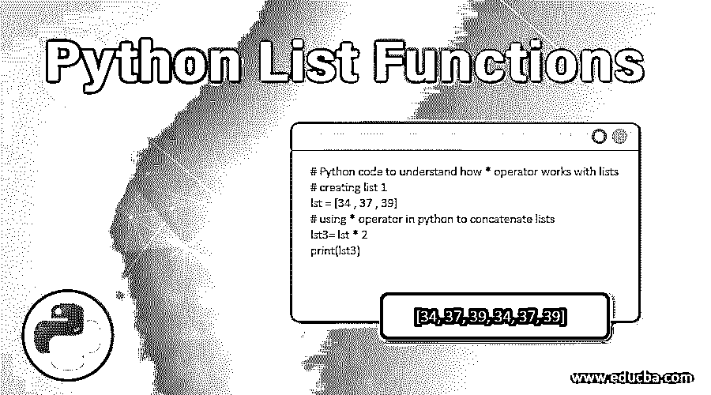
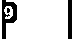
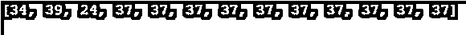
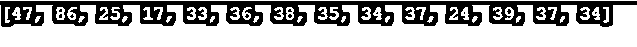

# Python 列表函数

> 原文：<https://www.educba.com/python-list-functions/>




## Python 列表函数简介

python 中有不同类型的数据类型，如元组、集合、字典等。既可改变又可排序的在 Python 中被称为 List。它还允许将重复的值作为一个成员，其中每个成员都可以以迭代的方式单独访问。在本主题中，我们将学习 Python 列表函数。

下面是定义列表的基本语法:

<small>网页开发、编程语言、软件测试&其他</small>

```
List = ["grapes" , "mangoes" , "bananas" ,"kiwi"]
print(List)
```

**输出:**


### Python 列表函数的示例

我们来讨论一下可以应用的各种功能。

#### 1.In 运算符

它用于验证任何特定元素是否是列表的成员。

**代码:**

```
# Python code to showcase the usage of in operator
lst = [1 , 6 , 7 , 4 , 3]
# checking using in operator
if 1 in lst:
    print ("1 is present in the list")
else : print ("1 is not present in the list")
```

**输出:**


#### 2.不在运算符中

它用于验证任何特定元素是否不是列表的成员。

**代码:**

```
# Python code to showcase the usage of not in operator
lst = [1 , 6 , 7 , 4 , 3]
# checking using not in operator
if 1 not in lst:
    print ("1 is not present in the list")
else : print ("1 is present in the list")
```

**输出:**


*   **len():** 该函数返回作为参数传递的列表长度。
*   **min():** 该函数返回作为参数传递的列表的最小元素。
*   **max():** 这个函数返回列表中作为参数传递的最大元素。

**我们举个例子来理解一下同样:**

**代码:**

```
# Python code to showcase the usage of len(), max() & min() function
lst = [1 , 6 , 7 , 4 , 3]
print(len(lst))
print(min(lst))
print(max(lst))
```

**输出:**


#### 3.+运算符

该操作符用于将两个列表的成员添加到一个列表中。

**代码:**

```
# Python code to understand how + operator works with lists
#  creating list 1
lst = [34 , 37 , 39]
#  creating list 2
lst2 = [43 , 45 , 47]
# using + operator in python to concatenate lists
lst3= lst + lst2
print(lst3)
```

**输出:**


#### 4.*操作员

该运算符用于重复列表中的成员，该运算符与*运算符一起使用。

**代码:**

```
# Python code to understand how * operator works with lists
# creating list 1
lst = [34 , 37 , 39]
# using * operator in python to concatenate lists
lst3= lst * 2
print(lst3)
```

**输出:**


*   **count():** 这个函数返回一个元素在列表中出现的次数

**代码:**

```
# Python code to understand how count() function works with lists
# creating list 1
lst = [34 , 37 , 39 , 24 , 37, 37, 37, 37, 37, 37 , 37 ,37]
# using count() function with lists to understand its usage
print(lst.count(37))
```

**输出:**




*   **remove():** 这个函数用于从列表中删除第一个出现的指定成员

**代码:**

```
# Python code to understand how remove() function works with lists
# creating list 1
lst = [34 , 37 , 39 , 24 , 37, 37, 37, 37 , 37 , 37 , 37 , 37, 37 , 37]
# using remove() function with lists to understand its usage
lst.remove(37)
print(lst)
```

**输出:**




在这里，如果我们仔细注意，第一次出现的 37 被从列表中删除

*   **sort():** 这个 python 函数用于对作为参数传递的列表进行升序排序。

**代码:**

```
# Python code to understand how sort() function works with lists
# creating list 1
lst = [34 , 37 , 39 , 24 , 37, 34, 35, 38 , 36 , 33 , 17 , 25, 86 , 47]
# using sort() function with lists to understand its usage
lst.sort()
print(lst)
```

**输出:**


*   **reverse()** :这个 python 函数用于反转作为参数传递的列表。

**代码:**

```
# Python code to understand how sort() function works with lists
# creating list 1
lst = [34 , 37 , 39 , 24 , 37, 34, 35, 38 , 36 , 33 , 17 , 25, 86 , 47]
# using sort() function with lists to understand its usage
lst.reverse()
print(lst)
```

**输出:**




*   **clear():** 该函数用于清空作为参数传递给该函数的列表。

**代码:**

```
# Python code to understand how sort() function works with lists
# creating list 1
lst = [34 , 37 , 39 , 24 , 37, 34, 35, 38 , 36 , 33 , 17 , 25, 86 , 47]
# using sort() function with lists to understand its usage
lst.clear()
print(lst)
```

这个 python 程序的输出是:


### 结论

有各种适用于 python 列表的函数，它们通常帮助我们在 python 中修改、追加、排序、清除和实现列表上的多个其他操作，以实现 Python 中特定于业务的操作。

### 推荐文章

这是 Python 列表函数的指南。这里我们讨论 Python 列表函数的例子以及语法和输出。您也可以看看以下文章，了解更多信息–

1.  [Python 中的小写](https://www.educba.com/lowercase-in-python/)
2.  [Python 子串](https://www.educba.com/python-substring/)
3.  [Python 倒计时定时器](https://www.educba.com/python-countdown-timer/)
4.  [Python 字符串操作](https://www.educba.com/python-string-operations/)