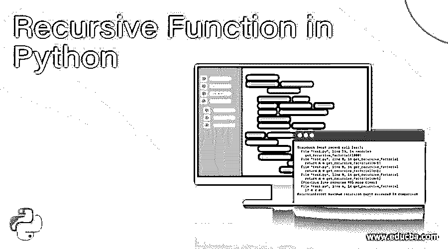
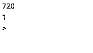
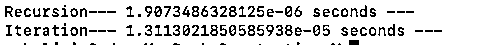
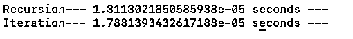
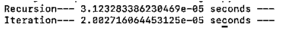
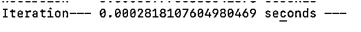
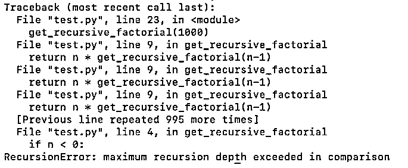

# Python 中的递归函数

> 原文：<https://www.educba.com/recursive-function-in-python/>




## 什么是递归函数？

Python 中的递归函数用于在程序执行过程中，通过分而治之的逻辑，反复调用同一个函数，直到循环达到期望值。在 Python 程序中使用递归函数的一个明显的缺点是,“如果递归不是一个受控的流程，它可能会导致系统内存的大量消耗。为了纠正这个问题，可以使用增量条件循环来代替 python 编程语言中的递归函数。

### Python 中的递归函数

Python 中递归的概念保持不变。该函数调用自身将问题分解成更小的问题。我们能想到的最简单的递归例子是寻找一个数的阶乘。

<small>网页开发、编程语言、软件测试&其他</small>

假设我们需要找到数字 5 的阶乘=> 5！(我们的问题)

去找 5！问题可以分解成更小的 5！=> 5 x 4！

所以，要得到 5！我们需要找到 4 个！然后乘以 5。

让我们继续分开这个问题

5!= 4!x 5

4!= 3!x 4

3!= 3 x 2！

2!= 2 x 1！

1! = 1

当它到达最小的块时，即得到 1 的阶乘时，我们可以返回如下结果

让我们以伪代码为例:-

### 阶乘算法

让我们看看阶乘的算法:

```
function get_factorial( n ):
    if n < 2:
        return 1
    else:
      return get_factorial(n -1)
```

### 函数调用

假设我们正在寻找 5 的阶乘。

```
get_factorial(5)		5 * get_factorial(4)  = returns 120  #1st call
  get_factorial(4)	  4 * get_factorial(3) = returns 24 #2nd call
    get_factorial(3)	    3 * get_factorial(2) = returns 6 #3rd call
      get_factorial(2)     2 * get_factorial(1) = returns 2 #4th call
        get_factorial(1)	  returns 1  #5th call
```

最终结果将是 120，这是我们开始执行函数的地方。当数字减少到可以得到结果时，我们的递归函数将停止。

*   第一个调用是获取 5 的阶乘，将导致一个递归条件，它将被添加到堆栈中，另一个调用将在数字减少到 4 后进行。
*   这种递归将继续调用并将问题分解成更小的块，直到达到基本条件。
*   这里的基本条件是当数字为 1 时。
*   每个[递归函数](https://www.educba.com/recursive-function-in-c/)都有自己的递归条件和基条件。

### Python 递归函数的利与弊

*   递归的执行是这样的，在到达基本条件之前，它不会做任何计算。
*   在达到基本条件时，您可能会耗尽内存。
*   在一个大问题中可能有一百万个步骤，或者我们可以说一百万次递归执行程序可能会导致内存错误或分段错误。
*   1000000! = 1000000 * 999999 ! =?
*   递归不同于迭代；它不像迭代方法那样按比例增加。
*   不同的语言对递归有不同的优化。
*   在许多语言中，迭代方法比递归执行得更好。
*   每种语言对递归的深度都有一些限制，这是你在解决大型问题时可能会遇到的。
*   有时候用递归很难理解复杂的问题，而用迭代却很简单。

#### 一些专业人士

*   在某些情况下，递归是一种方便快捷的使用方法。
*   非常有用的树和二分搜索法的遍历。

### Python 代码——递归与迭代

我们了解什么是递归以及它在 Python 中是如何工作的，因为我们知道所有语言都有不同的内存和计算优化递归实现。可能存在迭代比递归更快的情况。

这里我们将比较递归和迭代方法，看看 Python 在这两种情况下的表现。

#### 1.阶乘的递归代码

```
def get_recursive_factorial(n):
    if n < 0:
        return -1
    elif n < 2:                                     #base condition
        return 1
    else:
        return n * get_recursive_factorial(n -1)    #recursion condition
```

#### 2.使用迭代的阶乘问题(循环)

```
def get_iterative_factorial(n):
    if n < 0:
        return -1
    else:
        fact = 1
        for i in range( 1, n+1 ):
            fact *= i
        return fact
```

#### 3.打印结果

```
print(get_recursive_factorial(6))
print(get_iterative_factorial(6))
```

**输出:**




正如我们所看到的，两者都给出了相同的输出，因为我们已经编写了相同的逻辑。在这里我们看不出执行力有什么不同。

让我们添加一些时间代码来获得更多关于 Python 中递归和迭代执行的信息。

我们将导入“time”库，并检查递归和迭代返回结果需要多少时间。

#### 4.带时间计算的代码

```
import time
def get_recursive_factorial(n):
    if n < 0:
        return -1
    elif n < 2:
        return 1
    else:
        return n * get_recursive_factorial(n-1)
def get_iterative_factorial(n):
    if n < 0 :
        return -1
    else:
        fact = 1
        for i in range(1, n+1): 
            fact *= i
        return fact
start_time = time.time()
get_recursive_factorial(100)
print("Recursion--- %s seconds ---" % (time.time() - start_time))
start_time = time.time()
get_iterative_factorial(100)
print("Iteration--- %s seconds ---" % (time.time() - start_time))
```

我们将使用不同的阶乘值重复执行，并查看结果。以下结果可能因机器而异。我们用过 MacBook Pro 16 GB RAM i7。

我们使用 Python 3.7 来执行

情况 1:-6 的阶乘:




案例 2:50 的阶乘:




案例 3:100 的阶乘:




案例 4:500 的阶乘:


案例 5:1000 的阶乘:




We have analyzed both methods in a different problem. Moreover, both have performed similar except case 4.

在案例 5 中，我们在使用递归时遇到了一个错误。




Python 对递归的最大深度有限制，但同样的问题我可以用迭代来解决。

Python 对溢出问题有限制。Python 没有针对尾部递归进行优化，不受控制的递归会导致堆栈溢出。

“sys.getrecursionlimit()”函数会告诉您递归的限制。

递归限制可以更改，但不推荐使用；这可能很危险。

### 结论–Python 递归函数

*   对于像树遍历和其他问题，递归是一个方便的解决方案。
*   Python 不是一种函数式编程语言，我们可以看到，与迭代相比，递归堆栈并没有那么优化。
*   我们应该在我们的算法中使用迭代，因为它在 Python 中更优化，给你更快的速度。

### 推荐文章

这是 Python 中递归函数的指南。这里我们讨论什么是递归函数，Python 中的递归函数，阶乘的算法等等。您也可以浏览我们推荐的其他文章，了解更多信息——

1.  [Python 中的阶乘](https://www.educba.com/factorial-in-python/)
2.  [火花外壳命令](https://www.educba.com/spark-shell-commands/)
3.  [终于在 Python 中](https://www.educba.com/finally-in-python/)
4.  [Python 中的 Lambda](https://www.educba.com/lambda-in-python/)


