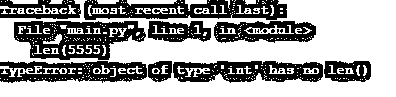

# Python len 函数

> 原文：<https://www.educba.com/python-len-function/>


## Python len 函数简介

Python len()函数是一个预定义或内置的函数，它返回作为参数传递给它的字符串的长度。Python len()函数是 Python 中最常见的内置功能之一，用于获取与我们正在处理的数据集相关的属性，尤其是长度。在本文中，我们将带您了解如何使用 len()函数获取数组、元组、字典、数据集中的一列的长度&一个示例字符串。

****语法:****

<small>网页开发、编程语言、软件测试&其他</small>

```
len(str)
```

**这里，一个字符串作为参数传递&len()函数返回该字符串的长度。**

 **### Python len 函数示例

下面是 Python len 函数的不同例子。

#### 示例#1

****代号:****

```
# Python program to demonstrate the usage of len() functon in python
# Length of below string is 3
str = "EDU"
print("Length of str1 is:")
print(len(str))
# Length of below string is ?
str2 = "EDU CBA"
print("Length of str2 is:")
print(len(str2))
```

****输出:****


**NOTE:** len() function takes into account each type of character to calculate the length of that string, whether it be a space numeral or even the special characters.

如果我们有一个巨大的数据集，并且我们想根据需求将 len()函数应用于特定的列，该怎么办呢？这是否也适用于数据框？让我们举一个现实生活中的例子，以便理解相同。

#### 实施例 2

****代号:****

```
# importing pandas module
import pandas as pd
# reading csv file from url
DF = pd.read_csv("C:/Users/name/Desktop/Projects/abc.csv")
## dropping null value columns to avoid errors as nulls can not be passed on to len() function
DF = DF.dropna()
# converting to string dtype
DF["Salary"]= DF["Salary"].astype(str)
# passing values
DF["Salary Length"]= DF["Salary"].str.len()
# converting back to float dtype
DF["Salary"]= DF["Salary"].astype(float)
# display
DF
```

****输出:****


让我们通过这个程序的功能来理解当一个整数作为参数传递时 len()函数的用法。

```
len(5555)
```

如果将一个整数作为参数传递给 len()函数，就像上面的语句一样，那么 python 客户端会抛出下面的错误:




这就是为什么我们使用下面的语句通过类型转换将 int 类型的 salary 列转换为一个字符串。

```
DF["Salary"]= DF["Salary"].astype(str)
```

可以将该列传递给 len()函数，使用下面的语句计算薪水的多少。

```
DF["Salary Length"]= DF["Salary"].str.len()
```

为每一行返回的值被返回并存储在数据框 DF 的“薪金长度”列中。要将名为“Salary”的列的数据类型恢复为原来的类型，我们可以使用 astype 函数传递所需的数据类型。我们把它转换成一个浮点值。使用下面的语句也可以做到这一点。

```
DF["Salary"]= DF["Salary"].astype(float)
```

最后，当我们在最后打印数据帧时，我们看到了预期的结果。

#### 实施例 3

len()函数也适用于一个元组吗？让我们举另一个例子来验证这一点:

****代号:****

```
## Python Program to find the length of a tuple
Tupl = ('Jan', 'feb', 'mar', 'apr', 'may', 'jun', 'jul', 'aug', 'sep', 'oct', 'nov', 'dec')
print("The value returned by len() function for this tuple is \n", len(Tupl))
```

****输出:****


***NOTE:** As expected, the len() function will be applied to the whole tuple, and the value returned will be the count of the elements present within the tuple. And not the length of each element present in the tuple.*

#### 实施例 4

让我们再举一个例子，其中我们将获得 python 字典中存在的元素数量:

****代号:****

```
## Python Program to find the length of a dictionary
Dic = {'EDU': 18,'CBA':12,'EDU CBA':22,'EDU EDU':25}
print("The value returned by len() function for this dictionary is \n", len(Dic))
```

你对这个程序的输出有什么期望？

*   **案例一:**字典内每个元素的长度？
*   **情况 2:** 字典的长度，即字典中存在的元素数量的计数？

是的，你是对的。案例二是。

****输出:****


因为我们在 python 字典中有四个元素[。因此 len()函数将返回值 4。](https://www.educba.com/python-dictionary-methods/)

#### 实施例 5

让我们举另一个简单的例子来理解 len()函数如何处理 python 中的数组。

****代号:****

```
## Python Program to find the length of an array
arr = ['EDU','CBA'] 
print("The value returned by len() function for this array is ", len(arr))
```

****输出:****


### 推荐文章

这是 Python len 函数的指南。这里我们讨论 Python len 函数的介绍，以及不同的例子和代码实现。您也可以阅读以下文章，了解更多信息——

1.  [Python 列表删除()](https://www.educba.com/python-list-remove/)
2.  [备忘单 Python](https://www.educba.com/cheat-sheet-python/)
3.  [Python 中的 strip 函数](https://www.educba.com/strip-function-in-python/)
4.  [Python 格式()函数](https://www.educba.com/python-format-function/)


**