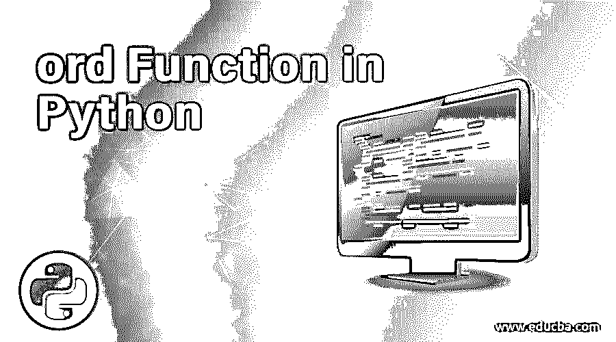
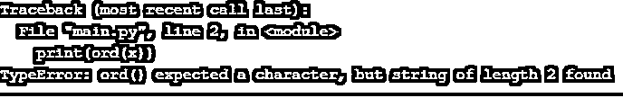
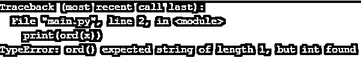

# Python 中 ord 函数

> 原文：<https://www.educba.com/ord-function-in-python/>

## Python 中的 ord 函数是什么？

Ord 是一个函数(序数的缩写),它返回一个表示传递给它的字符的整数。这意味着每个字符都有一个整数值；这些字符不能被计算机直接读取；它首先将每个字符转换成 ASCII 码。Python 为我们提供了 ord 函数，可以生成任意字符的 ASCII 码，而且会是整数。ord 函数只接受一个字符。您可以用单引号或双引号传递这个字符。也可以在 ord 函数内部传递字符串值，但字符串的长度应该是 1；否则，ord 函数将返回一个错误。

ASCII 是一种编码标准，它为键盘上的每个字符分配一个整数值。每个字符都有它的整数值。对于大写和小写字符，结果将是不同的。

<small>网页开发、编程语言、软件测试&其他</small>

`Syntax: ord(character)`

### Python 中的 ord 函数示例

在本文中，我们将借助几个例子来讨论 python 中的 ord 函数。

#### 示例#1

**代码:**

`x = 'a'
print(ord(x))`

**输出:**

正如你在上面的代码中看到的，我们已经在 ord 函数中传递了' a'。

#### 实施例 2

**代码:**

`x = 'A'
print(ord(x))`

**输出:**

所以从上面的例子可以看出，程序已经返回了一个整数值；这个整数值是“A”的 ASCII 码，即大写字母 A。这里需要注意的重要一点是，当我们谈论 ASCII 码时，那么 A！= a .表示大写字母不等于小写字母。他们都有自己的 ASCII 码。

#### 实施例 3

**代码:**

`x = "A"
print(ord(x))`

**输出:**

在上面的程序中，我们在双引号中有大写字母 A，所以它的字符串长度和 ord 函数将接受并返回相同的整数值。

#### 实施例 4

**代码:**

`x = "Ab"
print(ord(x))`

**输出:** 

正如你所看到的，这一次，我们有“Ab”，它是一个字符串，但字符串的长度是 2，而 ord 函数期望的字符串长度是 1。

#### 实施例 5

**代码:**

`x = "1"
print(ord(x))`

**输出:**

在上面的例子中，我们可以看到我在单引号中使用了整数值，即 1，所以当我们使用双引号时，它是一个字符串，所以现在 1 是一个长度的字符串，我们得到了想要的结果。

#### 实施例 6

**代码:**

`x = '1'
print(ord(x))`

**输出:**

在上面的例子中，我们在单引号中使用了 1，所以它现在是一个字符。所以 ord 函数会成功地执行它，我们得到了想要的结果。

#### 实施例 7

**代码:**

`x = 1
print(ord(x))`

**输出:**

在上面的例子中，我们与前面的代码具有相同的值，这一次，我们在 ord 函数中直接使用了 1，但是 ord 函数不会执行它，因为它预期长度为 1 的字符或字符串，并且 ord 函数将返回一个错误。

#### 实施例 8

**代码:**

`x = ' '
print(ord(x))`

**输出:**

在上面的程序中，你可能想知道我们提到了一个空字符，但 org functions 仍然工作，但它不是空的；这是一个单独的空间。单个空格也是 ASCII 图表中的一个字符，它的值是 32。空格是 ASCII 图表中的第一个字符。

#### 实施例 9

**代码:**

`x = '#'
print(ord(x))`

**输出:**

在上面的例子中，我们使用了一个特殊字符，ord 函数也适用于这个特殊字符。

#### 实施例#10

**代码:**

`x = '.'
print(ord(x))`

**输出:**

在上面的例子中，我有“.”作为 ord 函数的输入，我们已经得到了预期的结果。

### 结论

Ord 函数将单个字符或长度为 1 的字符串作为输入，并返回整数，即 ASCII 等价代码。计算机只理解这些 ASCII 码；ASCII 码被转换成计算机用来处理信息的二进制码。

### 推荐文章

这是 Python 中 ord 函数的指南。在这里，我们讨论 Python 中 ord 函数的基本概念和例子，以及输出。您也可以看看以下文章，了解更多信息–

1.  [在 Python 中设置函数](https://www.educba.com/python-set-function/)
2.  [Python 中的一元运算符](https://www.educba.com/unary-operators-in-python/)
3.  [Python 列表删除()](https://www.educba.com/python-list-remove/)
4.  [Python 格式()函数](https://www.educba.com/python-format-function/)

