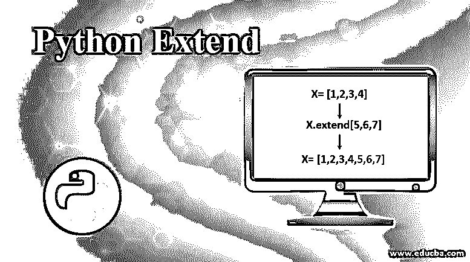
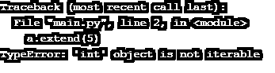

# Python 扩展

> 原文：<https://www.educba.com/python-extend/>




## Python Extend 简介

Python 扩展是 python 中的一个伟大特性。这是一个关键字，也是一种方法。我们可以使用 python extend 将任何类及其特性扩展到现有代码中。在面向对象的范例中，它也被称为继承。Extend 也是 python 中的一个内置方法，可以与列表或数组一起使用来扩展其项目。它几乎是一个类似于列表的追加方法。

当我们对 array 使用 extend 方法时，它将接受两个数组，并在第一个数组的末尾附加另一个数组。Append 也以类似的方式工作，但是它在 append 的情况下创建嵌套数组，而 extend 方法不创建嵌套数组；它将第二个数组的元素添加到第一个数组中。

<small>网页开发、编程语言、软件测试&其他</small>

**语法:**

```
array_one.extend(array_two)
```

### Python 扩展的例子

python extend 的例子有:

#### 示例# 1–扩展阵列

**代码:**

```
import array as arr
arr1 = arr.array('i', [1,2,3,4])
arr2 = arr.array('i', [5,6,7])
arr1.extend(arr2)
print(arr1)
```

**输出:**


在上面的程序中，我们已经导入了数组模块，并给它起了一个别名‘arr’。我们创建了两个数组 arr1，arr2。这些是整数类型的数组。然后我们使用了扩展方法。我们使用 arr1 作为主阵列，因为我们想用 arr2 的元素扩展 arr1。我们既传递了数组，又传递了输出；你可以看到我们有两个数组的元素。

#### 示例 2–扩展列表

**代码:**

```
a = [1,2,3,4,5]
b = [6,7]
a.extend(b)
print(a)
```

**输出:**


在上面的程序中，我们创建了两个列表，a 和 b。这两个列表都有整数类型的元素。然后我们用列表' b '的元素扩展列表' a'。在输出中，您可以看到列表 b 的所有元素都扩展到了列表 a 中。

#### 实施例 3

**代码:**

```
a = [2010,2011,2012]
b = ['john','doe',2013]
a.extend(b)
print(a)
```

**输出:**


在上面的程序中，你可以看到我们已经创建了两个列表；在第二个列表中，我们添加了整数值和字符串值。Extend 方法适用于同一列表中的整数和字符串元素。正如您在输出中看到的，第一个列表被扩展了。

Extend 方法仅在传递的项是可迭代的情况下有效。Iterable 意味着它可以循环。如果列表只有一个元素，那么它也是可迭代的。但是我们已经尝试在 extend 方法中直接传递值；然后，就会产生错误。

#### 实施例 4

**代码:**

```
a = [2010,2011,2012]
a.extend(5)
print(a)
```

**输出:**




如您所见，我们在 extend 方法中传递了 value 而不是 list，它返回了一个错误“object is not iterable”。我们传递的值是一个整数，但是如果我们传递了一个字符串值，那么 extend 方法将会很好地工作，因为字符串是字符的集合。

#### 实施例 5

**代码:**

```
a = [2010,2011,2012]
a.extend("John")
print(a)
```

**输出:**


正如你在上面的例子中看到的，我们传递了一个字符串值，而不是一个列表，但是它仍然有效。Extend 方法将字符串值视为字符的集合，它们是可迭代的。所以我们可以说字符串是可迭代的。输出可能不是我们想要的，因为它分隔了字符串中的每个字符。但是我们已经使用 append 方法执行了上面的操作，那么我们将得到想要的结果。append 方法不会分隔每个字符串。

### 结论

当我们已经有了一个数组或列表，并且希望在其中添加更多元素时，Python 扩展特性是一个非常有用的方法。使用 extend 方法，我们可以很容易地做到这一点，而不需要做任何类型的元素，也不需要逐个插入元素。它将一次性添加所有元素。

### 推荐文章

这是 Python 扩展的指南。这里我们讨论 python extend 的介绍，以及不同的例子和它的代码实现。您也可以看看以下文章，了解更多信息–

1.  [Python 列表删除()](https://www.educba.com/python-list-remove/)
2.  [Python 中的多重继承](https://www.educba.com/multiple-inheritance-in-python/)
3.  [Python 特性](https://www.educba.com/python-features/)
4.  [Python 逆向列表](https://www.educba.com/python-reverse-list/)


