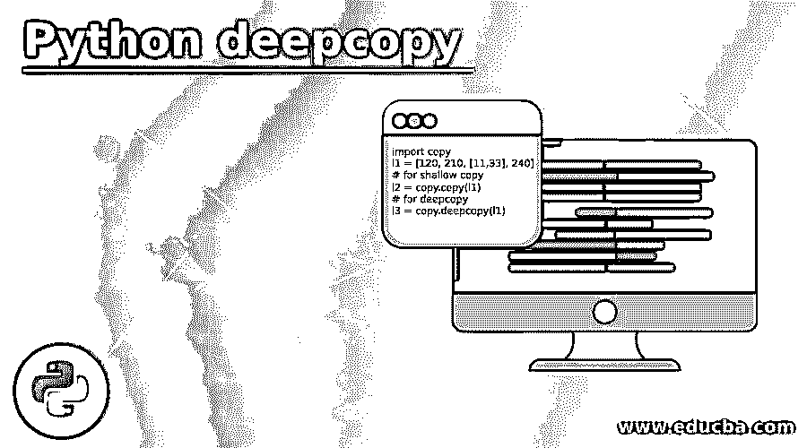
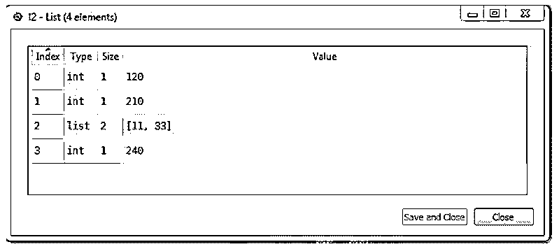
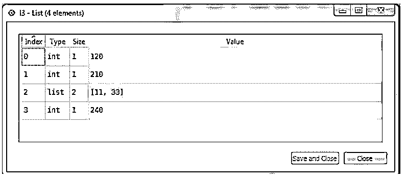
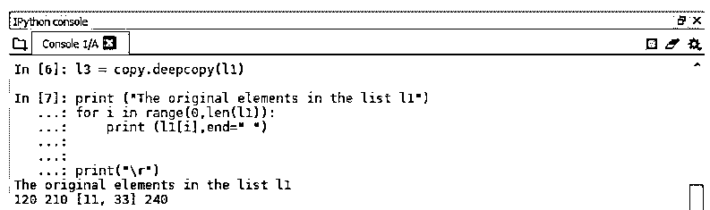
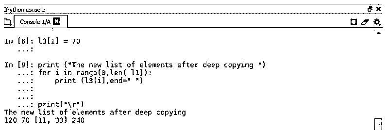
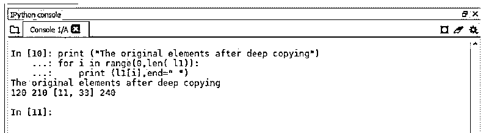
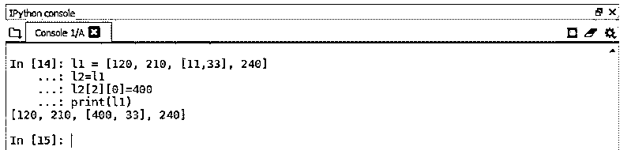
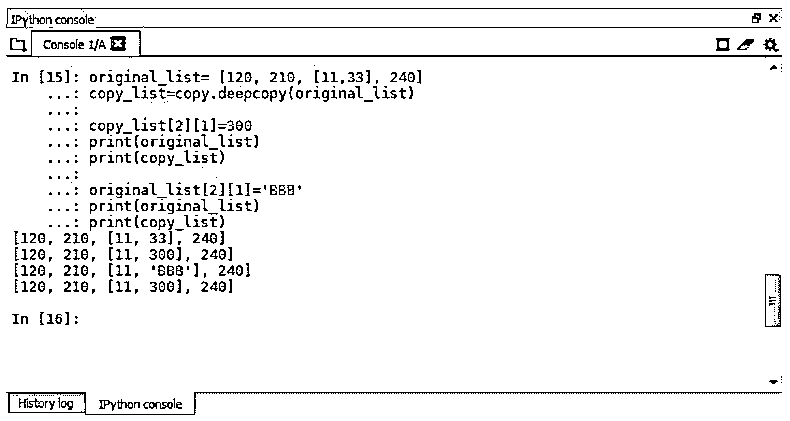
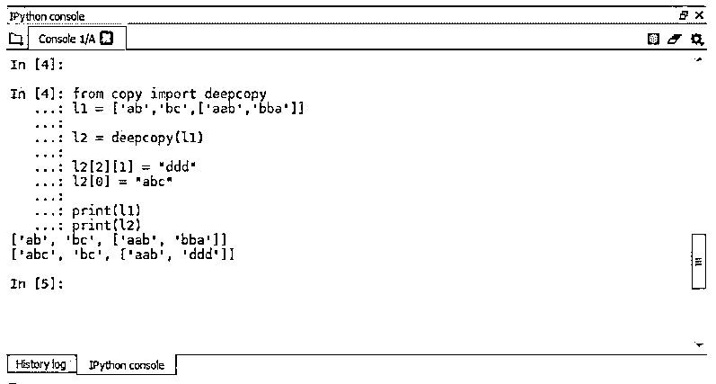
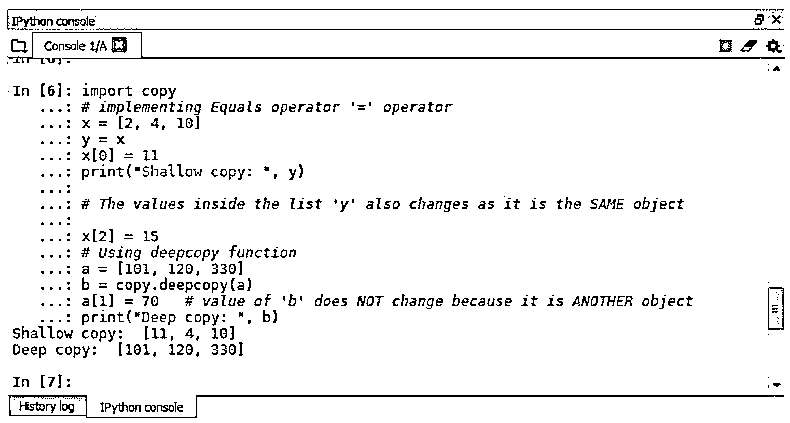

# Python deepcopy

> 原文：<https://www.educba.com/python-deepcopy/>




## Python deepcopy 简介

deepcopy 是一种创建 python 对象副本的技术，用户可以通过创建实际对象的副本来处理可变对象，而无需更改或修改原始对象。或者换句话说，当用户决定通过实现允许用户在不编辑或改变实际对象的情况下对其进行操作的不同操作来修改对象时，可以通过实现 deepcopy 语法从原始对象进行复制来执行。

### Python deepcopy 的语法

有两种类型的拷贝浅层拷贝和深层拷贝，用户可以根据需要或使用拷贝的目的在 Python 中执行。

<small>网页开发、编程语言、软件测试&其他</small>

Python copy 的基本语法。

**语法:**

```
import copy
l1 = [120, 210, [11,33], 240]
# for shallow copy
l2 = copy.copy(l1)
# for deepcopy
l3 = copy.deepcopy(l1)
```

**输出:**

**浅拷贝**




**深度复制**




上面的代码显示了我们声明的列表 l1 的 Shallowcopy 和 deepcopy 的输出。deepcopy 将以递归方式复制原始对象，其中初始文档只需复制原始对象。那么子对象的连续副本将被递归地复制，使得原始对象保持不变。代码中使用了函数 deepcopy()来执行 deepcopy 操作，其中在对象的 deepcopy 中所做的更改不会反映在原始对象中。

### deepcopy 是如何工作的？

这里展示了一个简单的例子，我们在一个列表上执行了 deepcopy 操作，然后修改了复制的列表并打印了列表中的实际值和复制的值，从而清楚地展示了 deepcopy 对象的功能。

**语法:**

```
import copy
l1 = [120, 210, [11,33], 240] 

# using deepcopy for copying l1   
l3 = copy.deepcopy(l1)

print ("The original elements in the list l1") 
for i in range(0,len(l1)): 
    print (l1[i],end=" ") 

print("\r") 

# Altering the Deepcopy list l3
l3[1] = 70

# Change made at 2nd position is seen in list l2  
print ("The new list of elements after deep copying ") 
for i in range(0,len( l1)): 
    print (l3[i],end=" ") 

print("\r") 
### The Actual List l1 remains unchanged  
print ("The original elements after deep copying") 
for i in range(0,len( l1)): 
    print (l1[i],end=" ")
```

**输出:**

**实际清单 l1**




**变更列表 l3**




**未改变的实际列表 l1**




像列表、类或其他东西这样的复合对象的相关性使得浅拷贝和深拷贝有所不同。deepcopy 新创建了一个复合对象，如列表或类，并且递归地从实际对象中复制对象，因此 deepcopy 中的任何更改都不会反映在原始对象中。

当用户使用=操作符创建一个重复的对象并将它赋给一个不同的变量时，它看起来就像一个独立的对象。尽管如此，它表示原始对象，因此对同一事物的任何更改都会导致原始对象的更改。

**举例:**

在下面的例子中，我们看到了=运算符的功能。

**语法:**

```
l1 = [120, 210, [11,33], 240]
l2=l1
l2[2][0]=400
print(l1)
```

**输出:**




在输出中，我们可以看到，一旦使用=运算符创建的副本被更改，原始列表 l1 就被更改了。因此，为了避免这种情况并且不改变原始列表，我们使用 Python deepcopy，它保留了原始列表，并允许我们在副本中更改和执行不同的操作。

**举例:**

这里我们有一个例子，说明在执行 deepcopy 时，原始对象和副本对象作为唯一对象独立工作。

**语法:**

```
original_list= [120, 210, [11,33], 240]
copy_list=copy.deepcopy(original_list)
copy_list[2][1]=300
print(original_list)
print(copy_list)
original_list[2][1]='BBB'
print(original_list)
print(copy_list)
```

**输出:**




在上面的例子中，我们创建了两个列表，修改了两个列表，并打印了值，所以输出显示两者都是独立的，一个不影响另一个对象。这是 Python 中 deepcopy 的主要目标。

**举例:**

更多 deepcopy 的例子，以更好地理解 deepcopy 的功能。

**语法:**

```
from copy import deepcopy
l1 = ['ab','bc',['aab','bba']]
l2 = deepcopy(l1)
l2[2][1] = "ddd"
l2[0] = "abc"
print(l1)
print(l2)
```

**输出:**




**语法:**

```
import copy
# implementing Equals operator '=' operator
x = [2, 4, 10]
y = x
x[0] = 11
print("Shallow copy: ", y)
# The values inside the list 'y' also changes as it is the SAME object
x[2] = 15
# Using deepcopy function
a = [101, 120, 330]
b = copy.deepcopy(a)
a[1] = 70
print("Deep copy: ", b)
```

**输出:**




在上面的例子中，我们有两个列表，a & b 和 x & y，它们都有数字，我们修改了这两个列表，在列表的不同位置替换了不同的值，并打印出相应的输出。当我们使用 Shallowcopy 函数时，我们发现一旦 x 的值改变，对象 y 也随之改变，这限制了我们保留旧的和实际的对象。所以为了克服这个限制，我们使用了 deepcopy 函数并创建了 list b，它是 list a 的副本，更改是在 list a 中完成的；不要改变或更改这些值，因为它是一个完全独立和唯一的对象。

在导入包副本后可以调用 deepcopy 函数，deepcopy 和 shallowcopy 都可以从包副本中获得。我们可以使用导入拷贝或从拷贝导入深层拷贝。

### 结论

我们已经详细了解了 Python 编程平台中最流行的 Python deepcopy，因为它在处理原始对象的副本或拷贝时非常重要，用户可以创建实际事物的副本，并使其独立于原始对象，以使用精确的副本来执行多种操作或功能。在实现各种 Python 开发项目时，理解 Python deepcopy 非常方便。

### 推荐文章

这是 Python deepcopy 的指南。在这里，我们讨论 Python deepcopy 的介绍以及它如何与相应的示例一起工作。您也可以看看以下文章，了解更多信息–

1.  [终于在 Python 中](https://www.educba.com/finally-in-python/)
2.  [Python 空列表](https://www.educba.com/python-empty-list/)
3.  [Python 中的 Lambda](https://www.educba.com/lambda-in-python/)
4.  [Python BeautifulSoup](https://www.educba.com/python-beautifulsoup/)


