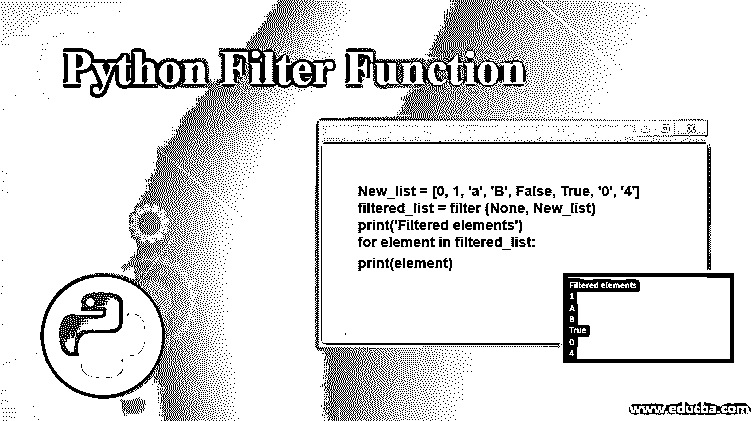
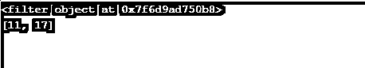
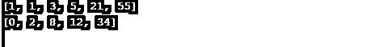
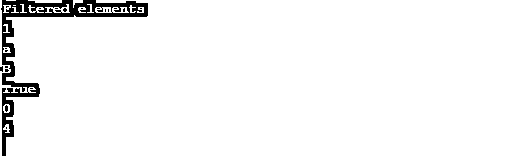

# Python 过滤器函数

> 原文：<https://www.educba.com/python-filter-function/>

## Python 过滤器函数简介

filter 函数是 Python 程序中可以使用的编程原语之一。它内置于 Python 中，提供了一种优雅的方式来过滤掉序列中函数使用 Lambda 表达式返回 True 的所有元素。与 map 函数不同，filter 函数只需要一个 iterable。

### 什么是 Lambda 表达式？

lambda 表达式是函数的匿名内嵌声明，通常作为参数传递。它可以做常规函数能做的任何事情，除了它不能在定义它的行之外被调用，因为它是匿名的:它没有名字。当你需要一个简短的、一次性的匿名函数时，Lambda 函数非常有用。一些你只会用一次的简单的东西。常见的应用是排序和过滤数据。

<small>网页开发、编程语言、软件测试&其他</small>

`lambda arguments: expression`

键入关键字 Lambda，后跟零个或多个输入。就像函数一样，没有输入的匿名函数是完全可以接受的。接下来，键入一个冒号。最后，你输入一个表达式。这个表达式是一个返回值。不能对多行函数使用 Lambda 表达式。

**filter()的语法:**

`filter (function, iterable)`

**过滤参数:**

过滤函数有两个参数:

*   **函数**:测试 iterable 的元素是真还是假的函数。如果没有，函数默认为 identity function，如果任何元素为 false，则返回 false。
*   **Iterable** :要过滤的 Iterable 可以是集合、元组、列表或任何迭代器的容器。

### 理解 Python 过滤器函数的示例

让我们讨论一下 Python 过滤器函数:

过滤平均值以上的值。

#### 示例#1

**代码:**

`import statistics
data = [1,3,5,7,11,17] #The short list of data is collected from a nearby fuel sensor.
avg= statistics.mean (data)
new =filter(lambda x : x > avg, data)
print(new)
new =list(filter(lambda x: x>avg, data))
print(new)`

*   首先，导入统计模块，因为它包含均值函数。
*   让我们计算一下这个数据的平均值。
*   然后显示平均值，这样您就可以看到过滤器按预期工作。
*   现在我们使用过滤函数来选择大于平均值的数据。
*   我们创建一个匿名函数来创建输入(Lambda 表达式),以查看它是否高于平均值。
*   接下来，传入最后一个数据。
*   filter()将只返回函数为真的数据。

**输出:**

很整洁，是吧！再来看几个。

**注:**

The return value of the filter() is not a list.It is a filter object (<filter object at 0x7f04cc7ec950>). Which is actually an iterator over the results. This is highly favorable, especially working with large collections of data. We can, however, turn this into a list by passing the filter to the list constructor.

如果简洁是智慧的灵魂，那么 Python 本身就是一个类别。

**小常识:**如果你有 Python 3.x 版本，filter 方法返回一个生成器，即可以被遍历。如果您使用的是 Python 2.x 版本，filter 方法会返回一个列表。

#### 实施例 2

考虑一个过滤奇数和偶数的程序。

**代码:**

`Fibnocci = [0,1,1,2,3,5,8,12,21,34,55] odd_numbers = list (filter (lambda x : x %2, Fibnocci))
print (odd_numbers)
even_numbers = list (filter(lambda x : x%2 == 0, Fibnocci))
print(even_numbers)`

**输出:**

#### 实施例 3

当 None 值传递参数时会发生什么？

下面创建了一个随机数据列表，由字符串、整数和布尔值组成。当筛选器的 function 参数为 None 时，它会根据元素是 True 还是 False 来筛选出数据，并相应地返回。

**代码:**

`New_list = [0, 1, 'a', 'B', False, True, '0', '4'] filtered_list = filter (None, New_list)
print('Filtered elements')
for element in filtered_list:
print(element)`

**输出:**

在 Python 中，被视为 false 的值是空字符串“、零 0、空列表[]、空元组()、空字典{}、false、none，以及那些向 Python 表明它是普通实例的对象。

但是以这种方式使用过滤函数时要小心。比如，在大多数情况下，0 0 是一个有效的数据，我不想把它过滤掉。

想知道是否有任何这样的功能，过滤虚假项目？

是的，确实如此。

`Itertools. Ifilterfalse (function, iterable)`

### 结论

map、filter 和 reduce 函数极大地简化了处理列表和其他可迭代数据集合的过程；事实上，如果您使用 lambda 表达式，您的工作通常可以在一行中完成。在你掌握了这些函数之后，你会意识到 Python 应该是一个喜剧演员，因为它充满了一句俏皮话。

### 推荐文章

这是一个 Python 过滤函数的指南。这里我们讨论过滤函数的语法和参数，以及不同的例子和代码实现。您也可以看看以下文章，了解更多信息–

1.  [Python 地图功能](https://www.educba.com/python-map-function/)
2.  [Python 中的过滤器](https://www.educba.com/filter-in-python/)
3.  [Python 逆向列表](https://www.educba.com/python-reverse-list/)
4.  [Python SQLite 创建数据库](https://www.educba.com/python-sqlite-create-database/)

