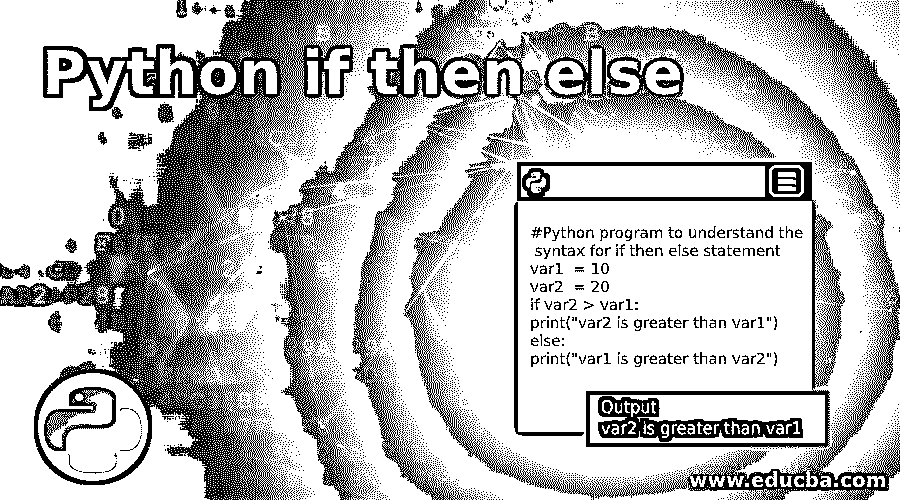
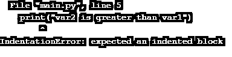

# Python 如果那么否则

> 原文：<https://www.educba.com/python-if-then-else/>




## Python 简介 if then else

python“if then else”是一个条件语句，用于基于现有变量之上的几个条件导出新变量。这也有助于 Python 中的决策，尤其是当我们希望仅在满足某些条件的情况下执行代码时。不同的逻辑运算符，如等于、小于、大于、小于等于、大于等于等。，可以与 if 语句一起使用。我们将详细讨论条件运算符，以及如何在 python 中使用 if then else 语句。

**语法:**

<small>网页开发、编程语言、软件测试&其他</small>

```
#Python program to understand the syntax for if then else statement
var1  = 10
var2  = 20
if var2 > var1:
   print("var2 is greater than var1")
else:
   print("var1 is greater than var2")
```

**输出:**


### Python 是如何工作的？

*   我们一开始就声明了变量，即 var1、var2，并分别给它们赋了静态值，即 10 和 20。
*   然后是 if 语句，它使用大于号运算符比较 var1 和 var2
*   基于这个逻辑比较的布尔输出，将决定下一个缩进语句的执行。
*   如果结果输出为真，那么将执行下一条语句，并跳过 else 语句。
*   否则，控制权将被传递给 else 语句，该语句下的语句将被执行。
*   这就是原因。这叫做 if then else 语句。因为逻辑条件评估为真，那么只执行第一组语句；否则，执行 else 语句下的第二组语句。
*   这个程序的结果也证实了这一点；if conditional 的值为 true，因为 var2(值为 20)大于 var1(值为 10)，因此我们可以将输出视为 if conditional 下第一个 print 语句的结果。

### 可以与 if 语句一起使用的条件运算符

让我们详细讨论可以与 if 语句一起使用来计算布尔表达式的条件运算符:

*   **等于(==):** 为了检查两个变量是否相等，使用了“等于”运算符。它由两个相等的数学符号组成，这就是它不同于赋值操作符的地方。例如:x == p
*   **不等于(！=):** 为了检查两个变量的不相等，使用了“不等于”运算符。它由一个非和一个等于一个数学符号组成。比如:x！= p
*   **小于(< ):** 为了检查两个变量的不相等，特别是当变量 1 小于变量 2 时，使用“小于”运算符。它由一个小于数学符号组成。比如:x < p
*   **小于等于(< = ):** 为了检查两个变量的不相等，特别是当变量 1 小于等于变量 2 时，使用“小于等于”运算符。它由一个小于和一个等于数学符号组成。比如:x < = p
*   **大于(> ):** 为了检查两个变量的不相等，特别是当变量 1 大于变量 2 时，使用“大于”运算符。它由一个大于数学符号组成。比如:x > p
*   **大于等于(> = ):** 为了检查两个变量的不相等，特别是当变量 1 大于等于变量 2 时，使用“大于等于”运算符。它由一个大于号和一个等号组成。比如:x > = p

### Python 中的“if then else”语句如何缩进？

让我们举一个例子来详细理解这一点:

#### 示例#1

**代码:**

```
#Python program to understand the indentation for if then else statement
var1  = 110
var2  = 20
if var2 > var1:
print("var2 is greater than var1")
else:
print("var1 is greater than var2")
```

**输出:**

这将抛出下面的错误。




原因是，我们需要在 if 和 else 语句后使用一段缩进的代码，如下所示:

**代码:**

```
#Python program to understand the indentation for if then else statement
var1  = 110
var2  = 20
if var2 > var1:
    print("var2 is greater than var1")
else:
    print("var1 is greater than var2")
```

**输出:**


#### 示例 2–在 if then else 中使用“AND”逻辑运算符

如果我们要检查不止一个条件，那么在这种情况下，可以使用 AND 运算符。我们举个例子来理解同样的道理。

**代码:**

```
#Python program to understand the usage of AND operator if then else statement
var1 = 10
var2 = 20
var3 = 30
if var2 > var1 and var3 > var1:
    print("var1 is smaller than var2 and var 3")
```

**输出:**


#### 示例 3–在 if then else 中使用“或”逻辑运算符

如果我们要检查不止一个条件，那么在这种情况下，也可以使用 OR 操作符。我们举个例子来理解同样的道理。

**代码:**

```
#Python program to understand the usage of OR operator if then else statement
var1 = 10
var2 = 20
var3 = 30
if (var2 > var1) | (var3 > var1):
    print("var1 is not the greatest variable")
```

**输出:**


这里，我们将代码的比较部分封装在圆括号中，并对其应用 OR(|)运算符

### 结论–Python if then else

python“if then else”条件语句对于程序中基于条件值运行某段代码的决策非常有用。我们有许多运算符可以和“if then else”语句一起使用来计算这些条件。制表符必须缩进要运行的语句；否则，Python 将抛出一个错误。

### 推荐文章

这是 Python 的一个指南。在这里，我们讨论了介绍以及 Python if then else 如何与不同的示例及其代码实现一起工作。您也可以阅读以下文章，了解更多信息——

1.  [Python 绝对值](https://www.educba.com/python-absolute-value/)
2.  [Python 修剪字符串](https://www.educba.com/python-trim-string/)
3.  [Python 中的过滤器](https://www.educba.com/filter-in-python/)
4.  [Python 设置方法](https://www.educba.com/python-set-methods/)


