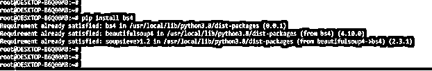
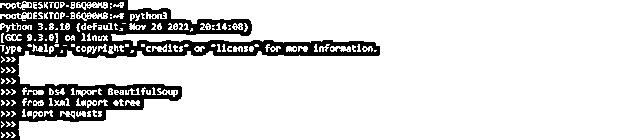
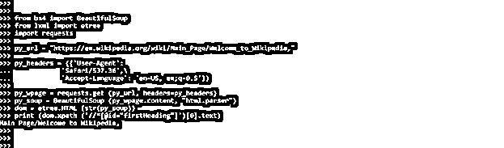
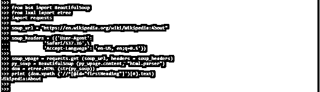
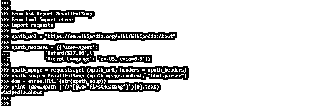

# BeautifulSoup XPath

> 原文：<https://www.educba.com/beautifulsoup-xpath/>


## 美丽组 XPath 的定义

Beautifulsoup xpath 的功能与标准文件系统相同。默认情况下，BeautifulSoup 不支持 xpath。因此，我们的汤对象必须转换成 etree 的东西。XPath 1.0 由一个名为 lxml 的替代库支持。它包含了一个 BeautifulSoup 兼容模式，该模式试图以 Soup 相同的方式解析破损的 HTMLBeautifulsoup xpath 在 python 中非常有用且必不可少。

### 什么是 BeautifulSoup XPath？

*   另一方面，默认的 lxml HTML 解析器做了类似的解析不完整 HTML 的工作，并且速度更快。一旦我们将页面解析成 lxml 树，就可以使用 xpath 函数来查找元素。
*   使用 lxml 从网页元素获取数据需要使用 Xpaths。XPath 的功能类似于典型的文件系统。
*   刮擦是产生初始研磨的唯一方式，该初始研磨可用于将该精度传递到其他表面。然而，因为它们影响孤立的高或低的地方，研磨和磨削不能产生刮削可能产生的长距离的平面度。

### 如何使用 BeautifulSoup XPath？

*   我们需要安装各种包来在我们的项目中使用漂亮的 xpath。下面的步骤展示了如何使用漂亮的 xpath。

1.  在这一步中，我们使用 pip 命令安装 bs4 包。Bs4 包用于导入所有的 beautifulsoup 模块。在下面的例子中，我们已经在我们的系统中安装了 bs4 包，所以它将显示需求已经得到满足，所以我们不需要做任何事情。

```
pip install bs4
```




2\. After installing the bs4 package in this step, we are installing the requests packages because the requests package is also required when using beautifulsoup xpath in our project. In the below example, we have already installed the requests package in our system, so it will show that requirement is already satisfied, then we have no need to do anything.

<small>网页开发、编程语言、软件测试&其他</small>

```
pip install requests
```


3.在这一步安装了 requests 包之后，我们将安装 lxml 包，因为在我们的项目中使用 beautifulsoup xpath 时也需要 lxml 包。在下面的例子中，我们已经在我们的系统中安装了 requests 包，所以它将显示需求已经得到满足，然后我们不需要做任何事情。

```
# pip install lxml
```


4.我们可以使用以下方法找到特定元素的 xpath。首先，我们需要右键单击想要检查的元素，然后单击 elements 选项卡；我们需要复制 xpath。


5.安装完所有模块后，我们使用 python3 命令打开 python shell。

```
python3
```


6.打开 python shell 后，我们导入 beautifulsoup、etree 和 requests 模块。我们使用 bs4 包导入 beautifulsoup 模块，如下所示。

```
from bs4 import BeautifulSoup
from lxml import etree
import requests
```




*   在下一步中导入模块后，我们从网站获取内容并重新调整它的用途。因为 BeautifulSoup 默认情况下不支持处理 XPath，所以我们必须更改 etree 对象来使用它。而 Lxml 支持 XPath 1.0。此外，它还包括一个 BeautifulSoup 兼容模式，该模式试图以与 Soup 相同的方式解析破损的 HTML。要复制元素的 XPath，检查元素，然后右键单击它的 HTML 并查找 XPath。之后，我们使用 lxml 模块的 etree 类中的 xpath 方法。

**代码—**

```
from bs4 import BeautifulSoup
from lxml import etree
import requests
py_url = "https://en.wikipedia.org/wiki/Main_Page/Welcome_to_Wikipedia,"
py_headers = ({'User-Agent':
'Safari/537.36',\
'Accept-Language': 'en-US, en;q=0.5'})
py_wpage = requests.get (py_url, headers=py_headers)
py_soup = BeautifulSoup (py_wpage.content, "html.parser")
dom = etree.HTML (str(py_soup))
print (dom.xpath ('//*[@id="firstHeading"]')[0].text)
```




*   上面的例子表明，我们首先导入了 bs4、etree 和 requests 模块。导入模块后，我们使用 url。
*   使用完网址后，我们从网页上刮下内容；然后，为了转换 soup 对象，我们使用 xpath。

### 漂亮的 XPath 方法

*   当我们想到 python 中的 web 抓取时，Scrapy 是第一个想到的包。另一方面，Scrapy 更适合大型的刮擦项目。
*   然而，Scrapy 有一个需要时间的学习曲线。因此，Scrapy 对于那些我们只需要从网页上收集数据的小问题来说可能是多余的。
*   在这种情况下，我们可以使用请求和漂亮的 Soup/lxml 包快速抓取所需的内容。
*   这些说明包括所有主要功能的演示。以下示例显示了 beautifulsoup xpath 的方法，如下所示。

**代码—**

```
from bs4 import BeautifulSoup
from lxml import etree
import requests
soup_url = "https://en.wikipedia.org/wiki/Wikipedia:About"
soup_headers = ({'User-Agent':
'Safari/537.36',\
'Accept-Language': 'en-US, en;q=0.5'})
soup_wpage = requests.get (soup_url, headers = soup_headers)
py_soup = BeautifulSoup (py_wpage.content, "html.parser")
dom = etree.HTML (str(py_soup))
print (dom.xpath ('//*[@id="firstHeading"]')[0].text)
```




### 漂亮的 XPath 示例

*   下面的例子显示了 beautifulsoup xpath 如下。在下面的例子中，我们使用维基百科的网址如下。

**代码—**

```
from bs4 import BeautifulSoup
from lxml import etree
import requests
xpath_url = "https://en.wikipedia.org/wiki/Wikipedia:About"
xpath_headers = ({'User-Agent':
'Safari/537.36',\
'Accept-Language': 'en-US, en;q=0.5'})
xpath_wpage = requests.get (xpath_url, headers = xpath_headers)
xpath_soup = BeautifulSoup (xpath_wpage.content, "html.parser")
dom = etree.HTML (str(xpath_soup))
print (dom.xpath ('//*[@id="firstHeading"]')[0].text)
```




*   在上面的例子中，我们已经导入了 bs4、etree 和 requests 模块。导入模块后，我们使用 url。此外，我们正在使用维基百科的网址从网页上删除内容。

### 结论

一旦我们将页面解析成 lxml 树，就可以使用 xpath 函数来查找元素。Beautifulsoup xpath 的功能类似于标准文件系统。默认情况下，BeautifulSoup 不支持 xpath。相反，我们的 soup 对象必须转换成 etree 的东西。

### 推荐文章

这是 BeautifulSoup XPath 的指南。这里我们讨论定义，什么是 BeautifulSoup XPath，如何使用 BeautifulSoup XPath，以及带代码的例子。您也可以看看以下文章，了解更多信息–

1.  [XPath 名称空间](https://www.educba.com/xpath-namespace/)
2.  [XPath 祖先](https://www.educba.com/xpath-ancestor/)
3.  [XPath 备忘单](https://www.educba.com/xpath-cheat-sheet/)
4.  [XPath 属性](https://www.educba.com/xpath-attribute/)


