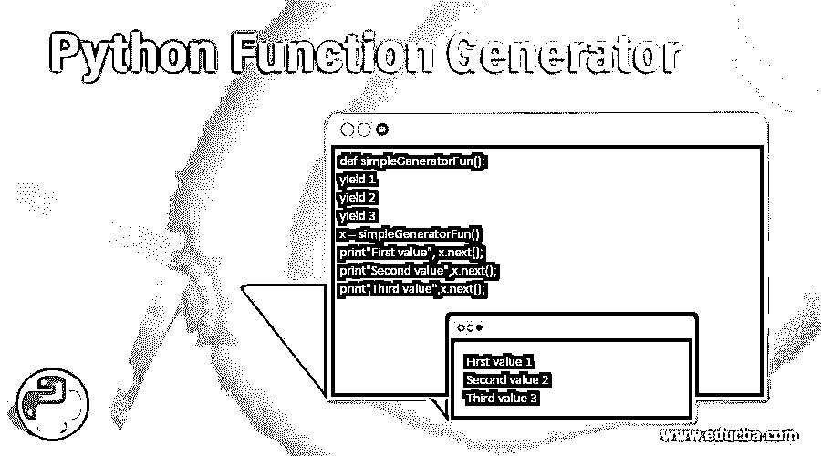
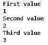
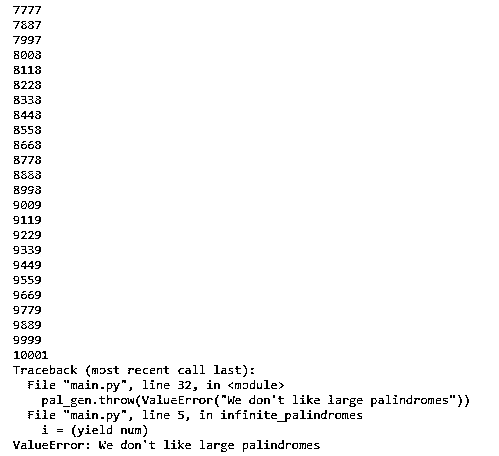

# Python 函数生成器

> 原文：<https://www.educba.com/python-function-generator/>

**

** 

## Python 函数生成器简介

python 编程语言中的函数被定义为函数体内的一组语句，通过调用函数名而不是这组语句，可以在程序中执行任意次。一个正常的函数通常会一直执行，直到找到返回语句、异常或函数结束。

生成器函数与 python 中的普通函数相同，但在普通函数中，它只能返回一个值，而在生成器函数中，它可以通过使用“yield”关键字返回一系列值。在正常函数中，return 语句的工作是将执行控制返回到调用函数的位置。在生成器函数中，yield 语句的工作是转移控制，这是临时的，因为它可以返回多个值。简而言之，生成器函数是创建迭代器的一种方式，这意味着该函数返回一个我们可以迭代的迭代器。

<small>网页开发、编程语言、软件测试&其他</small>

### Python 生成器函数是如何工作的？

在 python 中，与列表不同，生成器函数是在循环中返回值的特殊函数之一，但是这些迭代器不将内容存储在内存中。normal 函数和 generator 函数之间的唯一区别是，使用 yield 语句而不是 normal 函数 return 语句，yield 语句产生多个值，而不是像 normal 函数那样产生单个值。

**语法:**

```
def generator_function(arguments):
           statement(s)
yield [value] 
```

上面的代码是生成器函数在中的语法；这段代码类似于普通的函数语法，但是有一个 yield 语句而不是 return 语句。当解释器注意到一个 yield 语句而不是一个 return 时，它就把它当作一个生成器函数并返回一个迭代器。

正常函数中的 return 语句是最后一次调用，但是 yield 会暂时挂起函数的执行，然后继续执行。return 语句退出 yield 将值发送回调用者的函数。

在 Python 中，生成器是一个非常简单且有吸引力的话题，很容易实现。在普通函数中，返回值需要多个语句，但是如果使用生成器函数，它有助于代码的可重用性，从而节省行数。让我们看看下面计算 2 的幂的例子。

```
class power_two:
	def  _init_(self, max = 0 ):
		self. max = max

	def _iter_(self):
		self.n = 0
		return self

	def _next_(self):
		if self.n > self. max:
			raise StopIteration
			result = 2 ** self.n
			self.n+=1
			return result
```

因此，上面的例子可以用几行代码编写成一个生成器函数，而不是普通函数。

```
def power_two(max = 0 ):
	n = 0
	while n < max:
		yield 2 ** n
		n+ =1
```

这个生成器函数有两个主要方法，一个是停止迭代，另一个是从生成器获取下一个值，它们分别被声明为 iter()或 close()，以及 next()或 send()。生成器函数中还有另一个方法，称为 throw()方法，该方法通过生成器抛出一个异常。

### 实现 Python 函数生成器的示例

以下是 Python 函数生成器的示例:

#### 示例#1

**代码:**

```
def generator_funciton():
    a = 1
    print("First value")
    yield a

    a += 1
    print("Second value")
    yield a

    a += 1
    print("Third value")
    yield a

for x in generator_funciton():
    print(x)
```

**输出:**




**解释:**上面的例子是 yield 语句，给出了从 1 到 3 的一系列输出。要返回的“a”的值是 1，所以要打印这些值的序列，我们需要使用 for 语句来获取序列。因此，通过每次使用 yield 语句，值 a”增加 1，并使用 yield 语句返回。

因此，生成器对象或一系列值要么使用 for 循环返回，就像我们在上面的示例中所做的那样，另一个选项是使用 next()方法来获取一系列值或生成器对象。

#### 实施例 2

**代码:**

```
def simpleGeneratorFun(): 
   yield 1
   yield 2
   yield 3

x = simpleGeneratorFun() 

print"First value", x.next(); 
print"Second value",x.next(); 
print"Third value",x.next(); 
```

**输出:**


#### 实施例 3

的。throw()方法用于通过生成器抛出异常。

**代码:**

```
def infinite_palindromes():
    num = 0
    while True:
        if is_palindrome(num):
            i = (yield num)
            if i is not None:
                num = i
        num += 1

def is_palindrome(num):
    # Skip single-digit inputs
    if num // 10 == 0:
        return False
    temp = num
    reversed_num = 0

    while temp != 0:
        reversed_num = (reversed_num * 10) + (temp % 10)
        temp = temp // 10

    if num == reversed_num:
        return True
    else:
        return False

pal_gen = infinite_palindromes()
for i in pal_gen:
    print(i)
    digits = len(str(i))

    if digits == 5:
        pal_gen.throw(ValueError("We don't like large palindromes"))
        pal_gen.send(10 ** (digits)) 
```

**输出:**




**解释:**如果我们在处理巨大的数据集或数据流或 CSV 文件(一组用逗号分隔的数据)，python 中的生成器函数是重要的主题之一。使用 generator 函数，我们可以从大量数据集中产生一系列值，比如许多行等。下面这段代码是对数据集或大型 CSV 文件使用生成器函数的一个小例子。

**代码:**

```
def csv_reader("article.txt"):
           for row in open("article.txt","r"):
                       yield row

generator_csv = csv_reader("article.txt")
count_rows = 0

for rows in generator_csv:
           count_rows+= 1 
print("Count of number of rows", count_rows) 
```

**解释:**它将计算文本文件中存在的行数。

**Note:** the file article.txt is an example file. Kindly give the filename that is available on your PC.

上面的示例输出了文件“article.txt”中的行数。我们首先以读取模式打开文件，然后在 for 循环中使用 yield 语句。

### 结论

python 中的生成函数，它使用 yield 语句而不是 return 语句来获得一系列值，而不是获得单个值。生成器功能非常容易实现；它是内存高效的，因为生成器在实现一个值序列时是内存友好的，而在正常函数中，它将使用内存来存储要返回的整个值序列。

### 推荐文章

这是一个 Python 函数生成器的指南。在这里，我们讨论 Python 函数生成器及其示例和代码实现的简要概述。您也可以浏览我们推荐的其他文章，了解更多信息——

1.  [Python 编程的优势](https://www.educba.com/advantages-of-python/)
2.  [Python 中的递归函数是什么？](https://www.educba.com/recursive-function-in-python/)
3.  [Python 范围函数介绍](https://www.educba.com/python-range-function/)
4.  [Python 集合函数的 7 大方法](https://www.educba.com/python-set-function/)


