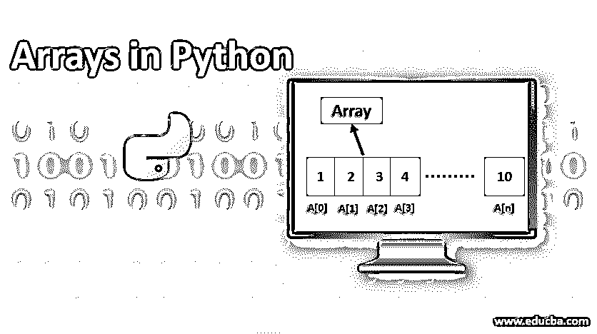
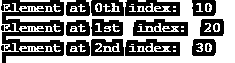
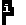
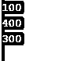
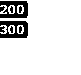
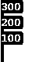
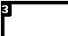
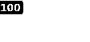
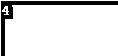

# Python 中的数组

> 原文：<https://www.educba.com/arrays-in-python/>




## Python 中数组的介绍

数组是同类项目的集合，其中每个项目都有自己的索引值，索引从 0 开始。Python 没有对数组的内置支持，但是我们可以导入数组并使用它们。Python 中还有另一种类似于数组的数据类型，即列表在 Python 中作为数组是有用的，但不同之处在于列表可以保存任何类型的值，但数组只存储类似类型的值，另一种列表是 Python 中的内置数据类型，而数组则必须从数组模块中导入。

*   **Index:** 是代表数组中某个值的数字，并且总是从 0 开始。
*   **元素:**是数组中的值。
*   **len():** 是数组中元素的总数。
*   **append()** :这是向数组中添加元素的方法。
*   **remove():** 是从数组中移除元素的方法。

有许多类似于 append 和 remove 的方法可以帮助我们对数组或列表执行各种操作。for-in 循环结构用于在 Python 中循环遍历数组。让我们也学会这一点。

<small>网页开发、编程语言、软件测试&其他</small>

### Python 中数组是如何工作的？

该数组存储在连续的内存位置，其中索引是一个数字序列，表示存储在每个特定索引处的值。为了访问或引用数组中特定索引处的值，我们使用了一组方括号[]；此外，我们可以使用 for-in 循环来遍历数组。该数组具有索引(索引的复数形式)和值。在每个索引处，存储一个值。我们使用数组是因为很难一次存储和记住几百个数字；在这种情况下，使用数组会更简单，比如整数数组如下所示。array ('i '，[1，2，3，4，5，6，7，8，9，10])，然后我们将使用下面的格式来访问这些值。

a[0] => 1

a[1] => 2

a[2] => 3

a[3] => 4

a[4] => 5

a[5] => 6

a[6] => 7

a[7] => 8

a[8] => 9

a[9] => 10

记住，索引从 0 开始。我们还将使用 for-in 循环来遍历给定的数组:

`for i in a
print a[i]`

这将给出从 1 到 10 的值。

### 如何在 Python 中创建数组？

要在 Python 中创建数组，我们需要首先导入数组模块。

`import array as arr`

在哪里，

arr = >是别名

导入模块的另一种方法是以下述方式:

`from array import *`

创建数组的语法是:

`array(typecode [,intializer])`

在哪里，

typecode => int 或 float 或 double 或数组所包含的值的类型。

initializer = >是可选值，可以是任何类型，如列表、字符串或任何特定类型的可迭代元素。

下面以表格的形式提到了 typecode 及其值。

| **类型代码** | **C 型** | **Python 类型** | **值** |
| 我 | 有符号整数 | （同 Internationalorganizations）国际组织 | Two |
| 英语字母表中第九个字母 | 无符号整数 | 长的 | Two |
| 英语字母表中第二个字母 | 有符号字符 | （同 Internationalorganizations）国际组织 | One |
| 英语字母表的第 2 个字母 | 无符号字符 | （同 Internationalorganizations）国际组织 | One |
| 英语字母表中第八个字母 | 带符号的短 | （同 Internationalorganizations）国际组织 | Two |
| 英语字母表中第八个字母 | 无符号短整型 | （同 Internationalorganizations）国际组织 | Two |
| 英语字母表中第十二个字母 | 长签名 | （同 Internationalorganizations）国际组织 | Four |
| 英语字母表中第十二个字母 | 无符号长整型 | （同 Internationalorganizations）国际组织 | Four |
| 英语字母表中第六个字母 | 漂浮物 | 漂浮物 | Eight |
| 英语字母表的第 4 个字母 | 两倍 | 漂浮物 | Four |

让我们通过下面的例子来理解每一个。

#### Typecode: i

**代码:**

```
import array as arr
a=arr.array('i', [10 , 20 ,30] )
print("Element at 0th index: " , a[0])
print("Element at 1st  index: " , a[1])
print("Element at 2nd index: " , a[2])
```

**输出:**




#### Typecode: I

**代码:**

```
import array as arr
a=arr.array('I', [10 , 20 ,30] )
print("Element at 0th index: " , a[0])
print("Element at 1st  index: " , a[1])
print("Element at 2nd index: " , a[2])
```

**输出:**


#### 类型代码:b

**代码:**

```
import array as arr
a=arr.array('b', [10 , 20 ,30] )
print("Element at 0th index: " , a[0])
print("Element at 1st  index: " , a[1])
print("Element at 2nd index: " , a[2])
```

**输出:**


#### 类型代码:b

**代码:**

```
import array as arr
a=arr.array('B', [10 , 20 ,30] )
print("Element at 0th index: " , a[0])
print("Element at 1st  index: " , a[1])
print("Element at 2nd index: " , a[2])
```

**输出:**


#### 类型代码:h

**代码:**

```
import array as arr
a=arr.array('h', [10,20,30] )
print("Element at 0th index: " , a[0])
print("Element at 1st  index: " , a[1])
print("Element at 2nd index: " , a[2])
```

**输出:**


#### 类型代码:h

**代码:**

```
import array as arr
a=arr.array('H', [10,20,30] )
print("Element at 0th index: " , a[0])
print("Element at 1st  index: " , a[1])
print("Element at 2nd index: " , a[2])
```

**输出:**


#### 类型代码:l

**代码:**

```
import array as arr
a=arr.array('l', [10,20,30] )
print("Element at 0th index: " , a[0])
print("Element at 1st  index: " , a[1])
print("Element at 2nd index: " , a[2])
```

**输出:**


#### 类型代码:L

**代码:**

```
import array as arr
a=arr.array('L', [10,20,30] )
print("Element at 0th index: " , a[0])
print("Element at 1st  index: " , a[1])
print("Element at 2nd index: " , a[2])
```

**输出:**


#### 类型代码:f

**代码:**

```
import array as arr
a=arr.array('f', [10,20,30] )
print("Element at 0th index: " , a[0])
print("Element at 1st  index: " , a[1])
print("Element at 2nd index: " , a[2])
```

**输出:**


#### 类型代码:d

**代码:**

```
import array as arr
a=arr.array('d', [10,20,30] )
print("Element at 0th index: " , a[0])
print("Element at 1st  index: " , a[1])
print("Element at 2nd index: " , a[2])
```

**输出:**


### Python 中的数组方法

我们将在给定的数组上看到以下方法:

#### 类型代码 1()

**语法:**

```
array.typecode()
```

该函数返回给定数组中使用的 typecode 的值。

**代码:**

```
#importing array module
import array as arr
#creating array
a1 = arr.array('i', [100,200,300] )
#printing array with method
print(a1.typecode)
```

**输出:**




#### 2.插入()

**语法:**

```
array.insert(*index, element*)
```

它将一个元素添加到数组中的索引之前

**代码:**

```
#importing array module
import array as arr
#creating array
a = arr.array('i', [100,200,300])
#inserting a value of 400 to after index 2
a.insert(3, 400);
#looping through array a
for i in a:
print(i)
```

**输出:**


#### 3.更新()

**语法:**

```
arrayname[index] = value
```

它将索引处的特定值更新为新值。

**代码:**

```
#importing array module
import array as arr
#creating array
a = arr.array('i', [100,200,300] )
#updating a value of 200 to 400
a[1] = 400
#looping through array a
for i in a:
print(i)
```

**输出:**




#### 4.删除()

**语法:**

```
array.remove(element)
```

这个函数从数组中移除元素。

**代码:**

```
#importing array module
import array as arr
#creating array
a = arr.array('i', [100,200,300] )
#deleting a value 100
a.remove(100)
#looping through array a
for i in a:
print(i)
```

**输出:**




#### 5.追加()

**语法:**

```
array.append(element)
```

这个函数将元素追加到数组的末尾。

**代码:**

```
#importing array module
import array as arr
#creating array
a = arr.array('i', [100,200,300] )
#appending 400 to the end
a.append(400)
#printing array
for i in a:
print(i)
```

**输出:**


#### 6.反向()

**语法:**

`array.reverse()`

这个函数反转给定数组中元素的顺序。

**代码:**

```
#importing array module
import array as arr
#creating array
a = arr.array('i', [100,200,300] )
//applying the reverse method to the array
a.reverse()
//printing the array
for i in a:
print(i)
```

**输出:**




#### 7.计数()

**语法:**

```
array.count(element)
```

该函数返回元素在给定数组中出现的次数。

**代码:**

```
#importing array module
import array as arr
#creating array
a3 = arr.array('i', [100,200,300,100,400,100,500] )
#printing the array count
print(a3.count(100))
```

**输出:**




#### 8.索引()

**语法:**

```
array.index(x)
```

此方法返回“I”，它是 x 在数组中第一次出现的索引和最小值。

**代码:**

```
#importing array module
import array as arr
#creating array
a3 = arr.array('i', [700,200,300,100,400,100,500] )
#search the value 100 and return its index
print(a3.index(100))
```

**输出:**


#### 9.流行()

**语法:**

```
array.pop([ i ])
```

这个函数移除并返回给定数组中索引为 I 的元素。默认情况下，它移除并返回最后一个元素。

**代码:**

```
#importing array module
import array as arr
#creating array
a3 = arr.array('i', [100,200,300] )
# removing 100 and printing
print(a3.pop(0))
```

**输出:**




#### 10\. itemsize()

**语法:**

```
array.itemsize()
```

**代码:**

```
#importing array module
import array as arr
#creating array
a3 = arr.array('i', [100,200,300] )
#printing the itemsize
print(a3.itemsize)
```

**输出**:




#### 11.len()方法

**语法:**

```
len(arrayname)
```

这个方法给出了数组长度。

**代码:**

```
#importing array module
import array as arr
#creating array
a3 = arr.array('i', [100,200,300,400,500] )
#printing the length of method
print(len(a3))
```

**输出:**


### 结论

我希望这篇文章对你所有的概念都有帮助，也希望这篇文章足够有趣，能鼓励你学习新的东西。练习只会让你走向完美，所以要尽可能多的练习。

### 推荐文章

这是 Python 中数组的指南。这里我们讨论如何在 Python 中创建数组及其方法，以及代码实现和输出。您也可以浏览我们的相关文章，了解更多信息——

1.  [Python 中的 3d 数组](https://www.educba.com/3d-arrays-in-python/)
2.  [Python 中的 2D 数组](https://www.educba.com/2d-arrays-in-python/)
3.  [Python 特性](https://www.educba.com/python-features/)
4.  [Python 中的字符串数组](https://www.educba.com/string-array-in-python/)


