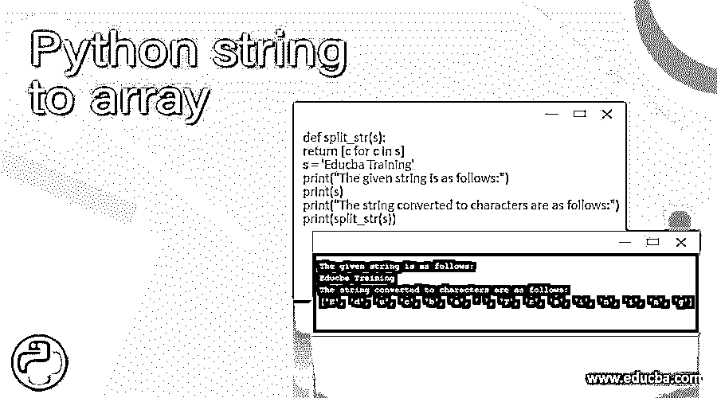
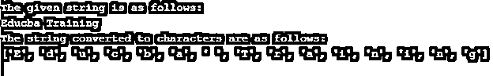
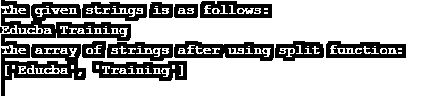
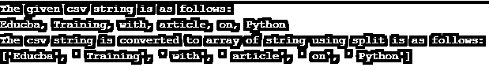
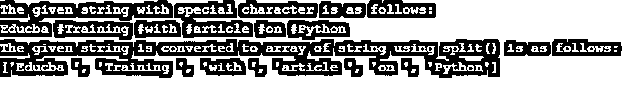

# Python 字符串到数组

> 原文：<https://www.educba.com/python-string-to-array/>




## Python 字符串到数组简介

在本文中，我们将讨论在 Python 中将字符串转换为数组。一般来说，我们知道数组是一种数据结构，能够存储 Python 中相同数据类型的元素，而列表包含不同数据类型值的元素。在这里，我们要看看如何将字符串转换成数组。我们必须注意如何把给定的字符串分割成一个数组；它可以是一组字符或字符串。这种转换可以不同的方式进行；主要技术是使用 split 函数将字符串转换为数组。

### 使用示例研究如何将字符串转换为数组

在这篇文章中，我们正在讨论一个字符串到一个数组。为此，我们使用 split()函数将字符串转换为数组。现在让我们看看如何将单个字符串转换为字符数组，但我们将使用一个简单的函数来代替下面示例中的 split()函数。

<small>网页开发、编程语言、软件测试&其他</small>

**举例:**

```
def split_str(s):
return [c for c in s]
s = 'Educba Training'
print("The given string is as follows:")
print(s)
print("The string converted to characters are as follows:")
print(split_str(s))
```

**输出:**




在上面的程序中，我们不使用 split()函数将给定的字符串分割成字符。在上面的程序中，我们可以看到我们已经创建了一个名为“split_str”的函数，在这里我们传递一个字符串，它返回一个字符数组。在上面的截图中，我们可以看到给定的字符串结果变成了单个字符。

现在让我们看看如何使用 split()函数将字符串拆分为数组，如下例所示:

**语法:**

```
split(separator, maxsplit)
```

**举例:**

```
t = "Educba Training"
print("The given strings is as follows:")
print(t)
x = t.split()
print("The array of strings after using split function:")
print(x)
```

**输出:**




在上面的示例中，我们可以看到给定的字符串为“Educba Training”，这意味着有两个字符串，它被视为存储在变量“t”中的单个字符串。然后，我们对变量“t”应用了 split()函数，结果存储在另一个变量“x”中。因此，输出将显示为字符串数组，如“['Educba，' Training']”

假设我们有 CSV 字符串，那么我们也可以对这些字符串应用 split()函数并获得字符串数组，但是我们必须将每个字符串的分隔符指定为“，”让我们看看下面的例子，使用相同的 split()函数将 CSV 格式的字符串转换为字符串数组。

**举例:**

```
str1 = "Educba, Training, with, article, on, Python"
print("The given csv string is as follows:")
print(str1)
str2 = str1.split(",")
print("The csv string is converted to array of string using split is as follows:")
print(str2)
```

**输出:**




在上面的程序中，我们可以看到 str1 保存了 CSV 格式的字符串，意思是逗号分隔的字符串，所以要获取字符串的数组；首先，我们必须在给定字符串中的每个单词或字符串处将它与逗号分开。因此，当 split()函数应用于这样的字符串，并且我们指定("，")逗号作为分隔符或分隔符来获得字符串数组时。

默认情况下，当我们在任何字符串上指定或应用 split()函数时，它会默认将“空白”作为分隔符或定界符。因此，如果我们有任何字符串有任何特殊字符，我们只想提取一个字符串数组，那么我们可以只指定作为分隔符或分隔符的特殊字符，以获得字符串数组。我们将看到一个简单的例子，在给定的字符串中有一些特殊的字符。我们只需要获得字符串数组；然后，我们可以通过在给定的字符串中使用带分隔符或分隔符的 split()函数再做一次。

**举例:**

```
str1 = "Educba #Training #with #article #on #Python"
print("The given string with special character is as follows:")
print(str1)
str2 = str1.split("#")
print("The given string is converted to array of string using split() is as follows:")
print(str2)
```

**输出:**




在上面的程序中，我们可以看到我们有一个给定的字符串，每个字符串都有特殊的字符，比如用哈希(" # ")分隔的字符串。该字符串存储在变量“str1”中，split 函数应用于该字符串，分隔符或定界符指定为(“#”)，获得的结果存储在另一个字符串 str2 中。字符串“str2”包含由给定字符串中的特殊字符分隔的字符串数组。因此，结果如上面的屏幕截图所示，其中有一个来自具有特殊字符的给定字符串的字符串数组。

### 结论

在本文中，我们已经了解了什么是数组，以及如何将任意字符串转换为数组。首先，我们已经看到了如何通过使用“for”循环将给定的单个字符串转换成字符。然后，我们看到了如何使用 split()函数将任何字符串转换为字符串数组。首先，我们看到了如何在不指定任何分隔符或定界符的情况下对字符串使用 split 函数，然后我们看到了如何对 CSV 格式的字符串应用 split 函数以获得字符串数组，最后我们还看到了 split()函数可以用于任何包含任何特殊字符的字符串，以获得唯一的字符串数组。

### 推荐文章

这是一个 Python 字符串到数组的指南。在这里，我们用例子来讨论如何将字符串转换成数组。您也可以看看以下文章，了解更多信息–

1.  [Python 缓冲器](https://www.educba.com/python-bufferedreader/)
2.  [Python StopIteration](https://www.educba.com/python-stopiteration/)
3.  [Python 操作系统模块](https://www.educba.com/python-os-module/)
4.  [字符串长度 Python](https://www.educba.com/string-length-python/)


