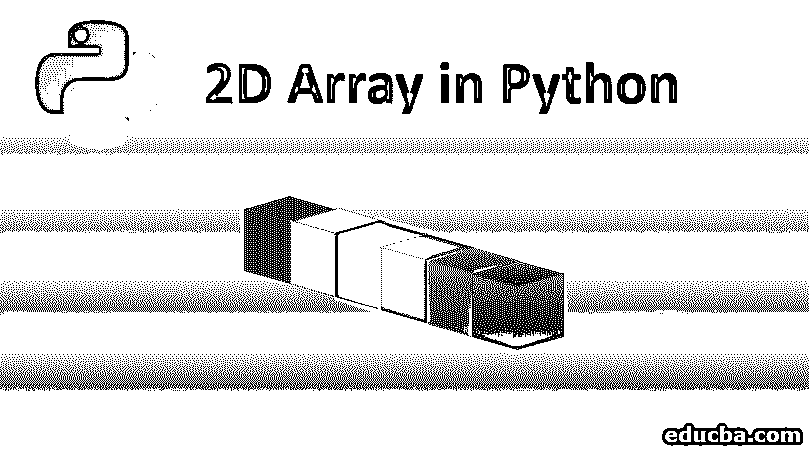
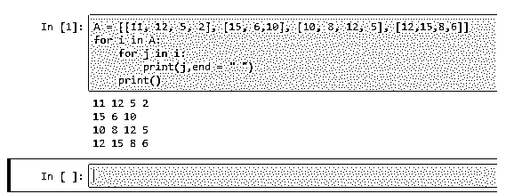
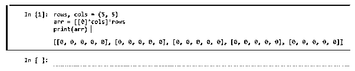
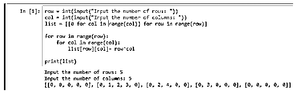
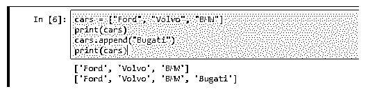
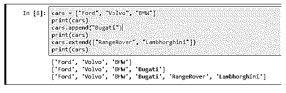
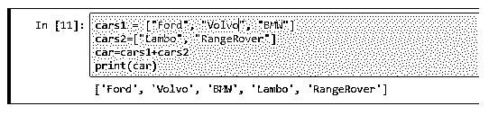
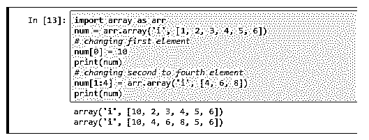
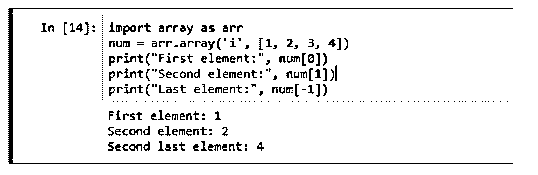
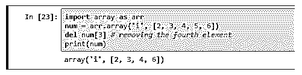

# Python 中的 2D 数组

> 原文：<https://www.educba.com/2d-arrays-in-python/>




## Python 中的 2D 数组简介

组成数组的元素排列，即数组中的数组。一种数组类型，其中两个索引引用一个数据元素的位置，而只有一个索引，元素的整个表示看起来像一个表，数据按行和列排列，它可以有效地用于执行从最简单的运算(如加、减)到最复杂的任务(如乘、逆运算)。在数据分析的上下文中，根据需求，它们在 Python 编程语言中被称为二维数组。

让我们举个例子，我们要测量 4 个人的身高和体重。
第一人:6.0 英尺 61 公斤
第二人:5.3 英尺 53 公斤
第三人:5.9 英尺 67 公斤
第四人:6.2 英尺 63 公斤

<small>网页开发、编程语言、软件测试&其他</small>

所以上面这组数据可以借助一个二维数组用下面的方式来表示。

`A= [[6, 61], [5.3, 53], [5.9, 67], [6.2, 63]]`

### Python 中 2D 数组的不同运算

在这里，我们用 Python 解释了 2D 数组中的不同操作，并给出了例子。

*   创造
*   插入
*   更新
*   删除

#### 创建数组

让我们看看如何用 Python 创建 2D 数组

**方法 1—**在这里，我们不是定义行和列的大小，而是直接将一个数组赋给某个变量 A.

```
A = [[11, 12, 5, 2], [15, 6,10], [10, 8, 12, 5], [12,15,8,6]]
for i in A:
    for j in i:
        print(j,end = " ")
    print()
```




**方法 2**–在这里，我们将定义数组的大小，然后尝试做一些基本操作，然后我们将打印我们的数组。

```
rows, cols = (5, 5)
arr = [[0]*cols]*rows
print(arr)
```




**方法 3—**在这个方法中，我们将要求用户输入行数和列数；我们可以使用输入法来接受用户的输入。

```
row = int(input("Input the number of rows: "))
col = int(input("Input the number of columns: "))
list = [[0 for col in range(col)] for row in range(row)]

for row in range(row):
    for col in range(col):
        list[row][col]= row*col

print(list)
```




#### 向数组中插入元素

这里，我们定义了一个名为“cars”的数组，与代码的第一行一样，数组的元素是 Ford、Volvo 和 BMW。现在假设，如果我们想向数组中添加更多的元素，我们可以使用 append 函数。在第三行代码中，我们使用 append 函数将另一个汽车元素“Bugatti”添加到现有数组中。然后我们打印了数组。

```
cars = ["Ford", "Volvo", "BMW"]
print(cars)
cars.append("Bugatti")
print(cars)
```




那么，如果我们想一次向数组中添加几个元素而不是一个呢？

在这种情况下，我们可以利用扩展函数。

```
cars = ["Ford", "Volvo", "BMW"]
print(cars)
cars.append("Bugati")
print(cars)
cars.extend(["RangeRover", "Lambhorghini"])
print(cars)
```




正如我们在这里看到的，我们使用了 extend 函数一次向数组添加多个元素，然后我们打印了数组。也可以连接到不同的阵列。

```
cars1 = ["Ford", "Volvo", "BMW"]
cars2=["Lambo", "RangeRover"]
car = cars1 + cars2
print(car)
```

这里，我们定义了两个名为 cars1 和 cars2 的[不同的数组](https://www.educba.com/arrays-in-php/)，然后我们添加了这两个数组并存储在一个名为 car 的数组中，然后我们简单地打印了 car 数组。最终结果包含两个数组中的元素。




#### 更新/更改数组元素

在本节中，我们将尝试更新和更改数组的元素。数组是可变的，数组的元素可以改变。下面是我们如何做到这一点的一个例子

```
import array as arr
num = arr.array('i', [1, 2, 3, 4, 5, 6])
# changing the first element
num[0] = 10
print(num)
# changing second to the fourth element
num[1:4] = arr.array('i', [4, 6, 8])
print(num)
```

正如我们看到的，我们首先创建了一个名为“num”的数组。我们用数字 10 替换了数组的第一个元素，然后我们打印了数组。接下来，我们将数组元素从第二个位置更改为第四个位置，然后打印出来。




#### 访问数组元素

我们可以通过指定索引位置来访问数组的元素。在下面的例子中，我们已经创建了一个数字数组，然后通过用 num array 的方括号指定索引位置，我们打印了数组的第一个元素。数组中的索引从 0 开始，当我们遍历时，它递增 1。我们也可以通过将索引指定为-1(减 1)来直接访问数组的最后一个元素。

```
import array as arr
num = arr.array('i', [1, 2, 3, 4])
print("First element:", num[0])
print("Second element:", num[1])
print("Last element:", num[-1])


 
```

#### 移除数组元素

我们可以通过使用 del 函数并指定想要删除数组元素的索引位置来从数组中删除元素。
例如，

```
import array as arr
num = arr.array('i', [2, 3, 4, 5, 6])
del num[3] # removing the fourth element
print(num)
```




图 10

来源:我的 Jupyter 笔记本

也可以只给出数组名而不给出任何索引位置来删除整个数组。例如:

```
import array as arr
num = arr.array('i', [2, 3, 4, 5, 6])
del num[3] # removing the fourth element
print(num)
del num
print(num)
```

这将删除整个数组，当您尝试打印该数组时，它会给出一个错误，提示该数组不存在。

### 结论

在本节中，我们学习了可以在阵列上执行的不同操作。我们从创建数组开始，看到了创建数组的不同方法；然后，我们看到了如何向数组中添加元素，如何更改或更新数组的元素，如何访问数组的元素，最后，我们学习了如何删除数组元素或如何删除整个数组本身。

### 推荐文章

这是 Python 中 2D 数组的指南。这里我们讨论 Python 中 2D 数组的不同操作，以及方法、代码和输出。您也可以浏览我们推荐的其他文章，了解更多信息——

1.  [Python 中的 3d 数组](https://www.educba.com/3d-arrays-in-python/)
2.  [Java 中的 2D 数组](https://www.educba.com/2d-arrays-in-java/)
3.  [C 语言中的二维数组](https://www.educba.com/2-d-arrays-in-c/)
4.  [c#中的 2D 数组](https://www.educba.com/2d-arrays-in-c-sharp/)


