# Python 中的字符串数组

> 原文：<https://www.educba.com/string-array-in-python/>

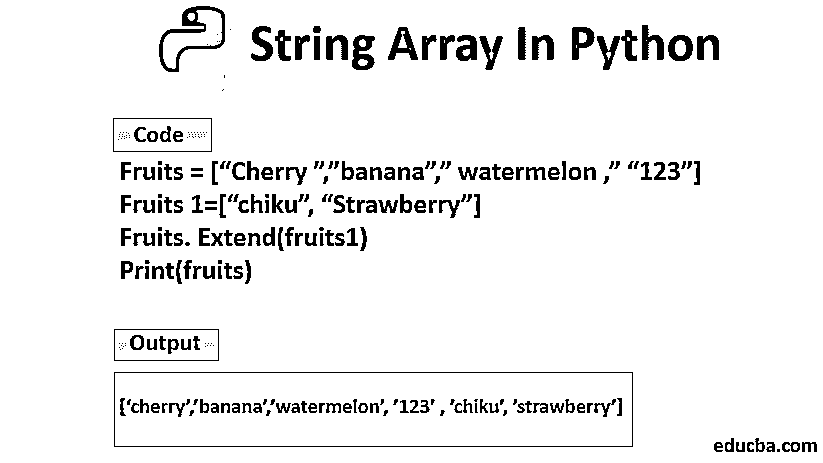

## Python 中的字符串数组简介

字符串数组可以定义为一个变量同时包含多个字符串值的容量，在程序执行过程中可以随时调用和访问。python 中没有针对字符数据类型的预定义特性，因为 Python 中的每个字符都被单独视为一个字符串。python 中字符串数组的各种类型有列表、负索引、按索引访问、循环、追加、使用 len()方法的长度、使用 pop()方法的移除、clear()、copy()等。

### 元素的访问

Python 没有对数组的内置支持。 [Python 列表用于](https://www.educba.com/python-list/)这一目的，所以我们将研究列表。需要注意的是，Python 没有字符数据类型。单个字符本身就是长度为 1 的字符串。方括号用于访问字符串的元素。

<small>网页开发、编程语言、软件测试&其他</small>

### Python 中的字符串数组列表

以下是 Python 中字符串数组的列表:

#### 1.目录

当有秩序的需要和频繁变化的要求时，我们更喜欢选择列表。列表的另一个特点是它允许重复。下面是一个简单的列表示例。

**代码:**

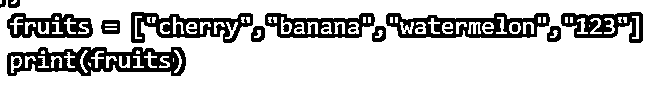

**输出:**

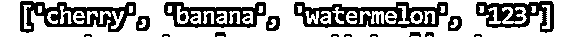

#### 2.通过索引访问

我们甚至可以通过引用索引来访问特定的元素。

**代码:**

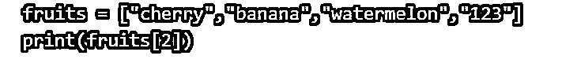

**输出:**

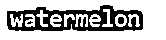

#### 3.负索引

我们甚至可以消极地访问索引。在这种情况下，最后一个 most 元素将具有索引-1；倒数第二个是-2，倒数第三个是-3，依此类推。

**代码:**

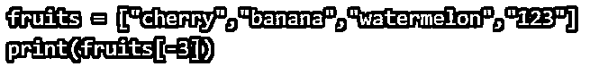

**输出:**

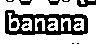

#### 4.长度

我们甚至可以使用 len()方法返回数组的长度。

**代码:**

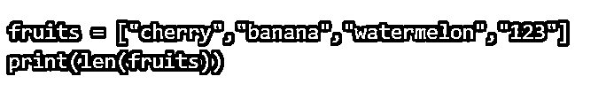

**输出:**

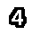

#### 5.环

遍历数组元素也是一项简单的任务。我们使用' for in' [,同时在数组中循环](https://www.educba.com/while-loop-in-python/)。

**代码:**

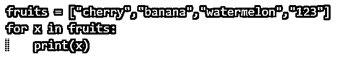

**输出:**

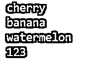

#### 6.附加

如果必须追加到列表中，那么可以使用‘append()’

**代码:**

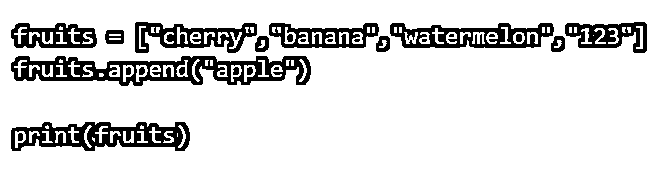

**输出:**

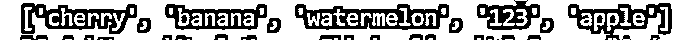

#### 7.消除

通过 pop()方法可以删除任何元素。在这里，我们可以通过引用索引来明确删除任何特定的元素。

**代码:**

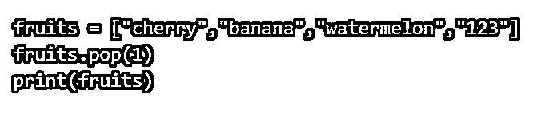

**Output:** As pop(1)表示列表中的第二个元素。它被移除了。

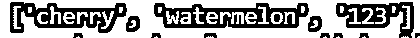

我们还可以使用 remove()方法，并提到可以删除的特定元素。

**代码:**

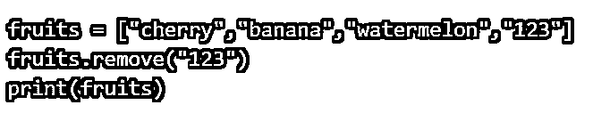

**输出:**

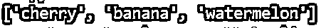

### Python 中字符串数组的方法

我们有一个可以在列表和数组上使用的底层方法列表。我们以前遇到过 append()、pop()和 remove()。我们将在这里讨论其他可以使用的方法。

#### 1.清除()

这将删除列表中的所有元素，并向您显示一个清除了所有元素的列表。

**代码:**

**输出:**

为了从列表中删除元素，我们已经删除了()方法，这是一个我们已经讨论过的 pop()方法。还有一个清除列表的“del”关键字。

**代码:**

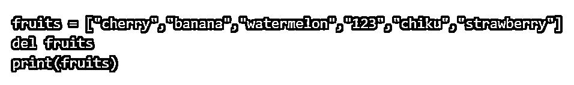

**输出:**del list 删除列表，我们得到如下输出。

#### 2.复制()

此方法返回列表的副本。从下面的例子可以看出。

**代码:**

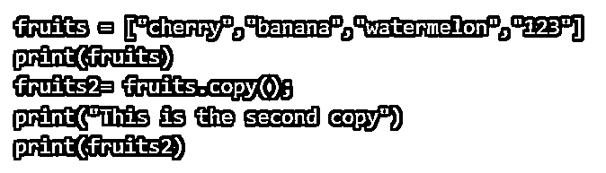

**输出:**

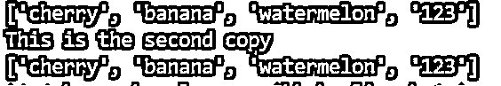

#### 3.计数()

返回列表中指定值的元素个数。

**代码:**

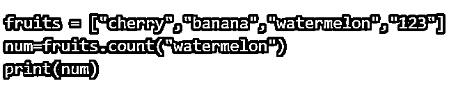

**输出:**

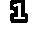

#### 4.扩展()

在另一个列表的帮助下，我们将元素添加到列表的末尾。然后，第二个列表形成了第一个列表的扩展。这是怎么做的。

**代码:**

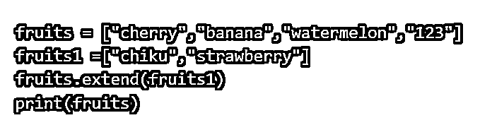

**输出:**

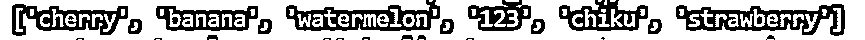

list 有 append()并扩展了()方法来连接或联接两个列表，但是'+'操作符也可以执行这个操作。我们将在下面的步骤中看到这个简单的连接:

**代码:**

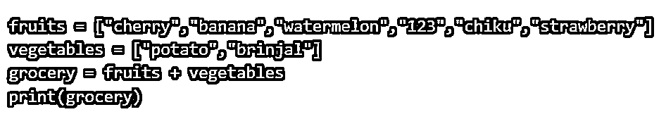

**输出:**杂货清单是上述“水果”和“蔬菜”清单的连接清单。

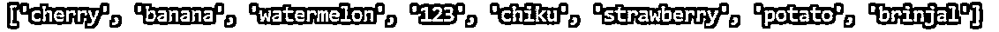

#### 5.索引()

此方法返回特定元素出现的位置。

**代码:**

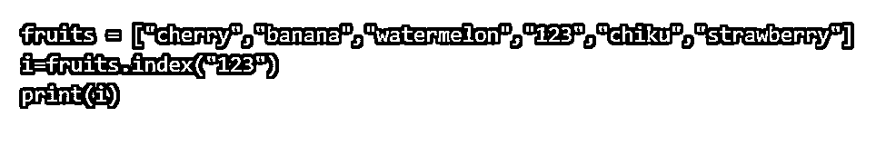

**输出:**

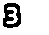

#### 6.插入()

此方法返回必须在指定位置插入的元素。该方法有两个参数，第一个是索引，第二个是必须位于该索引的元素。

**代码:**

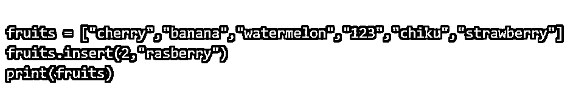

**输出:**

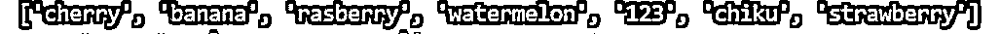

#### 7.反向()

此方法反转列表的排序顺序。这个方法返回一个反向迭代器对象。

**代码:**

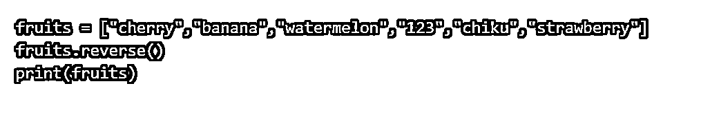

**输出:**我们在这里看到整个列表是如何反转的。

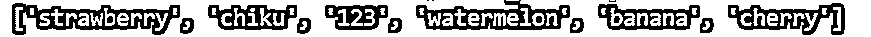

#### 8.排序()

这个方法会按照字母顺序排列列表，也可以说是按照升序设置列表。

该方法有两个参数；其中一个参数是反向的，另一个是可以指定排序标准的 key。如果 reverse=true，则列表将按降序排序，反之，如果 reverse=false，则按升序排序。这两个参数是可选的。

下面是一个我们使用反向参数的例子。

**代码:**

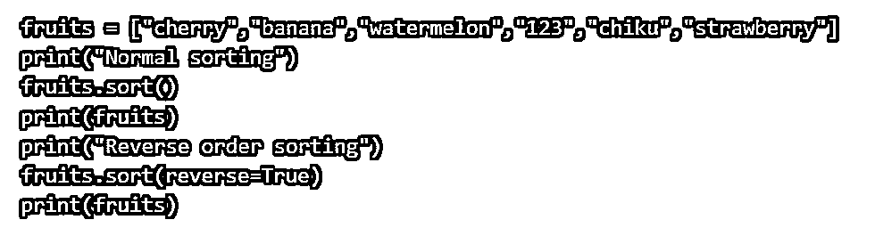

**Output:** 在这里，我们看到默认的排序，在另一个例子中，是前一个例子的反序。

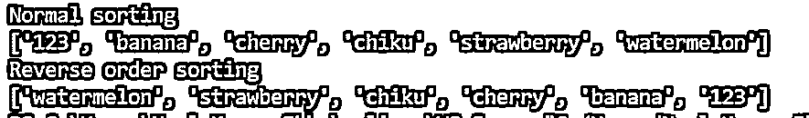

#### 9.索引范围

如果我们需要一个选择性的元素列表，从哪里开始，到哪里结束，我们选择这个选项。

**示例:**假设我们只需要列表中的第 1、2 第 2和 3 第 3个元素，那么我们将执行以下操作。需要注意的是，列表从 0 开始，不包括最后一个范围。

**代码:**

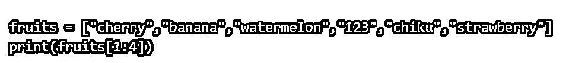

**输出:**

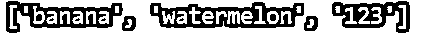

#### 10.项目价值的变化

特定项目的值可以更改。

**代码**

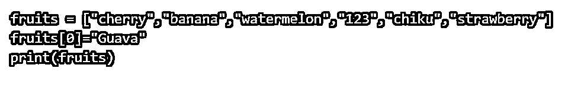

**输出:**

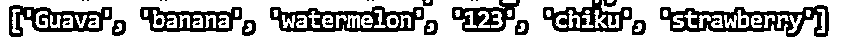

#### 11.检查元素是否存在。

假设我们必须检查一个特定的元素是否存在，然后使用' in '关键字。这里我们使用“if”关键字来确认一个元素的存在。

**代码:**

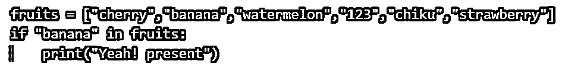

**输出:**

#### 12: list()构造函数

还有一个用于创建新列表的构造函数列表。必须注意，这里去掉了方括号[]，而使用了双圆括号(())。

**代码:**

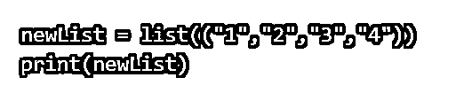

**输出:**

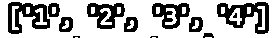

### 结论

还应该理解，Python 不支持数组；这仍然是我们用过的清单。然而，Numpy 是一个可用于创建 2D 3D 数组的库，用于计算科学和数学数据。

### 推荐文章

这是 Python 中字符串数组的指南。在这里，我们已经讨论了概述、元素的访问、python 列表以及带有代码和输出的方法。您也可以浏览我们的其他相关文章，了解更多信息——

1.  [Python 中的循环](https://www.educba.com/loops-in-python/)
2.  [Python 中的 2D 数组](https://www.educba.com/2d-arrays-in-python/)
3.  [c++中的字符串数组](https://www.educba.com/string-array-in-c-plus-plus/)
4.  [c#中的字符串数组](https://www.educba.com/string-array-in-c-sharp/)

