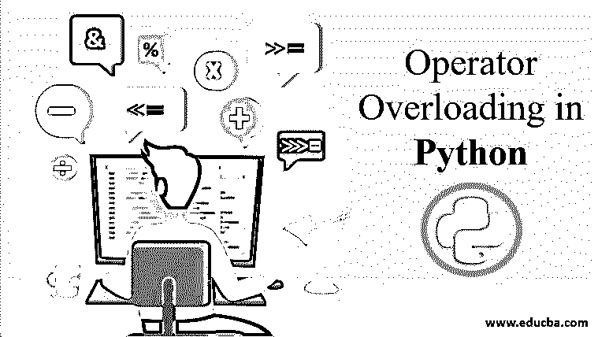
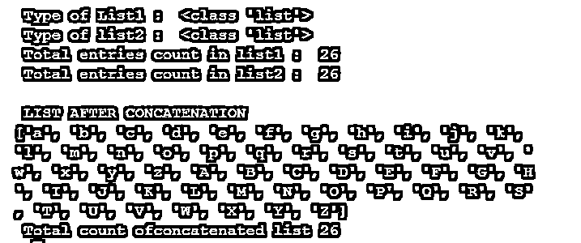
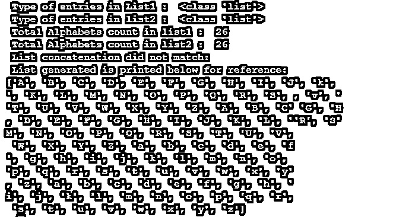
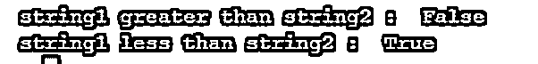
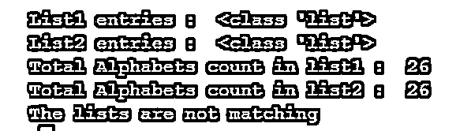
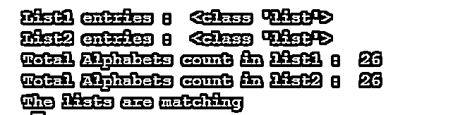

# Python 中的运算符重载

> 原文：<https://www.educba.com/operator-overloading-in-python/>

## Python 中运算符重载的介绍

python 操作符重载过程意味着不止一个元素将拥有相同的名称(方法、操作符等)。)，但区别存在于实体的属性上。属性的不同可能是因为所用属性的数量不同，甚至是因为属性的形式或类型不同。为了实现重载过程，python 编程语言中有两种关键方法，它们列举如下:

*   [函数重载](https://www.educba.com/function-overloading-in-java/)
*   运算符重载

### Python 中重载的 4 大运算符

这里我们讨论 python 中不同的运算符重载:

<small>网页开发、编程语言、软件测试&其他</small>

#### 1.加号运算符重载

这涉及到对运算符的扩展解释，而不仅仅是其最初的目的。最常见的例子是加法运算符“+”，它可用于通常的加法，也可用于组合两个不同的字符串。正如上面提到的，不同形式的加号是操作符级重载过程最典型的例子。特别是二元运算符对字符串对执行连接过程的能力尤其特殊。

##### 例子

**代码:**

`# Using len() function without method overloading
Lower_Case=['a','b','c','d','e','f','g','h','i','j','k','l','m', 'n','o','p','q','r','s','t','u','v','w','x','y','z' ] Upper_Case=['A','B','C','D','E','F', 'G','H','I' ,'J','K','L', 'M','N','O','P','Q','R','S' ,'T','U','V','W','X','Y','Z' ] Expected_Output = ['a','b','c','d','e','f','g','h' ,'i','j','k', 'l','m','n','o','p','q','r','s','t','u','v','w','x','y','z','A','B', 'C','D','E','F','G','H','I','J','K','L','M','N','O','P','Q','R','S', 'T','U','V','W','X','Y','Z'] print(' Type of List1 : ', type(Lower_Case))
print(' Type of list2 : ', type(Upper_Case))
print(' Total entries count in list1 : ',len(Lower_Case))
print(' Total entries count in list2 : ',len(Upper_Case))
List_Concat = Lower_Case + Upper_Case
if Expected_Output == List_Concat:
print("")
print(" LIST AFTER CONCATENATION ")
print(List_Concat)
print(' Total count ofconcatenated list',len(Upper_Case))
else :
print(" List concatenation did not match ")`

**输出:**

**解释:**程序由两个不同的列表组成，第三个列表是通过连接两个列表生成的。将新生成的列表与现有的输出参考进行比较以进行匹配。如果发生匹配，那么新生成的列表将打印在控制台中。这里，重载过程是通过'+'操作符实现的，它负责将两个列表连接成一个列表。因此，在这里，加号运算符的行为与其将两个值相加的实际行为不同。

#### 2.乘法运算符重载

重载过程中涉及的二元运算符的另一个类似示例可以在“*”的用法中看到。这个操作符不仅负责两个给定数字的乘法运算，还能够执行字符串和列表的重复运算。

##### 例子

**代码:**

`# Using len() function without method overloading
Lower_Case=['a','b','c','d','e','f','g','h','i','j','k','l','m', 'n','o','p','q','r','s','t','u','v','w','x','y','z' ] Upper_Case=['A','B','C','D','E','F', 'G','H','I' ,'J','K','L', 'M','N','O','P','Q','R','S' ,'T','U','V','W','X','Y','Z' ] Expected_Output=['a','b','c','d','e','f','g','h' ,'i','j','k', 'l','m','n','o','p','q','r','s','t','u','v','w','x','y','z','A','B', 'C','D','E','F','G','H','I','J','K','L','M','N','O','P','Q','R','S', 'T','U','V','W','X','Y','Z'] print(' Type of entries in List1 : ', type(Lower_Case))
print(' Type of entries in list2 : ', type(Upper_Case))
print(' Total Alphabets count in list1 : ',  len(Lower_Case))
print(' Total Alphabets count in list2 : ',  len(Upper_Case))
List_Concat = 2*Upper_Case + 2*Lower_Case
if Expected_Output == List_Concat:
print("                          ")
print(" LIST AFTER CONCATENATION ")
print(List_Concat)
print(' Total count ofconcatenated list',len(Upper_Case))
else :
print(" List concatenation did not match: ")
print(" List generated is printed below for reference: ")
print(List_Concat)`

**输出:**

**说明:**和上面的程序一样，这里也使用两个完全不同的列表来生成第三个列表。但是与上面的概念不同，重载过程是通过‘*’操作符实现的，它负责将给定列表的内容重复指定的次数，然后生成一个列表。因此，在这里，乘法运算符的行为与其将两个值相乘的实际行为不同。

#### 3.大于和小于运算符重载

甚至像>和

##### 例子

**代码:**

`String1 = "Hello"
String2 = "World"
Out1 = String1 > String2
Out2 = String1 < String2
print("string1 greater than string2 : ",Out1)
print("string1 less than string2 : ",Out2)`

**输出:**

**解释:**在给定的例子中，使用大于号和小于号运算符比较两个字符串以确定哪个更大。

#### 4.等于运算符重载

等号运算符(==)用于比较两个不同的列表。

##### 示例#1

**代码:**

`Lower_Case=['a','b','c','d','e','f','g','h','i','j','k','l','m', 'n','o','p','q','r','s','t','u','v','w','x','y','z' ] Upper_Case=['A','B','C','D','E','F', 'G','H','I' ,'J','K','L', 'M','N','O','P','Q','R','S' ,'T','U','V','W','X','Y','Z' ] print(' List1 entries : ', type(Lower_Case))
print(' List2 entries : ', type(Upper_Case))
print(' Total Alphabets count in list1 : ',  len(Lower_Case))
print(' Total Alphabets count in list2 : ',  len(Upper_Case))
if Lower_Case == Upper_Case:
print(" The lists are matching ")
else :
print(" The lists are not matching ")`

**输出:**

**说明:**在上面给出的程序中，匹配了两个不同的列表。“==”运算符用于匹配列表。这里，一个列表由小写值组成，而另一个列表由大写值组成。等于运算符匹配两个列表；如果匹配存在，这里会显示一条控制台消息。

##### 实施例 2

**代码:**

`Lower_Case=['a','b','c','d','e','f','g','h','i','j','k','l','m', 'n','o','p','q','r','s','t','u','v','w','x','y','z' ] Upper_Case=['a','b','c','d','e','f','g','h','i','j','k','l','m', 'n','o','p','q','r','s','t','u','v','w','x','y','z' ] print(' List1 entries : ', type(Lower_Case))
print(' List2 entries : ', type(Upper_Case))
print(' Total Alphabets count in list1 : ',  len(Lower_Case))
print(' Total Alphabets count in list2 : ',  len(Upper_Case))
if Lower_Case == Upper_Case:
print(" The lists are matching ")
else :
print(" The lists are not matching ")`

**输出:**

**说明:**这是上例 1 的相反情况；这里，两个不同的列表再次用于给定程序中的匹配。“==”运算符再次用于匹配列表。这里，一个列表包含小写值，而另一个列表也只包含小写值。等于运算符匹配两个列表；如果匹配存在，那么这里会显示一条控制台消息。

### 运算符重载的优势

*   代码的可重用性大大增加
*   增加了代码的清晰度
*   代码中包含的复杂性被大大压缩了

### 推荐文章

这是 Python 中运算符重载的指南。在这里，我们讨论了 python 中重载的介绍和前 4 个操作符，以及各种例子。您也可以阅读以下文章，了解更多信息——

1.  [Python 中的方法重载](https://www.educba.com/method-overloading-in-python/)
2.  [Python 中的一元运算符](https://www.educba.com/unary-operators-in-python/)
3.  [Python 字符串操作](https://www.educba.com/python-string-operations/)
4.  [Python 重载](https://www.educba.com/python-overloading/)

