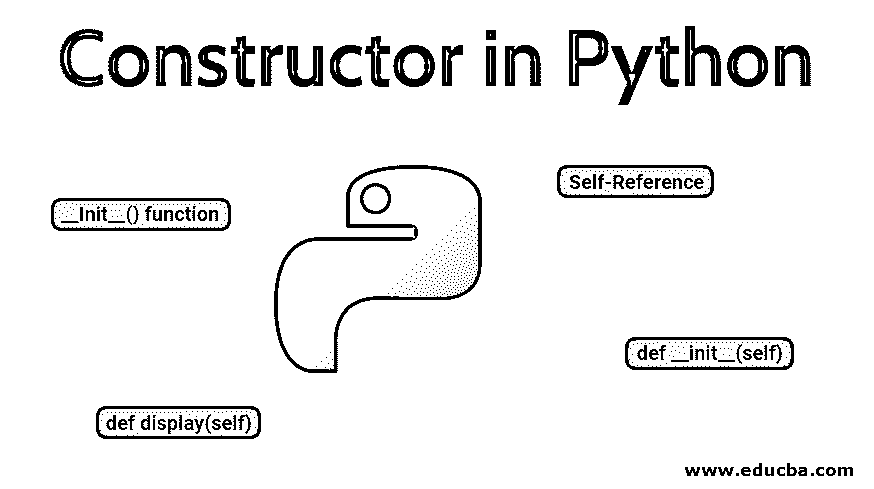

# Python 中的构造函数

> 原文：<https://www.educba.com/constructor-in-python/>




## Python 构造函数简介

当创建类的对象时，使用 Python 编程语言中的构造函数，同时验证对象是否有足够数量的资源来执行任何类型的启动任务。一种特殊类型的函数或方法，其目的是初始化类的成员，通常分为两种类型。这些函数基本上是一个参数化的构造函数和一个非参数化的构造函数。前者致力于考虑参数的想法，后者认为它不需要任何参数。

### Python 构造函数的类型

构造函数背后的关键逻辑是确保实例成员的初始化。在 python 中，这些构造函数扮演着相同的典型角色。在 python 中，所有的实例成员都可以通过这些构造函数进行初始化。

<small>网页开发、编程语言、软件测试&其他</small>

| **构造函数类型** |
| **默认构造函数** | **参数化构造器** |
| This is a default constructor where no arguments are accepted.默认参数出现在默认构造函数的情况下，即称为 self。此参数指的是为此类创建的对象。**举例:**班级样本:

#默认构造函数

def __init__(self):

#初始化变量实例

self.number_variable=1001

#一种方法

定义打印方法(自身):

print("数字变量: "，self.number_variable)

obj=sample()

obj.print_method()

**输出:**

数字变量:1001

 | Parameterized constructors accept arguments within them. Like default constructors here, too, the first argument being created references the instance of this class. The rest of the arguments are needed and defined by the programmer to reference the instance variables.**举例:**类样本:#参数化构造函数def __init__(自己，id，姓名，年龄，性别，doj，dob):self.id_value = idself.name_value = nameself.age_value =年龄self.gender_value =性别self.doj_value = dojself.dob_value = dob

定义打印输出(自身):

print("Id 值:"，self.id_value)

print("姓名值:"，自我姓名值)

print("年龄值:"，自我年龄值)

print("性别值:"，self.gender_value)

print("doj_value:"，self.doj_value)

print("dob_value:"，self.dob_value)

obj1 =样本(101，'特里'，27，'男性'，10072015，10071993)

obj1.print_output()

**输出:**

Id 值:101

姓名价值:特里

年龄值:27

性别值:男性

doj_value : 10072015

dob_value : 10071993

 |

### 构造函数是如何工作的？

为 python 类创建对象时，构造函数将是第一个启动执行的代码段，这使得所有初始化都作为程序工作的第一个实例发生。在这个构造函数的过程中，两个关键要素如下

*   **__Init__()函数**
*   **自我参考**

#### 1.Init()函数

当相应类的对象实例被创建时，这个函数被调用。这个构造函数是使用 def 关键字来确认的，该关键字与所有其他函数声明非常相似。在这些 init 函数声明中，另一个值得注意的事情是，函数的前缀和后缀都是双下划线。

**例子**

```
def __init__(self,salary_arg)
```

#### 2.自我参考

自我指的是对象本身。self 可以指与它所涉及的类相关的函数和变量。这必须是构造函数声明中最重要的参数。它表示指数应该与该对象的属性一起工作。

方法 show 也使用 self 作为其关键字

**例子**

```
def __init__(self,Employee_name,Employee_id, Employee_age):  
        self.Employee_name = name;  
        self.Employee_id = id;  
        self.Employee_age = age 
```

### 示例程序

使用构造函数的程序示例

```
#!/usr/bin/evn python

#      Define a class as 'Individual'      #
class Individual:
    #      Constructor#1     #
    def __init__(self):
     self.Student_Name = input( " Enter Name of the student : " )
     self.Student_age = input( " Enter age of the student : " )
     self.Student_gender = input( " Enter gender of the student : " )

    # Method
    def display(self):
        print( " \n \n Enter Name of the student : " , self.Student_Name )
        print( " Enter age of the student : " , self.Student_age )
        print( " Enter gender of the student : " , self.Student_gender )

#      Define a class as 'Evaluated_Marks'      #
class Evaluated_Marks:
    #      Constructor#2     #

    def __init__(self):
        self.stuClass = input( " Class of the student : " )
        print( " Evaluated Marks per subject : " )
        self.literature = int(input( " Mark in Literature subject : " ))
        self.math = int(input( " Mark in Math subject : " ))
        self.biology = int(input( " Mark in Biology subject : " ))
        self.physics = int(input( " Mark in Physics subject : " ))

     # Method
    def display(self):
        print( " Study in : " ,self.stuClass)
        print( " Total Evaluated_Marks : " , self.literature + self.math + self.biology + self.physics)

class student(Individual, Evaluated_Marks):
    def __init__(self):
        # Call ' Individual ' super class constructor 
        Individual.__init__(self)
        # Call ' Evaluated_Marks ' super class constructor
        Evaluated_Marks.__init__(self)

    def result(self):
        # Call method of class 'Individual'
        Individual.display(self)
        # Call method of class 'Evaluated_Marks'
        Evaluated_Marks.display(self)

#      Objects of class 'student'    #
Student1 = student()
Student2 = student()
print("                                                                           ") 
print( " Note : The instances get initialized with the given values Successfully " ) 
```

**输出:**

runfile('C:/Users/Dell/。spyder-py3/temp.py '，wdir='C:/Users/Dell/。spyder-py3’)
输入学生姓名:Arun
输入学生年龄:15
输入学生性别:男
学生班级:11
每科评估分数:
文学科目分数:45
数学科目分数:34
生物科目分数:23
物理科目分数:45

输入学生姓名:Rajan
输入学生年龄:16
输入学生性别:男
学生班级:11
每科评估分数:
文学科目分数:23
数学科目分数:34
生物科目分数:23
物理科目分数:56

**Note:** The instances get initialized with the given values Successfully

### 构造函数的优点

*   构造函数的主要优点是它们在初始化时很有帮助
*   最终状态的[实例变量](https://www.educba.com/instance-variable-in-java/)只能使用构造函数进行设置或初始化。
*   使用构造函数可以省略默认值初始化
*   为 python 类创建对象时。构造函数将是第一个被初始化执行的代码段，这使得所有的初始化作为程序工作的第一个实例发生。
*   构造函数可以带参数也可以不带参数初始化

### 结论 Python 中的构造函数

构造函数在每一种高级编程语言中都扮演着重要的角色。类似于 python 中的 like，当隐含了面向对象编程的概念时，构造函数的责任主要在适当的位置。构造函数有助于实现优化的实例变量初始化。

### 推荐文章

这是 Python 中构造函数的指南。这里我们讨论构造函数的类型以及 Python 中的构造函数是如何工作的。您也可以阅读以下文章，了解更多信息——

1.  [Python 编译器](https://www.educba.com/python-compilers/)
2.  [Java 中的布局](https://www.educba.com/layout-in-java/)
3.  [Python 框架](https://www.educba.com/python-frameworks/)
4.  [C++命令](https://www.educba.com/c-plus-plus-commands/)


