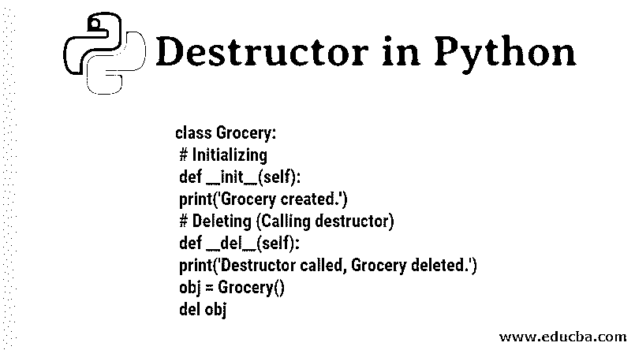
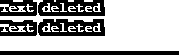

# Python 中的析构函数

> 原文：<https://www.educba.com/destructor-in-python/>




## Python 中析构函数的介绍

程序中的析构函数的作用是逆转由构造函数执行的操作，该操作用于清除由构造函数程序创建的类的对象。像任何其他用于开发系统或基于 web 的应用程序的面向对象编程语言一样，Python 允许处理类和对象的几乎所有功能特性。析构函数主要用作程序中的整理方法，作为组织代码和实现编码标准的一种方式。析构函数是用“__del__()”作为 python 代码的关键字定义的。

**语法:**

<small>网页开发、编程语言、软件测试&其他</small>

```
def __del__(self):
        #destructor body
```

可以看出，__del__ 是用来定义析构函数的关键字。当它被调用时，对该对象的所有引用都会被删除，这也称为垃圾收集。

### Python 中析构函数的例子

让我们看看 python 中不同的析构函数示例，以便更好地理解:

#### 示例#1

**代码:**

```
class Grocery: 
    # Initializing 
    def __init__(self): 
        print('Grocery created.') 
    # Deleting (Calling destructor) 
    def __del__(self): 
        print('Destructor called, Grocery deleted.')  
obj = Grocery() 
del obj
```

**输出:**


“杂货店”是用它的特殊方法定义的类:构造函数和析构函数。

因此，一旦创建了类“杂货”的对象，就可以看到。它会自动调用 __init__，这是该类的构造函数。然而，当执行“del obj”来删除对象时，会自动调用析构函数方法。

#### 实施例 2

**代码:**

```
class Text:
    def __del__(self):
        print ('Text deleted')
a = Text()
del a
a = Text()
b = a
del b
del a
```

**输出:**




Text 是一个类，“a”是对该类的对象引用。“b”引用“a”的本地副本。因此，当 b 被删除时，该方法不会被调用，因为它只是保存本地副本。

### Python 中析构函数的优势

前面说过，析构函数在 python 中使用的[不如在 Java、C++中使用的多。然而，概念是相同的。下面是在程序中使用它的一些优点:](https://www.educba.com/python-features/)

*   不需要的对象会被自动删除。这释放了内存空间，这就是所谓的垃圾收集。
*   优点还在于它会自动调用。

使用析构函数时应该注意的某些步骤:

1.Python 不知道销毁对象的顺序会更安全，因为这些对象可以保存对彼此的循环引用。正因为如此，人们建议在每个函数后都明确地使用“close”。但是在出现异常的情况下，管理 close 方法会变得很麻烦。因此使用析构函数更好，记住循环引用。

2.循环引用如果处理不好，很可能会出现抽象泄漏和糟糕的设计。最好的事情是:资源应该由类的最底层对象来处理。

3.当有人急需在复杂代码中使用对象的循环引用时， [Python 以模块名 weakref 的形式为](https://www.educba.com/python-sets/)提供了一个很好的解决方案。这意味着向 referent 提供弱引用，这最终有助于实现缓存，并且不再保持大对象的活动状态。当一个大对象不存在时，这意味着它出现在缓存中。

让我们通过一个小代码来看一下，得到一个清晰的理解:

**代码:**

```
import weakref
class C:
     def method(self):
         print("Hi!method called!")
c = C()
r = weakref.ref(c)
print(c)
print(r)
```

**输出:**


可以看出，“r”是对对象“c”的弱引用。

如果我们像 c2 = r()一样对“r”进行方法引用。那么“c”和“c2”应该是相同的，因为它们指的是同一个。请参见下面的示例:


在删除主对象的情况下，参考对象失去其存在。请参见下面的示例:


可以注意到，print(r())的结果是“None”。在那种情况下:
gc.collect()的结果会变成 0。

4.__del__ 不要和 python 中的 del 混淆。__del__ 是一个析构函数类的特殊方法，“del”用于销毁 python 环境中定义的变量。两者是完全不同的两回事。

比如:

```
xx = 10
del xx
```

### 结论

看完上面的内容，我们可以说构造函数和析构函数是 Python 至关重要的一部分。析构函数在管理内存中起着关键的作用，它对编程中使用的对象执行许多清理任务。处理小程序可能不会让你了解使用析构函数背后的真实情况。然而，在处理生产级程序或任何复杂的代码行时，析构函数的重要性显而易见，因为内存使用在那里变得非常重要。在使用析构函数时，记住循环引用的思想绝对可以带来好的设计。

### 推荐文章

这是 Python 中析构函数的指南。这里我们讨论 python 析构函数的基本概念、优点以及不同的例子。您也可以阅读以下文章，了解更多信息——

1.  [Python 中的抽象类](https://www.educba.com/abstract-class-in-python/)
2.  [Python 编辑器](https://www.educba.com/python-editors/)
3.  [Python Break 语句](https://www.educba.com/break-statement-in-python/)
4.  [换入 Python](https://www.educba.com/swapping-in-python/)


