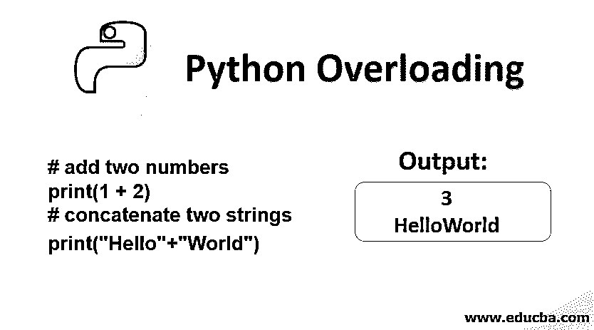
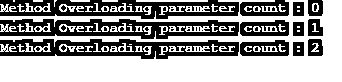
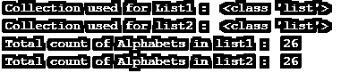
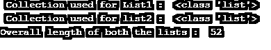

# Python 重载

> 原文：<https://www.educba.com/python-overloading/>




## Python 重载介绍

方法重载是一种向已经定义的函数添加新功能的方式，通过这种方式，我们重载了函数。还有很多其他语言[支持方法重载](https://www.educba.com/method-overloading-in-java/)，Python 也支持方法重载。例如，加号运算符是运算符重载的一个示例，它可以将整数和字符串相加。然后可以减去整数和集合的减号运算符也列出来了，这就是 Python 在其运算符和函数中的重载特性。

python 重载可以通过两种方式或实例来实现；下面列出了它们，

<small>网页开发、编程语言、软件测试&其他</small>

*   函数或方法的重载(函数重载)。
*   运算符重载(运算符重载)。

### Python 中的函数重载

方法重载在 python 中不是一个应用概念，但是可以通过几种技术来实现。首先，方法重载的概念可以分为两种不同的概念，

*   重载用户定义的函数。
*   重载默认函数。

#### 1.重载用户定义的函数

用户自定义的[函数重载可以在 python 中通过设置一个参数或自变量值为 none 来实现](https://www.educba.com/function-overloading-in-java/)。因此，如果某个参数被设置为 none，那么当没有为该参数传递值时，函数会以一种方式做出反应，而当没有为同一参数传递值时，函数会以另一种方式做出反应。

**举例:**

```
#!/usr/bin/env python
class Overloading_test:
    def overloading_function(self , argument1 = 0 , argument2 = 0 ):
        if argument1 is not None or argument2 is not None:
            print('Method Overloading parameter count :',(int( argument1) + int(argument2)))
        else:
            print( ' Method Overloading without parameters ' )
# Create instance
object1 = Overloading_test()    
# Call the method with no arguments
object1.overloading_function()   
# Call the method with 1 argument
object1.overloading_function(1)
# Call the method with 2 argument
object1.overloading_function(1,1)
```

****输出:****

**<u>**

**</u>** 

#### 2.重载默认或预定义的函数

重载内置函数涉及定义预定义函数，该函数预计将作为特殊函数在 python 类中重载。所以当预定义函数在 Python 类中被声明为特殊函数时，解释器会使用这个特殊函数作为预定义调用的声明。下面的例子精确地解释了这个过程。

**举例:**

让我们考虑 len()函数，它用于确定一个项目的长度；对于这个例子，下面的例子显示了长度函数的标准用法，没有暗示重载，并发布了相应的影响。

```
# Using len() function without method overloading
Lower_Case = [ ' a ' , ' b ' , ' c ', ' d ' , ' e ' , ' f ', ' g ' , ' h ' , ' i ' , ' j ' , ' k ' , ' l ' , ' m ' , ' n ' , ' o ', ' p ' , ' q ' , ' r ', ' s ' , ' t ' , ' u ' , ' v ', ' w ' , ' x ' , ' y ' , ' z ' ]
Upper_Case = [ ' A ' , ' B ' , ' C ', ' D ' , ' E ' , ' F ', ' G ' , ' H ' , ' I ' , ' J ' , ' K ' , ' L ' , ' M ' , ' N ' , ' O ', ' P ' , ' Q ' , ' R ', ' S ' , ' T ' , ' U ' , ' V ', ' W ' , ' X ' , ' Y ' , ' Z ' ]
print(' Collection used for List1 : ', type(Lower_Case))
print(' Collection used for list2 : ', type(Upper_Case))
print(' Total count of Alphabets in list1 : ',  len(Lower_Case))
print(' Total count of Alphabets in list2 : ',  len(Upper_Case))
```

****输出:****

**<u>**

**</u>** 

现在让我们[在同一个代码片段中为 len()函数使用方法重载](https://www.educba.com/method-overloading-in-python/)。

```
class overloading:
    def __init__(self,argument1, argument2):
        self.argument1 = argument1
        self.argument2 = argument2        
    def __len__(self):
        return argument1+argument2
Lower_Case = [ ' a ' , ' b ' , ' c ', ' d ' , ' e ' , ' f ', ' g ' , ' h ' , ' i ' , ' j ' , ' k ' , ' l ' , ' m ' , ' n ' , ' o ', ' p ' , ' q ' , ' r ', ' s ' , ' t ' , ' u ' , ' v ', ' w ' , ' x ' , ' y ' , ' z ' ]
Upper_Case = [ ' A ' , ' B ' , ' C ', ' D ' , ' E ' , ' F ', ' G ' , ' H ' , ' I ' , ' J ' , ' K ' , ' L ' , ' M ' , ' N ' , ' O ', ' P ' , ' Q ' , ' R ', ' S ' , ' T ' , ' U ' , ' V ', ' W ' , ' X ' , ' Y ' , ' Z ' ]
print(' Collection used for List1 : ', type(Lower_Case))
print(' Collection used for list2 : ', type(Upper_Case))
argument1 = len(Lower_Case)
argument2 = len(Upper_Case)
# Using len() function without method overloading
Object1 = overloading(argument1,argument2) 
print('Overall length of both the lists : ', len(Object1))
```

******输出:******

 ****<u>**

**</u>** 

我们可以清楚地注意到，没有使用通常的内置长度功能，而是使用了重载的特殊函数 __len__()来输出两个列表的总长度，而不是它们各自的长度。

### Python 中的运算符重载

这涉及到对运算符的扩展解释，而不仅仅是其最初的目的。最常见的例子是加法运算符“+”，它可用于通常的加法，也可用于连接两个不同的字符串。

****例如:****

```
# add two numbers
print(1 + 2)
# concatenate two strings
print("Hello"+"World")
```

****输出:****

**<u>**

**</u>** 

### <u>优势</u>

 <u>*   提高代码的可重用性。
*   增加代码的清晰度。
*   代码的复杂性大大降低了。

### 结论

[重载在许多高级编程语言中扮演着](https://www.educba.com/overloading-in-java/)至关重要的角色；在 python 的例子中，虽然它们没有被直接暗示，但是它们在避免代码的重复使用中扮演着重要的角色。

### 推荐文章

这是 Python 重载的指南。这里我们讨论用户定义的和预定义的函数以及它的操作符和优点。您也可以阅读以下文章，了解更多信息——

1.  [Python 变量](https://www.educba.com/python-variables/)
2.  [超载 vs 越权](https://www.educba.com/overloading-vs-overriding/)
3.  [Python 文件操作](https://www.educba.com/python-file-operations/)
4.  [Python 中的运算符重载](https://www.educba.com/operator-overloading-in-python/)


</u>**