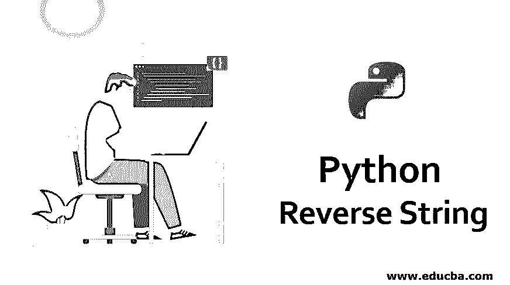
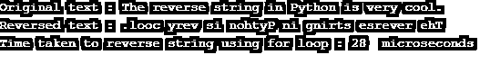
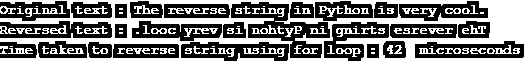
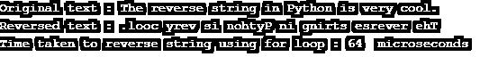
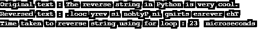
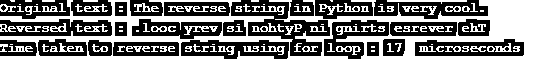
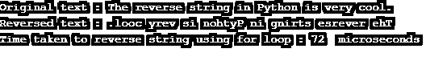

# Python 反向字符串

> 原文：<https://www.educba.com/python-reverse-string/>




## Python 反向字符串介绍

下面的文章提供了 Python 反向字符串的概要。通常，我们会遇到这样的情况，我们需要对程序中的单词或文本进行操作，以获得最终结果。程序中的单词或文本被称为字符串，它只不过是一系列字符数据。Python 中字符串的数据类型称为 str，由单引号或双引号中声明的任何字符集定义。

**举例:**

<small>网页开发、编程语言、软件测试&其他</small>

**代码:**

```
text = "A quick brown fox jumps over the lazy dog."
```

下面的变量文本属于 str 类型，它包含值“一只敏捷的棕色狐狸跳过了一只懒狗。”.现在，根据需要，可以在字符串上执行许多操作。一个这样的动作是反转一个字符串。我们的书写是左对齐的，也就是说，我们从左边写到右边。当我们反转一个字符串时，结果是原字符串左边表示的右边。

让我们举一个例子来说明这一点:

*   **原串:**“Python 里的反串很酷。”
*   **反转字符串:**。" looc yrev si nohtyp 或 gnirts esrever eht . "

这是如此有趣，一个简单的文本反转有时会如此混乱。但是这在编程中有很多应用，我们必须知道 Python 中反转一个文本的所有方法。

### Python 反向字符串示例

正如我们所知，Python 是当今世界使用最广泛的编程语言，所以必须将它包含在你的编程库中。在这里，我们将看看在 Python 中反转文本的不同方法，并最后对它们进行比较研究。

#### 示例 1:使用 For 循环

一个字符串可以被认为是一个字符列表，所以为了反转一个字符串，我们可以使用 for 循环遍历它，然后从后向前将字符追加到一个新的变量中。让我们看一下代码。

**代码:**

```
from datetime import datetime
text = "The reverse string in Python is very cool."
reversed_text = ""
time_start = datetime.now().microsecond
for character in text:
    reversed_text = character + reversed_text
time_finish = datetime.now().microsecond
print("Original text :",text)
print("Reversed text :",reversed_text)
print("Time taken to reverse string using for loop :",str(time_finish-time_start)," microseconds")
```

**输出:**




#### 示例 2:使用 While 循环

除了使用 For 循环，我们还可以使用 while 循环来让[获得反向字符串](https://www.educba.com/reverse-string-in-c/)。让我们看一下代码。

**代码:**

```
from datetime import datetime
text = "The reverse string in Python is very cool."
reversed_text = ""
length = len(text) - 1
time_start = datetime.now().microsecond
while(length>=0):
    reversed_text = reversed_text + text[length] 
    length = length - 1
time_finish = datetime.now().microsecond
print("Original text :",text)
print("Reversed text :",reversed_text)
print("Time taken to reverse string using for loop :",str(time_finish-time_start)," microseconds")
```

**输出:**




#### 示例 3:使用递归

递归是一种编程方法，在这种方法中，除非满足某个条件，否则函数会多次调用自身。

**代码:**

```
from datetime import datetime
text = "The reverse string in Python is very cool."
def reverse_recursion(text):
    if len(text) == 0:
        return text
    else:
        return reverse_recursion(text[1:]) + text[0]
time_start = datetime.now().microsecond
reverse_recursion(text)
time_finish = datetime.now().microsecond
print("Original text :",text)
print("Reversed text :",reverse_recursion(text))
print("Time taken to reverse string using for loop :",str(time_finish-time_start)," microseconds")
```

**输出:**




#### 示例#4:使用列表反转

字符串是一个字符列表，所以可以使用 list 的 reverse()函数进行反转。

**代码:**

```
from datetime import datetime
text = "The reverse string in Python is very cool."
def reverse_list(text):
    text_list = list(text)
    text_list.reverse()
    return ''.join(text_list)
time_start = datetime.now().microsecond
reverse_list(text)
time_finish = datetime.now().microsecond
print("Original text :",text)
print("Reversed text :",reverse_list(text))
print("Time taken to reverse string using for loop :",str(time_finish-time_start)," microseconds")
```

**输出:**




#### 示例 5:使用 join()和 reversed()函数

**代码:**

```
from datetime import datetime
text = "The reverse string in Python is very cool."
def reverse_join_reversed(text):
    reversed_text = ''.join(reversed(text))
    return reversed_text
time_start = datetime.now().microsecond
reverse_join_reversed(text)
time_finish = datetime.now().microsecond
print("Original text :",text)
print("Reversed text :",reverse_join_reversed(text))
print("Time taken to reverse string using for loop :",str(time_finish-time_start)," microseconds")
```

**输出:**




#### 示例 6:使用切片

**代码:**

```
from datetime import datetime
text = "The reverse string in Python is very cool."
time_start = datetime.now().microsecond
print("Original text :",text)
print("Reversed text :",text[::-1])
time_finish = datetime.now().microsecond
print("Time taken to reverse string using for loop :",str(time_finish-time_start)," microseconds")
```

**输出:**




从上面的例子可以明显看出，在 Python 中有很多方法可以反转一个字符串。但我们必须始终遵循最简洁、最快速的方法。

### 结论

在本文中，我们看到了 Python 中反转字符串的概念，并研究了实现这一点的各种方法及其语法。我们还做了比较研究，发现切片操作是反转字符串的最佳选择，因为它的计算时间很快。既然我们已经研究了反转字符串的所有内容，那么是时候将它付诸实践了。

### 推荐文章

这是一个 Python 反向字符串的指南。为了更好地理解，我们在这里讨论 python 反向字符串的介绍和例子。您也可以浏览我们推荐的文章，了解更多信息——

1.  [计数排序 Python](https://www.educba.com/counting-sort-python/)
2.  [Python 库列表](https://www.educba.com/python-libraries-list/)
3.  [Python 不等于](https://www.educba.com/python-not-equal/)
4.  [Python strftime](https://www.educba.com/python-strftime/)


