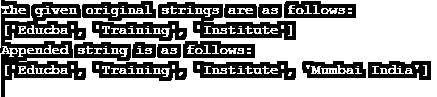
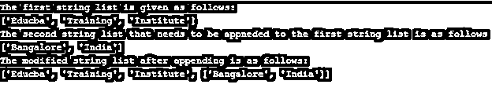

# Python 字符串追加

> 原文：<https://www.educba.com/python-string-append/>


## Python 字符串追加简介

在本文中，我们将讨论字符串的连接以及如何将一个字符串追加到另一个字符串中。在 python 中，我们还可以重复追加字符串。在 Python 中，串联意味着将一个字符串添加或追加到另一个字符串。通常，Python 的“+”运算符用于通过将一个变量添加到另一个变量来将一个字符串添加到另一个字符串。在 Python 中，我们也有 append()函数，它将向现有的项目添加单个项目。在对现有元素应用 append()函数后，该函数将返回修改后的项目列表。还有另一种称为 join()的方法，也用于追加字符串。

### 字符串追加的工作示例

在本文中，我们将看到 Python 中的 append()函数，还将看到追加或连接字符串的其他方法。我们知道，字符串的对象是不可变的；当我们使用“+”操作符连接字符串时，会创建一个新的不同的字符串。而追加字符串只是为了修改原始字符串，这也类似于使用“+”运算符。这个 append 函数主要用于字符串列表。为了重复追加字符串，我们需要首先将它转换成一个列表，然后将给定的元素追加到那个列表中，然后将列表连接回追加的字符串。

<small>网页开发、编程语言、软件测试&其他</small>

现在让我们看看如何使用“+”操作符追加一个字符串，这也称为字符串的连接。让我们看看下面的例子，它使用“+”操作符连接给定的字符串。

**举例:**

```
str1 = "Educba Training"
str2 = " MuMbai, India"
print("The given original string : " + str(str1))
print("The string given to append to the previous string: " + str(str2))
res = str1 + str2
print("The Modified string is obtained as follows:")
print(res)
```

**输出:**


在上面的程序中，我们看到有两个字符串，“str1”和“str2”，其中 str1 使用“+”运算符附加到 str2。这是在语句“res = str1 + str2”中完成的，其中我们将 string 1 添加到 string 2 以获得结果，该结果存储在变量“res”中。该结果是两个字符串的相加，或者我们可以说 str2 被附加到 str1。我们可以看到 str2 以空白开始，这样当它被附加到 str1 时，我们可以正确地读取它。

现在让我们看看如何使用 append()函数追加两个字符串。这个函数的工作方式与上面的“+”操作符类似。让我们看看下面使用 append()函数的例子。这个函数主要用于追加两个以上的字符串。

**语法:**

```
str.append(items)
```

要添加到字符串列表中的项。

这将向给定的字符串或字符串列表添加单个项目。

**举例:**

```
str = ['Educba', 'Training', 'Institute']
print("The given original strings are as follows:")
print(str)
str.append('Mumbai India')
print("Appended string is as follows:")
print(str)
```

**输出:**




在上面的程序中，我们看到了列表中的字符串是用“str”变量声明的，需要追加的字符串可以直接传递给 append()函数。我们应该注意，这里我们只能向字符串列表中添加一项。所以要对字符串列表对象这样做，我们应该应用 append()函数。因此，这是追加字符串的一种方式。

假设如果我们想要在给定的字符串列表中添加多个项目，这意味着可以通过如下方式将一个字符串列表添加到另一个字符串列表中:

**举例:**

```
str1 = ['Educba', 'Training', 'Institute']
print("The first string list is given as follows:")
print(str1)
str2 = ['Bangalore', 'India']
print("The second string list that needs to be appneded to the first string list is as follows")
print(str2)
str1.append(str2)
print("The modified string list after appending is as follows:")
print(str1)
```

**输出:**




在上面的程序中，我们可以看到我们有两个字符串列表，其中 str2 需要附加到 str1，结果是用一个单独的字符串获得的，第二个字符串附加到它上面。我们可以在上面的截图中看到，我们可以看到第二个字符串列表被附加到第一个字符串列表。

现在让我们看看使用 Python 中的 join()函数追加字符串的另一种方法。让我们考虑下面的例子来演示 join()函数。当我们需要添加更多的字符串而不是两个字符串时，这个函数很有用。

**举例:**

```
str1 = "Educba Training"
str2 = " Mumbai India"
print("The given first string : " )
print(str(str1))
print("The given second string that needs to be appended: ")
print(str(str2))
res = "".join((str1, str2))
print("The appended string is obtained as follows: ")
print(res)
```

**输出:**


在上面的程序中，我们看到了附加字符串的另一种方法。在上面的程序中，我们看到使用 join”()函数；我们可以将第二个字符串附加到第一个字符串上。

### 结论

在本文中，我们讨论了 Python 中的字符串追加。字符串追加本身意味着将两个或多个字符串连接或添加到给定的字符串或字符串列表，以获得包含字符串或字符串列表的修改后的字符串；在本文中，我们首先看到了如何使用“+”操作符添加到两个字符串中。然后我们看到了 append()，它用于将一个或多个字符串追加到字符串列表中。最后，我们看到了 join()函数，它用于追加字符串，也可以用于追加多个字符串。

### 推荐文章

这是 Python 字符串追加的指南。在这里，我们讨论如何使用“+”运算符对两个字符串进行追加，并举例说明字符串追加的工作原理。您也可以看看以下文章，了解更多信息–

1.  [Python kwargs](https://www.educba.com/python-kwargs/)
2.  [Python 多行字符串](https://www.educba.com/python-multiline-string/)
3.  [Python Unicode Error](https://www.educba.com/python-unicode-error/)
4.  [字符串长度 Python](https://www.educba.com/string-length-python/)


