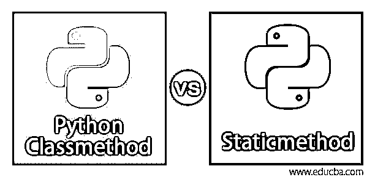
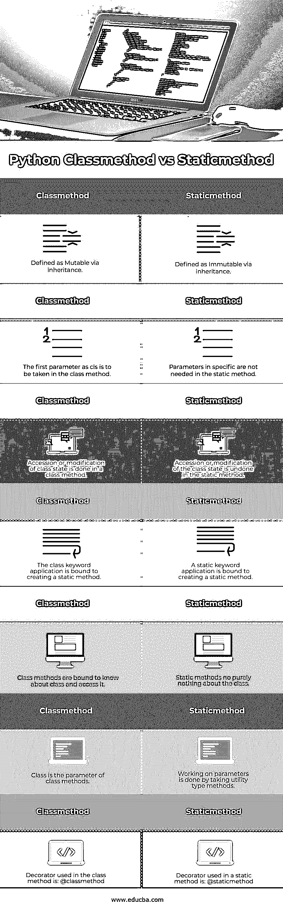

# Python 类方法与静态方法

> 原文：<https://www.educba.com/python-classmethod-vs-staticmethod/>




## Python 类方法和静态方法的区别

在本文中，我们将学习 Python Classmethod 与 Staticmethod 的主要区别和比较。

**前言**

<small>网页开发、编程语言、软件测试&其他</small>

实例方法、类方法和静态方法是 Python 中的 OOP 概念，是内置函数。classmethod()和 staticmethod()分别返回给定函数的类方法和静态方法。

Python 中的实例方法与类方法和静态方法不同，因为它们是普通的，可以访问实例的不同数据。与静态方法不同，类方法和实例方法必须有自己的参数。

在 Python 的新版本中，我们必须使用@classmethod 和@staticmethod 装饰器，因为以前的表示被认为是过时的和不和谐的。

**装修工**

在理解上述方法的不同之处之前，理解装饰器模式是很重要的，直接称为装饰器。

decorator 可以由用户编写，也可以从 Python 标准库中提取(可以组合多个 decorator)，因为它们只是函数，并且执行任务。它们改变其他函数的行为或应用逻辑。代码可重用性和逻辑分离得到了很好的执行。

装饰模式优先用于定义 static()和 class()。他们以符号**开始。**

### 句法

下面是提到的语法

#### 1.分类方法

```
class new_class:
     @classmethod
     def name_of_function (cls, arguments):
           #body of the function
           return value 
```

#### 2.静态法

```
class new_class:
    @static method
    def name_of_function (arguments):
         #body of the function
         return value 
```

### 一般表征

```
class Dear_class:
    def method(self):
      return 'This is instance method', self
    @classmethod #Decorator used
    def classmethod(cls):
      return 'This is classmethod', cls
    @staticmethod #Decorator used
    def staticmethod():
      return ' This is static method' 
```

### 因素

下面是提到的参数

#### 1.分类方法

这个方法跳转到一个类，而不是它的对象。没有必要创建类实例。这与静态方法非常相似。类方法的参数主要是类本身，因此它与类相关联。

**创建类方法:**

```
class Xname:
   year_of_birth = 1992
   def printAge(cls):
     print('The age is:',2020 - cls. year_of_birth)
# create printAge class method
Xname.printAge = classmethod(Xname.printAge)
Xname.printAge() 
```

**上面代码的输出:**


#### 2.静态法

这些很像类方法，它们跳到类中而不是对象中。静态方法独立于对象的状态，因此不需要创建类的实例。静态方法处理参数，因此不与类交互，或者至少不了解它。

**创建静态方法:**

```
class SimpleMath:
   def addition(a, b):
     return a + b
# creating a static method
SimpleMath.addition = staticmethod(SimpleMath.addition)
print('The result is:', SimpleMath.addition(5, 10)) 
```

**上面代码的输出:**


### Python Classmethod 与 Staticmethod 的直接比较(信息图表)

以下是 Python Classmethod 和 Staticmethod 的顶级对比:




### 主要差异

了解 Python Classmethod 和 Staticmethod 之间的主要区别

| **Python Classmethod**`class D
@staticmethod
def static_method(x,y)
@classmthod
def cls_method(cls, x, y)` | **Staticmethod**

`d = D()
d.static_method(1,2)static_method (1,2) #directly
d.cls_method(1,2)
cls_method (type(d),1,2)`

 |

当你在类中放入一个方法时，你放入了一个常规函数。当您通过类实例调用相同的函数时，它会神奇地插入额外的参数。如果您习惯于面向对象编程，这是很方便的，因为它的行为与面向对象方法在使用普通函数实现时的行为完全一样。

静态方法允许您定义一个没有隐式 self 参数的函数。当你调用它时，它不再进行转换。

`d.static_method(1,2)
static_method (1,2) #directly`

这是一种独立的方法。只是碰巧在一个类里面。根据调用它的内容，在它的开头没有插入任何参数。

一个选择是类方法。它接受第一个对象并插入第一个参数。除了这一点，它更聪明一点。当我们对类方法进行这种转换时，我们采用 d 的类型，所以这个调用变成了类方法的含义，

`d.cls_method(1,2)
cls_method (type(d),1,2)`

### Python Classmethod 与 Staticmethod 对照表

现在让我们在下面的表格中进行比较

| **Class Method**1.通过继承定义为可变的2.第一个参数 cls 将在类方法中获取。3.类状态的加入或修改是在类方法中完成的。4.class 关键字应用程序必须创建一个静态方法。

5.类方法必然知道类并访问它。

6.Class 是类方法的参数。

7.class 方法中使用的 Decorator 是:@classmethod

 | **Static Method**1.通过继承定义为不可变的2.静态方法中不需要特定的参数。3.在静态方法中，类状态的加入或修改是撤消的。4.静态关键字应用程序必然会创建静态方法。5.静态方法不完全是关于类的。6.对参数的操作是通过使用实用类型方法来完成的。7.静态方法中使用的 Decorator 是:@staticmethod |

### 结论

在 Python 中，类方法是构造函数的替代方法，静态方法不对实例或类进行操作。在现实世界中，像创建一个对象这样的例子被认为是像日期/时间模块和使用当前时间传递年/月和日期。

当您进入实际的函数体时，这个参数类就是调用它的对象的类型。如果使用继承，这可能会很方便。

### 推荐文章

这是 Python class method vs static method 的指南。在这里，我们讨论 Python Classmethod 和 Staticmethod 与信息图和比较表的主要区别。您也可以看看以下文章，了解更多信息–

1.  [Python vs Ruby](https://www.educba.com/python-vs-ruby/)
2.  [Python vs Matlab](https://www.educba.com/python-vs-matlab/)
3.  [Python 元组 vs 列表](https://www.educba.com/python-tuple-vs-list/)
4.  [Python vs Node.js](https://www.educba.com/python-vs-node-js/)


