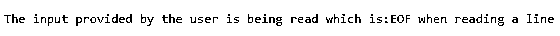
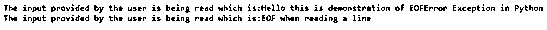

# Python EOFError

> 原文：<https://www.educba.com/python-eoferror/>


## Python EOFError 简介

python 中的 EOFError 是处理错误的异常之一，在 python 2.7 版和 python 3.6 版以及 3.6 版之后的其他版本中，当 input()函数到达 python 2.7 版中意外的文件结尾时，即在遇到输入结尾之前函数不读取任何日期时，会引发该异常。而 read()等方法在遇到文件结尾时必须返回一个空的字符串，python 中的这个 EOFError 是从 Exception 类继承的，而 Exception 类又是从 BaseException 类继承的。

**语法:**

<small>网页开发、编程语言、软件测试&其他</small>

`EOFError: EOF when reading a line`

### 在 Python 中使用 EOFError

以下是 EOFError 的工作原理:

**1。** BaseException 类是异常类的基类，它继承了 EOFError 类。

**2。** EOFError 在技术上不算错误，但却是个例外。当 input()函数或 read()函数等内置函数在没有读取任何数据的情况下返回一个空字符串时，就会引发 EOFError 异常。

**3。**当我们的程序试图获取某些东西并对其进行修改时，会引发这个异常，但是当它无法读取任何数据并返回一个空字符串时，就会引发 EOFError 异常。

### 例子

下面是 Python EOFError 的例子:

#### 示例#1

Python 程序来演示 EOFError，程序中有一个错误消息。

**代码:**

```
#EOFError program
#try and except blocks are used to catch the exception
try:
    	while True:
       		 #input is assigned to a string variable check
        		check = raw_input('The input provided by the user is being read which is:')
        		#the data assigned to the string variable is read
        		print 'READ:', check
#EOFError exception is caught and the appropriate message is displayed
except EOFError as x:
   	 print x 
```

**输出:**




**说明:**在上面的程序中，使用了 try 和 except 块来捕捉异常。在 try 块中使用 while 块，该块的计算结果为 true，只要条件为 true，就会读取用户提供的数据，并使用 print 语句显示这些数据，如果无法读取数据并返回空字符串，则 except 块会引发异常，并在输出中显示消息。

#### 实施例 2

Python 程序来演示 EOFError，程序中有一个错误消息。

**代码:**

```
#EOFError program
#try and except blocks are used to catch the exception
try:
    	while True:
       			 #input is assigned to a string variable check
       			 check = raw_input('The input provided by the user is being read which is:')
        			#the data assigned to the string variable is read
        		 print 'Hello', check
#EOFError exception is caught and the appropriate message is displayed
except EOFError as x:
    	print x 
```

**输出:**




**说明:**在上面的程序中，使用了 try 和 except 块来捕捉异常。在 try 块中使用 while 块，该块的计算结果为 true，只要条件为 true，就会读取用户提供的数据，并使用 print 语句显示这些数据，如果无法读取数据并返回空字符串，则 except 块会引发异常，并在输出中显示消息。

### 在 Python 中避免 EOFError 的步骤

如果在没有使用 input()函数读取任何数据的情况下发生文件结束错误或 EOFError，则会引发 EOFError 异常。为了避免引发此异常，我们可以尝试以下选项:

在发送文件结束异常之前，尝试输入类似 CTRL + Z 或 CTRL + D 或空字符串的内容，如下例所示:

**代码:**

```
#try and except blocks are used to catch the exception
try:
    	data = raw_input ("Do you want to continue?: ")
except EOFError:
    	print ("Error: No input or End Of File is reached!")
    	data = ""
    	print data 
```

**输出:**


**解释:**在上面的程序中，try 和 except 块通过使用一个空字符串来避免 EOFError 异常，该空字符串不会打印文件结束错误消息，而是打印由 is 提供的自定义消息，该消息显示在程序中，并且也打印在输出中。程序的输出显示在上面的快照中。

如果必须处理 EOFError 异常，可以使用 try 和 catch 块。

### 结论

在本教程中，我们通过定义了解了 Python 中 EOFError 的概念，Python 中 EOFError 的语法，通过编程示例及其输出了解了 Python 中 EOFError 的工作原理，以及避免 Python 中 EOFError 的步骤。

### 推荐文章

这是 Python EOFError 的指南。在这里，我们讨论 Python EOFError 的介绍和工作原理，以及示例和代码实现。您也可以浏览我们推荐的其他文章，了解更多信息——

1.  [Python 范围函数介绍](https://www.educba.com/python-range-function/)
2.  [Python 集合函数的 7 大方法](https://www.educba.com/python-set-function/)
3.  [Python Zip 函数|示例](https://www.educba.com/python-zip-function/)
4.  [蟒蛇龟示例指南](https://www.educba.com/python-turtle/)


