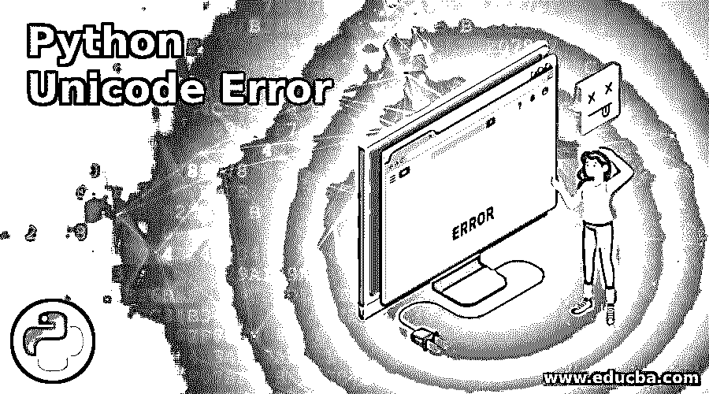
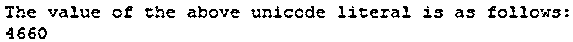
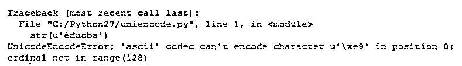
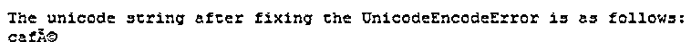
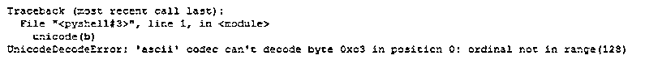
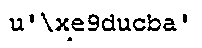

# Python Unicode Error

> 原文：<https://www.educba.com/python-unicode-error/>




## Python Unicode 错误介绍

在 Python 中，Unicode 被定义为一种字符串类型，用于表示允许 Python 程序处理任何类型的不同可能字符的字符。例如，目录的任何路径或任何链接地址作为字符串。当我们使用这样的字符串作为任何函数的参数时，都有可能出现错误。这种错误在 Python 中被称为 Unicode 错误。我们得到这样一个错误是因为 Unicode 转义序列(" \u ")之后的任何字符都会产生一个错误，这是 windows 上的一个典型错误。

### Python 中 Unicode 错误的处理及实例

Python 中的 Unicode 标准是以码位格式表示字符。制定这些标准是为了避免指定字符之间的不确定性，这种不确定性可能会导致 Unicode 错误。例如，让我们把“我”看作罗马数字一。甚至可以认为是大写字母“I”；他们看起来一样，但他们是两个不同的角色，有不同的含义，以避免这种歧义；我们使用 Unicode 标准。

<small>网页开发、编程语言、软件测试&其他</small>

在 Python 中，Unicode 标准有两种类型的错误:Unicode 编码错误和 Unicode 解码错误。在 Python 中，它包括 Unicode 错误处理程序的概念。每当在编码或解码字符串或给定文本的过程中出现问题或错误时，就会调用这些处理程序。为了在 Python 程序中包含 Unicode 字符，我们首先在任何字符串前使用 Unicode 转义符\u，这可以被视为 Unicode 类型的变量。

**语法:**

Python 程序中的 Unicode 字符可以写成如下形式:

`“u dfskgfkdsg”`

或者

`“U sakjhdxhj”`

或者

`“\u1232hgdsa”`

在上面的语法中，我们可以看到 3 种不同的声明 Unicode 字符的方式。在 Python 程序中，我们可以编写带有前缀“U”或“U”的 Unicode 文字，后跟一个包含字母和数字的字符串，我们可以看到上面的两个语法示例。在 end last 语法示例中，我们还可以使用“\ u”Unicode 转义序列来声明程序中的 Unicode 字符。在这里，我们必须注意，使用“\u”，我们可以编写一个包含任何字母或数字的字符串，但当我们想要声明任何十六进制值时，我们必须“\x”转义序列，它需要两个十六进制数字，对于八进制，它将需要数字 777。

#### 示例#1

现在让我们看一个在程序中声明 Unicode 字符的例子。

**代码:**

```
#!/usr/bin/env python
# -*- coding: latin-1 -*-
a= u'dfsf\xac\u1234'
print("The value of the above unicode literal is as follows:")
print(ord(a[-1]))
```

**输出:**




在上面的程序中，我们可以看到 python 程序中 Unicode 文字的示例，但在此之前，我们需要声明编码，这在不同版本的 Python 中是不同的，在这个程序中，我们可以在程序的前两行中看到。

现在我们将看到 Unicode 错误，如 Unicode 编码错误和 Unicode 解码错误，它们由 Unicode 错误处理程序处理，在遇到错误时会自动调用。Python Unicode 错误处理程序中有 3 个典型错误。

Python 中的 Strict error 会分别针对发生的编码和解码错误引发 UnicodeEncodeError 和 UnicodeDecodeError。

#### 实施例 2

UnicodeEncodeError 演示及其示例。

在 Python 中，它不能检测 Unicode 字符，因此它会抛出编码错误，因为它不能对给定的 Unicode 字符串进行编码。

**代码:**

`str(u'éducba')`

**输出:**




在上面的程序中，我们可以看到我们将参数传递给了 str()函数，这是一个 Unicode 字符串。但是这个函数将使用默认的编码过程 ASCII。正如我们在上面的语句中看到的，我们在这个程序的开始没有指定任何编码，因此它抛出一个错误，使用的默认编码是 7 位编码，它不能识别 0 到 128 范围之外的字符。因此，我们可以看到上面截图中显示的错误。

上面的程序可以通过手工编码 Unicode 字符串来修复，比如。编码(' utf8 ')，然后将 Unicode 字符串传递给 str()函数。

#### 实施例 3

在这个程序中，我们显式调用了 str()函数，这可能会再次抛出一个 UnicodeEncodeError。

**代码:**

```
a = u'café'
b = a.encode('utf8')
r = str(b)
print("The unicode string after fixing the UnicodeEncodeError is as follows:")
print(r)
```

**输出:**




在上面的内容中，我们可以展示如何通过使用。编码(' utf8 ')为 Unicode 字符串。

#### 实施例 4

现在我们将看到 UnicodeDecodeError 演示及其示例，以及如何避免它。

**代码:**

`a = u'éducba'
b = a.encode('utf8')
unicode(b)`

**输出:**

在上面的程序中，我们可以看到我们试图通过先编码来打印 Unicode 字符；然后，我们尝试将编码字符串转换成 Unicode 字符，这意味着解码回开始时给出的 Unicode 字符。在上面的程序中，当我们运行时，我们得到一个错误，称为 UnicodeDecodeError。所以为了避免这个错误，我们必须手动解码 Unicode 字符“b”。




所以我们可以通过使用下面的语句来修复它，我们可以在上面的截图中看到它。

解码(' utf8 ')




### 结论

在本文中，我们得出结论，在 Python 中，Unicode 文字是表示不同类型字符串的其他类型字符串。在本文中，我们看到了不同的错误，如 UnicodeEncodeError 和 UnicodeDecodeError，它们用于编码和解码程序中的字符串，并附有示例。在本文中，我们还看到了如何通过将字符串传递给函数来手动修复这些错误。

### 推荐文章

这是一个 Python Unicode 错误的指南。这里我们分别讨论 Python Unicode 错误的介绍和 Unicode 错误的处理示例。您也可以看看以下文章，了解更多信息–

1.  [Python 字符串操作](https://www.educba.com/python-string-operations/)
2.  [Python 排序列表](https://www.educba.com/python-sort-list/)
3.  [Python 中的快速排序](https://www.educba.com/quick-sort-in-python/)
4.  [Python 常量](https://www.educba.com/python-constants/)


