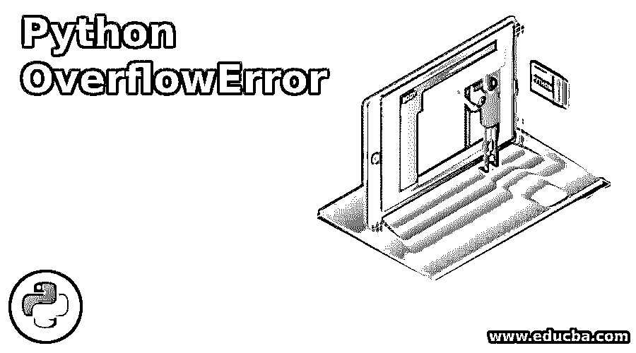
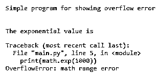
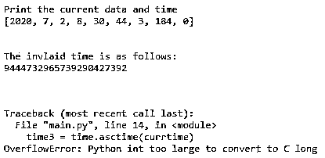
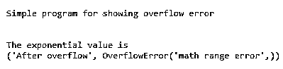
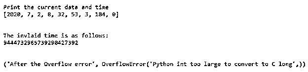

# Python OverflowError

> 原文：<https://www.educba.com/python-overflowerror/>




## Python OverflowError 简介

在 Python 中，当算术运算等任何操作或任何其他变量存储的任何值超过其限制时，就会发生溢出错误，然后会发生超出其指定或已定义限制的值溢出。一般来说，在所有的编程语言中，这个溢出错误的意思都是一样的。在 Python 中，当算术运算结果存储在任何变量中时，如果结果值大于任何给定的数据类型，如 float、int 等，超过当前 Python 运行时值的限制或值，也会发生此错误。因此，当这些值大于声明的数据类型值时，将导致引发内存错误。

### Python OverflowError 是如何工作的？

Python 中溢出错误的处理:

<small>网页开发、编程语言、软件测试&其他</small>

在本文中，我们将看到这种溢出错误在任何 Python 程序中何时以及如何发生。一般来说，溢出错误顾名思义是指溢出本身定义了一个额外的部分，因此在 Python 中，当获得的值或结果大于程序中声明的操作或数据类型时也会发生这种情况，这时会抛出一个溢出错误，指示该值超过了给定或声明的限制值。

### 实现 Python OverflowError 的示例

现在让我们看看下面简单而一般的例子:

#### 示例#1

**代码:**

```
print("Simple program for showing overflow error")
print("\n")
import math
print("The exponential value is")
print(math.exp(1000))
```

**输出:**




**解释:**在上面的程序中，我们可以看到我们正在声明 math 模块并使用来计算指数值，例如 exp(1000 ),这意味着 e^x 这里的 x 值是 1000，e 值是 2.7，当我们试图计算它时，它会给出一个双精度的结果值，并且它不能打印结果，因此， 它给出了一个溢出错误，如上面的程序所示，它说它超出了范围，因为 x 值是 1000，当结果给出超出范围的值或 double 来存储该值并打印它。

#### 实施例 2

现在我们将看到一个程序，由于数据类型值存储超出范围，它将给出一个错误。在上面的程序中，我们看到了算术运算。现在，让我们在下面的示例中演示该值超过了数据类型值:

**代码:**

```
import time

currtime = [tm for tm in time.localtime()]
print("Print the current data and time")
print(currtime)
print("\n")

time2 = (2**73)
print("The invlaid time is as follows:")
print(time2)
print("\n")

currtime[3] = time2
time3 = time.asctime(currtime)
print(time3)
```

**输出:**




**解释:**在上面的程序中，我们使用时间模块打印当前时间，当我们在程序中打印固化时间时，我们使用 time.local time()函数打印当前时间，该函数产生带有[年、月、日、分、秒……]的输出，然后我们试图通过将小时值更改为它所能存储的更大的值来打印该值。因此，当我们试图打印这个值时，它会抛出一个错误，说 Python int 太大，无法转换为 C long。这意味着它不能存储如此大的值并将其转换为长数据类型。这个输出给出了溢出错误，因为 time3 使用普通整数对象，因此它不能接受任意长度的对象。这些错误可以通过使用异常处理来处理。在下一节中，我们将了解这个异常处理。在上面的程序中，我们看到了当前值超过极限值时发生的溢出错误。因此，为了处理这个问题，我们必须引发 overflowError 异常。在层次结构中发现的此异常依次是 Baseexception、Exception、ArithmeticError，然后是 OverflowError。现在让我们看看上面的程序是如何解决这个问题的。

#### 实施例 3

现在让我们看看如何通过在下面的程序中使用 try 和 except 异常处理来处理上述超出范围的数学溢出错误。**代码:**

```
print("Simple program for showing overflow error")
print("\n")

import math

try:
    print("The exponential value is")
    print(math.exp(1000))

except OverflowError as oe:
    print("After overflow", oe)
```

**输出:**




**解释:**所以我们可以在上面的截图中看到，我们正在使用 try 和 except 块处理 OverflowError，当它抛出这个异常时，它将打印消息。我们可以在上面的结果输出中看到异常是如何处理的。

#### 实施例 4

让我们通过使用这个异常处理概念来看看上一节中另一个程序的解决方案。让我们在下面演示一下:

**代码:**

```
import time
try:
    currtime = [tm for tm in time.localtime()]
    print("Print the current data and time")
    print(currtime)
    print("\n")

    time2 = (2**73)
    print("The invlaid time is as follows:")
    print(time2)
    print("\n")
    currtime[3] = time2
    print(time.asctime(currtime))
except OverflowError as oe:
    print("After the Overflow error", oe)
```

**输出:**




**解释:**在上面的程序中，我们可以看到，我们再次通过使用 try 和 except 块或异常处理来处理 OverflowError，就像我们在上面的程序中所做的那样。

### 结论

在本文中，我们得出结论，溢出错误是当 Python 程序获得的当前运行时值超过极限值时发生的错误。在本文中，我们看到当我们在程序中使用算术运算并且结果超过极限范围值时，就会出现这种错误。我们还看到，当值大于给定的数据类型存储范围时，当我们试图从一种数据类型转换为另一种数据类型时，会出现此错误。最后，我们看到了如何通过使用 try 和 except 块的异常处理来处理这个错误。

### 推荐文章

这是 Python OverflowError 的指南。这里我们讨论 Python OverflowError 的介绍，它是如何与编程示例一起工作的。您也可以浏览我们的其他相关文章，了解更多信息——

1.  [Python 异常处理](https://www.educba.com/python-exception-handling/)
2.  [Python 中的队列](https://www.educba.com/queue-in-python/)
3.  [蟒蛇卷曲](https://www.educba.com/python-curl/)
4.  [Python Rest 服务器](https://www.educba.com/python-rest-server/)


