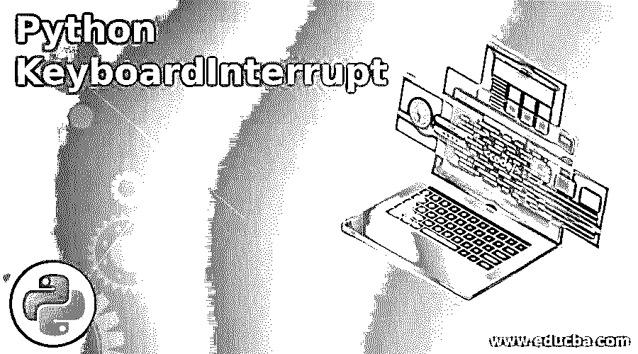

# Python 键盘中断

> 原文：<https://www.educba.com/python-keyboardinterrupt/>




## Python 键盘中断简介

因为我们已经知道什么是异常以及如何在 Python 中处理它们。通俗地说，异常就是中断程序正常流程的东西。类似地，KeyboardInterrupt 是一个 python 异常，它是在用户/程序员中断程序的正常执行时产生的。python 中的解释器在执行程序时会定期检查任何中断。在 python 中，当用户/程序员无意或有意按下 ctrl–c 或 del 键时，解释器抛出键盘中断异常。KeyboardInterrupt 异常继承了 BaseException，类似于 python 中的一般异常，它由 try except 语句处理，以阻止解释器突然退出程序。

**语法:**

<small>网页开发、编程语言、软件测试&其他</small>

如上所述，KeyboardInterrupt 异常是一个正常的异常，用来处理键盘相关的问题。Python 中没有这种特定的 KeyboardInterrupt 异常语法，它是在代码中的普通 try 和 except 块中处理的。可能导致错误的代码被放在带有“raise”关键字的 try 块中，以引发该异常，或者 python 解释器自动引发该异常。为了捕捉异常并执行所需的任务，在 except 块中编写了特殊的代码。

```
try:
# code that can raise the exception
# raising this exception is not mandatory
raise KeyboardInterrupt
except KeyboardInterrupt:
# code to perform any specific tasks to catch that exception
```

### Python 中 KeyboardInterrupt 异常是如何工作的？

使用 python 时最烦人的事情之一是，一旦用户有意或无意地按下 ctrl–c，它就会退出程序，这在处理大量数据时是一个大问题，例如从数据库中检索记录、处理、执行一个同时处理许多任务的大程序等。这个异常的工作方式非常简单，就像 Python 中的其他异常一样。关于这个异常唯一的事情是它是用户生成的，没有计算机的参与。为了理解 Python 中 KeyboardInterrupt 异常的工作原理，让我们先理解下面写的代码。

**代码:**

```
try:
# code inside the try block which can cause an exception
# taking the input ‘name’ from the user
    name  = input('Enter the name of the user ')
# writing the different exception class to catch/ handle the exception
except EOFError:
    print('Hello user it is EOF exception, please enter something and run me again')
except KeyboardInterrupt:
    print('Hello user you have pressed ctrl-c button.')
# If both the above exception class does not match, else part will get executed
else:
    print('Hello user there is some format error')
```

在上面的代码中:

*   首先执行 try 块中的代码。
*   如果用户按下 ctrl–c，将引发一个异常，try 块的其余语句的执行将停止，并将移动引发异常的 except 块。
*   如果 try 块中没有出现异常，则以正常方式继续执行，但不会执行“except”块语句。
*   如果异常被引发，但与 except 关键字后出现的异常处理程序的类名不匹配，它将开始在内部 try 块之外寻找相应的 catch 块来处理它。如果没有找到，那么它会用正常的 python 消息退出程序。

### Python 中如何避免 KeyboardInterrupt 异常？

*   Python 中没有避免 KeyboardInterrupt 异常的方法，因为当用户按下 ctrl–c 时，它会自动引发 KeyboardInterrupt 异常。
*   众所周知，finally 块总是被执行的。因此，如果出现异常，并且我们陷入了某个无限循环，那么我们可以在 finally 块中编写一个干净的代码(它将在每种情况下执行)，这可以帮助我们回溯这种情况。
*   这完全取决于程序员如何编码来避免这种情况，因为每个程序员都有不同的思维方式和编码方式。
*   有些人添加了一个标志或变量，当用户点击 ctrl- c 按钮时，这个标志或变量就会增加；有些程序员创建了一个单独的函数，它接受一些额外的输入或跟踪用户按下 ctrl-c 键的情况，并做出相应的响应。

### Python 键盘中断示例

下面是提到的例子:

用户按下 ctrl–c 按钮时的一般输出。

**代码**:

```
try:
# code inside the try block which can cause an exception
# taking the input ‘name’ from the user
    name  = input('Enter the name of the user ')
# writing the different exception class to catch/ handle the exception
except EOFError:
    print('Hello user it is EOF exception, please enter something and run me again')
except KeyboardInterrupt:
    print('Hello user you have pressed ctrl-c button.')
# If both the above exception class does not match, else part will get executed
else:
    print('Hello user there is some format error')
```

**输出 1:**

当用户在程序询问用户名时按下 ctrl -c 按钮，会生成下面的输出。


**说明:**

在上面的输出中，当用户按下 ctrl–c 时，显示为键盘中断异常编写的打印语句，这是一个用户中断异常。

**输出 2:**

当用户按下 ctrl–d 按钮询问程序的用户名时，会生成以下输出。


**说明:**

在上面的输出中，当用户按下 ctrl–d 按钮表示文件结束时，将显示在 EOF 异常类下编写的打印语句。这表示当异常出现时，搜索所需的异常类。如果在代码中捕获到异常，则执行下面的块。

### 结论

上面的文章清楚地解释了什么是 KeyboardInterrupt 异常，它是如何在 Python 中被引发和处理的。KeyboardInterrupt 异常顾名思义是一个简单的异常，当程序被用户键盘中断时引发。对于任何程序员来说，无论是新手还是专家，详细了解每一种类型的异常都是非常重要的，以便相应地处理它们，并高效地编写程序(能够处理任何类型的这种情况)。

### 推荐文章

这是 Python 键盘中断的指南。在这里，我们讨论了 KeyboardInterrupt 异常是如何工作的，以及如何通过相应的例子来避免 Python 中的 KeyboardInterrupt 异常。您也可以看看以下文章，了解更多信息–

1.  [Python 中的 Lambda](https://www.educba.com/lambda-in-python/)
2.  [Python 迭代器字典](https://www.educba.com/python-iterator-dictionary/)
3.  [Python BeautifulSoup](https://www.educba.com/python-beautifulsoup/)
4.  [Python 中的快速排序](https://www.educba.com/quick-sort-in-python/)


