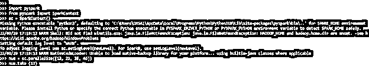
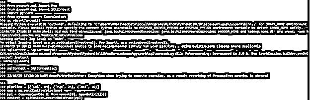

# PySpark 管道

> 原文：<https://www.educba.com/pyspark-pipeline/>


## PySpark 管道的定义

PySpark 流水线充当估计器；流水线由作为转换器或估计器的阶段序列组成。在调用 pipeline.fit 方法时，这些阶段按顺序执行。假设 stage 是 estimator，然后 estimator.fit 方法被调用到输入数据集以拟合模型。然后使用 transformer 方法将数据集转换为下一级 PySpark 管道的输入。

### py spark 管道介绍

pyspark 机器学习库将建模功能构建到分布式环境中。spark 包是构建在数据帧上的高级 API。这个 API 将帮助我们调整机器学习的管道。PySpark 机器学习会参考基于管道 API 的 MLlib 数据帧。流水线机器是结合多种机器学习算法的完整工作流；学习和处理数据需要多个步骤，并且需要算法的顺序。流水线定义了 ML 过程的排序和阶段。

<small>网页开发、编程语言、软件测试&其他</small>

### 如何在 PySpark 管道中使用 Dataset？

Pyspark 机器学习主要是由于用户数据的增加而选择了这个空间。新的 API 将引入强大的管道概念，其中 ML 的不同阶段将作为单个实体工作，它将被视为机器学习工作流。它包含一组阶段；每一级包含一个估计器或一个变换器。所有阶段都按顺序运行，数据帧的输入在通过每个阶段时进行转换。

下面的步骤显示了我们如何使用数据集，如下所示。要使用它，首先，我们需要在系统中安装 pyspark 模块。我们可以安装相同的 pip 命令。

*   第一步，我们使用 pip 命令安装 PySpark 包。我们也可以使用另一个命令在我们系统的包中安装相同的东西。以下示例显示了如何安装 PySpark 包，如下所示。

**代号:**

```
pip install pyspark
```


*   安装 PySpark 包后，我们登录 python shell 来导入 PySpark 包。

**代码:**

```
python
```


*   登录 python shell 后，我们现在使用 import 关键字导入所需的包，如下所示。我们从 PySpark 模块导入行、管道和标记化器包。

**代码:**

```
from pyspark.ml import Pipeline
from pyspark.ml.classification import LogisticRegression
from pyspark.ml.feature import HashingTF, Tokenizer
from pyspark.sql import Row
```


*   在这一步导入模块后，我们定义 LDoc 变量、标签 systeminfo 和 buildingid 列。

**代码:**

```
LDoc = Row ("BuildingID", "SystemInfo", "label")
```


*   在这一步定义了变量之后，我们将创建函数名作为解析文档，如下所示。

**代码:**

```
def parseDocument (line):
    py_val = [str(x) for x in line.split (',')]
    if (py_val[3] > py_val[2]):
        hot = 1.0
    else:
        hot = 0.0
```


*   创建函数后，现在在这一步中，我们加载数据集文件名为 pyspark.txt 如下。

```
data = loadtxt ('pyspark.txt', delimiter = ",")
```


*   加载数据集后，我们正在创建数据框的上下文如下。

**代码:**

```
name = [('ABC',1), ('PQR',2), ('XYZ',3)]
id = sc.parallelize (name)
map = id.map()
df = sqlContext.createDataFrame(map)
```


### Pyspark 管道数据探索

PySpark 是由 apache spark 的一个社区创建的工具；允许与 RDD 一起工作。它提供使用 python 的 API。PySpark 是用来实现集群计算的命名引擎。要定义数据浏览，我们必须遵循以下步骤。

*   导入 PySpark 的模块。
*   数据处理
*   构建数据的处理管道。
*   评估和训练模型。
*   超参数调谐

我们还可以使用 CSV 文件来浏览 PySpark 管道中的数据。数据集是无关紧要的，我们可以说计算需要时间。Pyspark 处理数据，PySpark 的性能相比其他机器学习库还是不错的。在下面的例子中，我们从 CSV 文件中提取数据，如下所示。我们使用 pyspark.sql 包导入 SQLContext，如下所示。

**代码:**

```
from pyspark.sql import SQLContext
web = " "
from pyspark import SparkFiles
sc.addFile (web)
sqlContext = SQLContext (sc)
```

**输出:**


我们也可以提取用户输入的数据。下面是根据用户输入提取数据的示例。在下面的例子中，我们导入的 PySpark 模型如下。

**代码:**

```
import pyspark
from pyspark import SparkContext
sc = SparkContext()
num = sc.parallelize([13, 21, 35, 46])
num.take (13)
```

**输出:**




### 例子

以下是不同的例子:

#### 示例#1

在下面的例子中，我们将模块名导入为 PySpark，并如下定义 ROW。

**代码:**

```
from pyspark.ml import Pipeline
from pyspark.ml.classification import LogisticRegression
from pyspark.ml.feature import HashingTF, Tokenizer
from pyspark.sql import Row
import pyspark
from pyspark import SparkContext
sc = SparkContext()
def parseDocument(line):
values = [ ]
   			 if () :
        			hot = 1.0
    			else:
       				hot = 0.0
pipeline = sc.textFile()
doc = pipeline.filter()
pipe = doc.toDF()
```

**输出:**


#### 实施例 2

在下面的例子中，我们从用户输入中检索数据，如下所示。

**代码:**

```
from pyspark.sql import Row
from pyspark.sql import SQLContext
import pyspark
from pyspark import SparkContext
sc =SparkContext()
sqlContext = SQLContext (sc)
pipeline = [('ABC', 19), ('PQR', 25), ('XYZ', 32)]
con = sc.parallelize(pipeline)
ppl = con.map()
contest = sqlContext.createDataFrame(ppl)
contest.printSchema()
```

**输出:**




### 关键要点

*   在 PySpark 管道中，转换器是从模型中学习到的抽象特性。PySpark 管道组件将添加、删除或更新数据集中的现有要素。
*   PySpark 管道中的每个转换都包含在执行管道时调用的转换方法。

### 常见问题解答

下面是提到的常见问题:

#### Q1。PySpark 管道中的变压器有什么用？

变压器是 PySpark 管道的一个组件。转换器是一个抽象，它包含了转换器和模块的特性，它实现了转换的方法。

#### Q2。PySpark 管道中的估算器有什么用？

估计器是 PySpark 管道的一个组件。一个评估者正在抽象学习算法的概念。一个评估者正在将方法名实现为 fit。

#### Q3。为什么我们在 PySpark 中使用管道？

在 ML 中，按顺序运行算法并从数据中学习算法是很常见的。

### 结论

PySpark 流水线充当估计器，流水线由作为转换器或估计器的阶段序列组成。Pyspark API 将帮助我们创建和调整机器学习的管道。pyspark 机器学习将引用基于管道 API 的 MLlib 数据帧。

### 推荐文章

这是 PySpark 管道指南。在这里，我们将讨论简介以及如何在 PySpark 管道中使用数据集，并提供数据探索和示例。您也可以看看以下文章，了解更多信息–

1.  [PySpark 写 CSV](https://www.educba.com/pyspark-write-csv/)
2.  [PySpark MLlib](https://www.educba.com/pyspark-mllib/)
3.  [PySpark 数据帧](https://www.educba.com/pyspark-dataframe/)
4.  PySpark fillna


