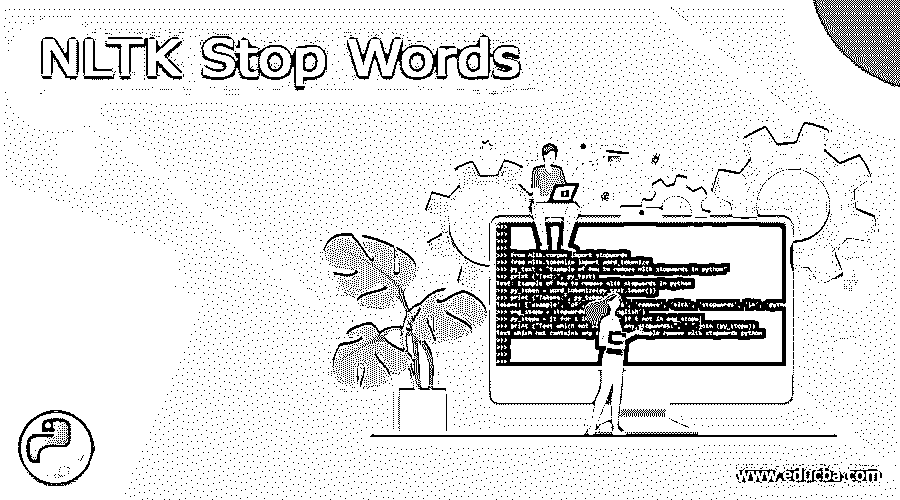
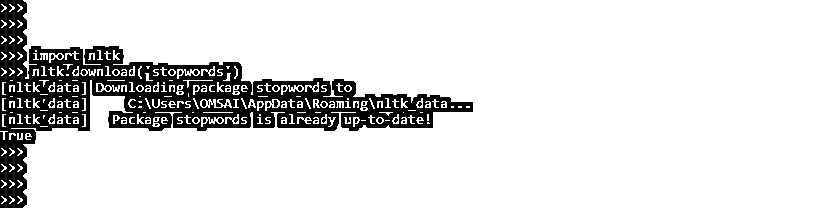
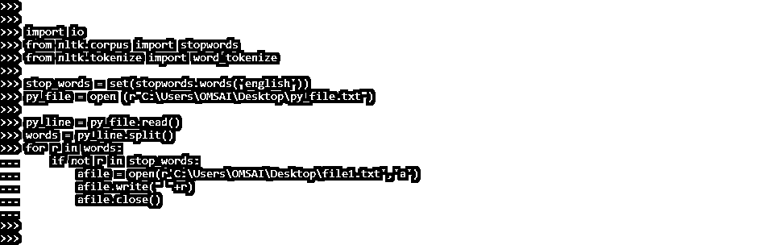
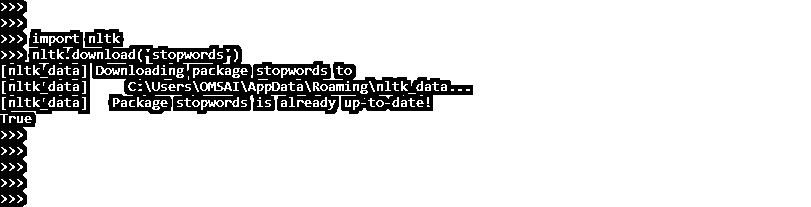
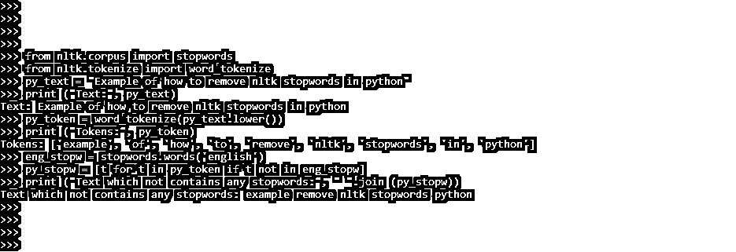

# NLTK 停止字

> 原文：<https://www.educba.com/nltk-stop-words/>




## NLTK 停用词介绍

Nltk 停用词是广泛使用的词(如“the”、“a”、“an”或“in”)，搜索引擎在索引和检索条目时会忽略这些词。预处理是将数据转换成计算机可以理解的格式。过滤掉没有价值的数据是最常见的预处理类型之一。停用词在 NLTK 中用来指代无意义的词。

### 什么是 NLTK 停止字？

*   我们不希望任何术语占用我们数据库中的存储空间或处理时间。我们可以很容易地通过保留一个我们认为是停用词的术语列表来消除它们。停用词在 NLTK 中以 16 种不同的语言保存。nltk 数据目录包含它们。
*   NLP 是一个研究领域，处理各种问题，包括自然语言理解。
*   如果我们保留一个我们认为是停用词的单词列表，这很容易实现。因此，NLTK 语料库列出了他们认为是停用词的术语。
*   停用词是在任何语言或语料库中频繁出现的词。但是，他们不提供额外的文本，包括几个 NLP 任务的文本。
*   数据预处理是用户输入或发送的处理语句或文字。删除不必要或不完整的数据是数据预处理中最关键的阶段之一。
*   NLP 困难，关键是要记住像“the”、“is”、“there”等词不应该被处理。停用词是某些类型词的名称。如果停用字词没有被编码为忽略或删除，它们将被忽略。
*   来释放更多的内存或数据库空间，因此，代码的效率会大大降低。
*   可以从 NLTK 包下载一个单独的停用词包。通过 NLTK 可以下载和使用不同语言的停用词。它可以在下载后作为参数提供，表示应该忽略这些单词。
*   它们可以被安全地忽略，而不会损害句子的意思。这样的词之前已经在语料库中被捕获。我们从在 Python 环境中安装它开始。
*   要首先使用 nltk 停用词，我们需要在我们的 python 环境中下载相同的停用词。
*   下面是为 python 环境下载停用词的代码示例。但是，首先，我们必须将 nltk 模块导入到我们的程序代码中，以便下载停用词。

```
import nltk
nltk.download ('stopwords')
```




<small>网页开发、编程语言、软件测试&其他</small>

*   在上面的例子中，我们已经看到，在执行 download 命令之后，它将显示停用词包是最新的，我们不需要下载任何东西来在我们的代码中使用 nltk 停用词。

### NLTK 停用词程序

*   下面是 py_file.txt 输入文件，下面的代码将从该文件中删除停用词。生成的文件是 file1.txt。
*   在上面的例子中，我们首先导入了 io 和 nltk 模块；导入模块后，我们已经设置了英语停用词词典。为了设置停用词词典，我们创建了停用词词典的对象 stop_words。
*   定义了停用词词典后，我们要以只读方式打开 py _ file 为了以只读模式打开文件，我们必须将对象创建为 py_file。
*   以只读方式打开文件后，我们要调用 read 方法来读取定义好的文件；同样，我们创建了 py_line 对象。
*   在我们通过调用 split 方法拆分单词之后，我们必须编写并关闭文件。

**代码:**

```
import io
from nltk.corpus import stopwords
from nltk.tokenize import word_tokenize
stop_words = set(stopwords.words ('english'))
py_file = open (r"C:\Users\OMSAI\Desktop\py_file.txt")
py_line = py_file.read()
words = py_line.split()
for r in words:
    if not r in stop_words:
        afile = open(r'C:\Users\OMSAI\Desktop\file1.txt','a')
        afile.write(" "+r)
        afile.close()
```




### NLTK 停止字删除

虽然 NLP 中没有统一的停止短语，但许多 Python NLP 模块都有。因此，我们也可以列出停用字词表。

我们不会编写自己的停用词，因为我们将使用 NLTK 库的列表。因此，我们必须在停用词之前先下载 NLTK 库。

下面是从 nltk python 中删除停用词的步骤，如下所示。

*   要在 python 中首先从 nltk 中删除停用词，我们需要导入并下载它。下面的例子显示了导入 nltk 模块和下载停用词库。

**代码:**

```
import nltk
nltk.download('stopwords')
```




*   然后，我们小写我们的文本，并划分单词列表。接下来，我们会列出一个不在停用词列表中的新术语列表。
*   以下示例显示了如何在 python 中移除 nltk 停用词。

**代码:**

```
from nltk.corpus import stopwords
from nltk.tokenize import word_tokenize
py_text = "Example of how to remove nltk stopwords in python"
print ("Text:", py_text)
py_token = word_tokenize (py_text.lower ())
print ("Tokens:", py_token)
eng_stopw = stopwords.words ('english')
py_stopw = [t for t in py_token if t not in eng_stopw]
print ("Text which not contains any stopwords:", " ".join (py_stopw))
```




*   在上面的例子中，我们首先将 nltk 模块导入到我们的程序中；然后，我们下载了停用词库。然后我们导入了停用词和 word_tokenize 模块。
*   导入该模块后，我们定义了随机文本，并在 python 中删除了停用词，然后打印了这个随机文本。打印完文本后，代码的实际执行就开始了。
*   最后我们可以看到，上面的代码中去掉了 how、to、in 关键字。

### NLTK 停用词列表

*   我们可以使用下面的命令来检查停用词列表。为了检索停用词，我们必须在代码中导入相同的停用词。导入停用词后，我们使用 set 命令检索停用词。

```
from nltk.corpus import stopwords
set (stopwords.words ('english'))
```


*   在上面的例子中，我们已经使用 nltk 检索了多个停用词。Nltk 停用词在 python 编程中非常重要。

### 结论

NLP 是一个研究领域，处理各种问题，包括自然语言理解。例如，Nltk stopwords 是一个广泛使用的单词(如“the”、“a”、“an”或“in”)，搜索引擎在索引和检索条目时会将其忽略。

### 推荐文章

这是 NLTK 停用词指南。在这里，我们还讨论了定义、程序，以及如何从 NLTK 和列表中删除停用词。您也可以看看以下文章，了解更多信息–

1.  [安装 NLTK](https://www.educba.com/install-nltk/)
2.  [蟒蛇版](https://www.educba.com/anaconda-version/)
3.  [Coq 语言](https://www.educba.com/coq-language/)
4.  [Java Swing GUI Widget 工具包](https://www.educba.com/course/online-java-swing-training/)


