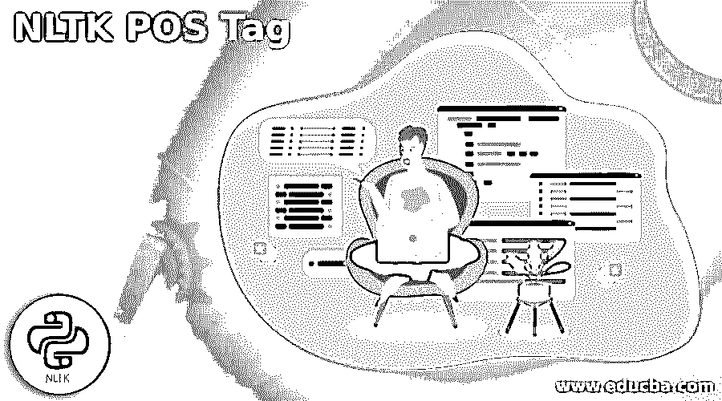
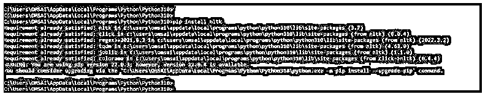
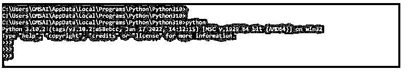
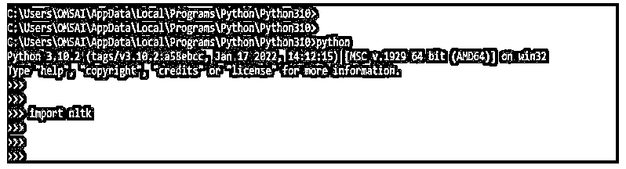
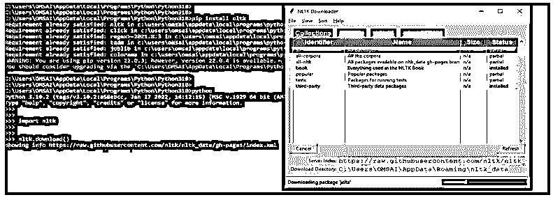
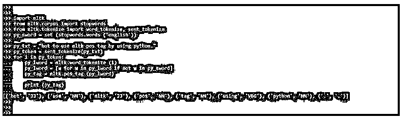
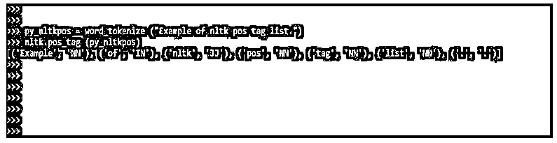
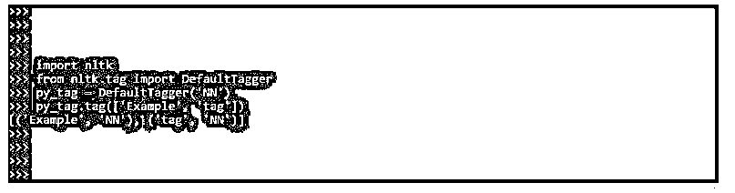
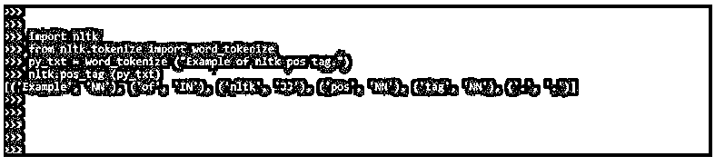

# NLTK 位置标签

> 原文：<https://www.educba.com/nltk-pos-tag/>




## NLTK POS 标签介绍

NLTK 词性标注是以文本格式为特定的语音上下文片段标记单词的实践，称为词性标注(词性标注)。它负责解释一种语言的文本，并将每个单词与一个特定的标记相关联。语法标记是它的另一个术语。词性标注器，也称为词性标注器，分析一串单词。

### 什么是 NLTK POS Tag？

*   这些词将被赋予一个词性标记。首先，我们必须使用标记化的概念。
*   内置的语音标记器是 NLTK for Python 最有用的特性。Nltk pos tagger 并不完美，但是相当不错。所以如果我们想要更好的东西，我们可以购买一些或者修改现有的 NLTK 代码。
*   词性标注的目的是帮助我们掌握句子结构，并开始使用我们的计算机来跟踪单词、词性及其形成的字符串的句子意义。

### NLTK POS 标签怎么用？

描述令牌分配被标记，这是一种分类。描述符是一个“标签”，代表语音和语义信息的一个组成部分。另一方面，当涉及到词性标注时，它可以被定义为将写成单词列表的句子转换成元组列表的过程。在这种情况下，元组具有单词标记形式。词性标注也可以定义为将给定单词与词性相关联的过程。

<small>网页开发、编程语言、软件测试&其他</small>

以下步骤显示了如何通过 python 使用 nltk pos 标签，如下所示:

1.当使用 nltk pos 标记时，第一步是在我们的系统中安装 nltk。接下来，我们将使用 pip 命令安装 nltk。

下面的例子显示了使用 pip 命令在我们的系统中安装 nltk。在下面的例子中，我们已经安装了 nltk，因此它将显示一条消息，表明已经满足了一个需求。

**代码:**

```
pip install nltk
```

**输出:**




2.登录 python shell——安装 nltk 后，下一步是登录 python shell 来执行 python 代码。

在下面的例子中，我们使用 python 版本 3.10.2。

**代码:**

```
python
```

**输出:**




3.登录 python shell 后，下一步是将 nltk 模块导入我们的代码。我们使用 import 关键字在 python 代码中导入 nltk 模块。例如，“import nltk”命令导入 nltk 模块。

**代码:**

```
import nltk
```

**输出:**




4.导入模块后，下一步是下载 nltk 的所有包。下面的例子显示了如下下载 nltk 模块的所有包。执行“nltk.download”命令后，将出现一个图形用户界面，我们可以在其中为所有包选择“all ”,然后单击 download。这将安装分词器、各种算法、组块器和语料库，需要很长时间。

**代码:**

```
nltk.download()
```

**输出:**




5.下面的例子展示了如何在我们的代码中使用 nltk pos 标签。

在下面的例子中，我们看到我们已经导入了 nltk 模块。在导入 nltk 模块之后，我们使用 nltk.corpus 导入了 stopwords 模块，然后我们必须使用 nltk.tokenize 模块导入 word_tokenize 和 sent_tokenize 模块。导入所有模块后，我们调用 set 方法。调用 set 方法后，我们已经定义了要在词性标注中使用的句子。定义完句子后，我们调用 sent_tokenize 和 word_tokenize 方法。然后我们必须调用 nltk.pos_tag 方法来在我们的代码中使用 nltk pos 标记。在调用这个方法的时候，我们已经创建了对象。创建对象后，我们将它输出。

**代码:**

```
import nltk
from nltk.corpus import stopwords
from nltk.tokenize import word_tokenize, sent_tokenize
py_sword = set (stopwords.words ('english'))
py_txt = "hot to use nltk pos tag by using python."
py_token = sent_tokenize (py_txt)
for i in py_token:
   	py_lword = nltk.word_tokenize (i)
   	py_lword = [w for w in py_lword if not w in py_sword]
   	py_tag = nltk.pos_tag (py_lword)
   	print (py_tag)
```

**输出:**




### NLTK 位置标签列表

以下是 nltk 的 pos 标签列表。nltk 中有一个多标签列表，标签列表按单词显示在输出中。

*   CC: 是并列连词
*   **CD:** 是基数的数字
*   **DT:** 是限定词
*   存在主义
*   **FW:** 是外来词
*   **IN:** 介词和连词
*   JJ: 形容词
*   **JJR 和 JJS:** 形容词和最高级
*   **LS:** 列表标记
*   **MD:** 模态
*   NN: 单数名词
*   **NNS，NNP，NNPS:** 专有名词和复数名词
*   **PDT:** 预定器
*   wh 的副词
*   所有格 wh
*   **WP:**wh 的代词
*   **WDT:**WP 的限定词
*   **VBZ:** 动词
*   **VBP，VBN，VBG，VBD，VB:** 动词形式
*   **呃:**感叹词
*   **去:**去
*   **RP:** 粒子
*   **RBS，RB，RBR:** 副词
*   **PRP，PRP$:** 人称和职业代词

以下示例显示了 nltk pos 标签列表的示例，如下所示:

**代码:**

```
py_nltkpos = word_tokenize ("Example of nltk pos tag list.")
nltk.pos_tag (py_nltkpos)
```

**输出:**




### NLTK POS 标签示例

标记是词性标记的第一步，也是最基本的一步，可以用 NLTK 的 tagger 类来完成。

标记为每个令牌分配相同的 POS 标记。默认标记也是衡量准确性改进的基准。

#### 示例#1

下面是默认 nltk pos 标签的例子。

**代码:**

```
import nltk
from nltk.tag import DefaultTagger
py_tag = DefaultTagger ('NN')
py_tag.tag (['Example', 'tag'])
```

**输出:**




#### 实施例 2

在下面的例子中，我们没有使用任何默认标签，所以它将根据我们使用的单词显示标签。

**代码:**

```
import nltk
from nltk.tokenize import word_tokenize
py_txt = word_tokenize ("Example of nltk pos tag.")
nltk.pos_tag (py_txt)
```

**输出:**




### 结论

词性标注也可以定义为将给定单词与词性相关联的过程。Nltk 词性标记是以文本格式为语音上下文的特定片段标记单词的实践，被称为词性标记。

### 推荐文章

这是 NLTK POS 标签的指南。在这里，我们通过一个列表和例子来讨论介绍以及如何使用 NLTK POS 标签。您也可以看看以下文章，了解更多信息–

1.  [Python 用户定义的异常](https://www.educba.com/python-user-defined-exception/)
2.  [Python Reduce](https://www.educba.com/python-reduce/)
3.  [Timsort Python](https://www.educba.com/timsort-python/)
4.  [Python Z 测试](https://www.educba.com/python-z-test/)


