# NLTK 引理器

> 原文：<https://www.educba.com/nltk-lemmatizer/>

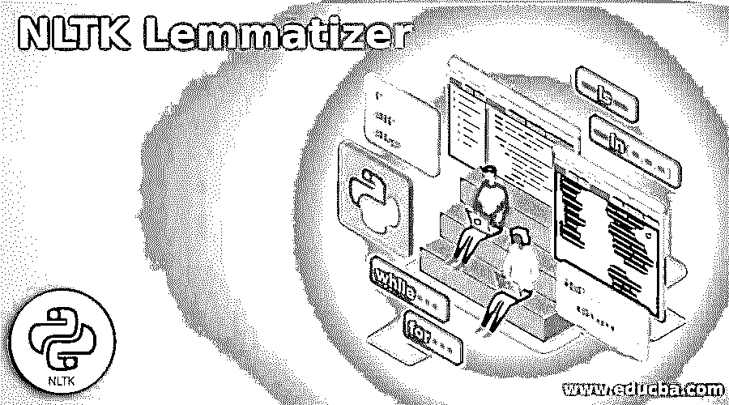


## NLTK Lemmatizer 简介

NLTK Lemmatizer 将一个单词的几种变形形式组合成一个项目进行分析。与词干化类似，词汇化增加了单词上下文。因此，它把意思相似的单词连接在一起。词干化和词汇化都包含在文本预处理中。人们经常误解这两个术语。有些人混淆了这两者。词汇化比词干化更可取，因为它对单词进行形态学检查。

### 什么是 NLTK Lemmatizer？

*   在 NLTK 中，词汇化就是算法根据单词的含义和上下文来确定单词的词汇的过程。在大多数情况下，词汇化是指对单词进行形态学研究，以消除屈折词尾。
*   它有助于检索一个词的词条、基本形式或词典形式。NLTK 词汇化技术使用 WorldNet 中内置的 morph 函数。
*   后缀词就是蒸法的工作原理。从更广泛的意义上说，它划掉了单词的开头或结尾。
*   另一方面，词汇化是一个考虑单词形态分析的更强大的过程。它返回引理，即屈折形式或基本形式。
*   我们需要大量的语言学知识来编字典，寻找合适的术语形式。词干化是一个广泛的过程，但是词汇化是一个聪明的操作，它在字典中搜索正确的形式。因此，词汇化有助于开发更有效的机器学习功能。
*   在语言学中，词汇化指的是将一个单词的屈折变体组合起来，这样它们就可以作为一个单词进行分析。对于各种词条确定，NLTK 包括各种词条化技术和函数。与词干化相反，词汇化更适合于确定单词在文档中的上下文。
*   与词干化不同，词汇化使用句子中的单词来检查文档的主要上下文。因此，NLTK 词汇化对于理解文本并将其应用于自然语言处理和自然语言理解是至关重要的。
*   NLTK 字典查找算法对复杂术语进行词汇化有利于词汇化。
*   主要的区别是词干化经常会产生不存在的单词，而单词在 lemmatizer 中是真实的。所以，虽然我们不能检查我们的词根，但我们可以在字典中查找一个引理。
*   我们可能会想出一个和我们开始时非常接近的词，但我们也可能会想出一些完全不同的词。

### 如何使用单词 NLTK Lemmatizer？

WorldNet 是一个庞大的口头语言词汇数据库，旨在开发单词之间的结构化语义关联。它也是一个 lemmatizer，是最早的也是最广泛使用的。它有一个 NLTK 提供的接口，但是我们在使用它之前必须先下载它。

<small>网页开发、编程语言、软件测试&其他</small>

要使用单词 nltk lemmatizer，我们需要遵循如下步骤:

1.使用 pip 命令安装 nltk–第一步是使用 pip 命令安装 nltk。下面是展示如何使用 pip 命令安装 nltk 的示例。在下面的例子中，我们已经安装了 nltk，满足了需求。

**代码:**

```
pip install nltk
```

**输出:**

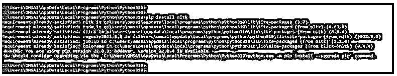


2.安装 pip 命令后，我们使用 python 命令登录 python shell，如下所示:

**代码:**

```
python
```

**输出:**

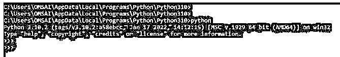


3.登录到 python shell 后，在这一步中，我们使用 import 关键字在程序中导入 nltk 模块。

下面的例子显示了在我们的程序中导入 nltk 模块，如下所示:

**代码:**

```
import nltk
```

**输出:**

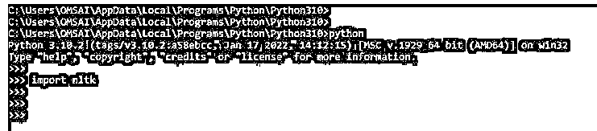


4.在这一步中导入 nltk 模块后，我们在程序中下载 WorldNet 模块。我们已经下载了 wordnet 包，所以它将显示该包已经是最新的。

**代码:**

```
nltk.download (‘wordnet’)
```

**输出:**

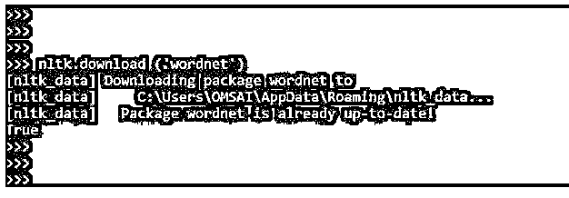


5.下载完 wordnet 包后，对于本步骤中的 lemmatize，我们将创建 WordNetLemmatizer 的实例，并调用 lemma tize 函数，如下所示:

**代码:**

```
import nltk
from nltk.stem import WordNetLemmatizer
py_lemmatizer = WordNetLemmatizer ()
```

**输出:**

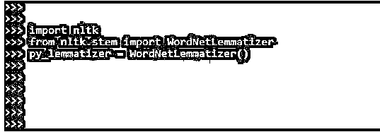


6.在创建了 WordNetLemmatizer 的实例之后，在这一步中，我们对简单的单词进行 lemmatizing，如下所示:

**代码:**

```
print (py_lemmatizer.lemmatize ("pythons"))
print (py_lemmatizer.lemmatize ("lemmatizers"))
print (py_lemmatizer.lemmatize ("nltks"))
print (py_lemmatizer.lemmatize ("cats"))
```

**输出:**

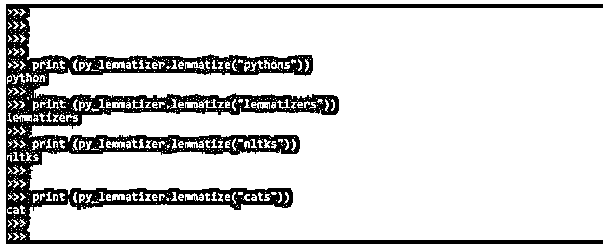


### 为文本创建

*   无论有没有 POS 标签，都可以进行词汇化。词性标签，也称为 POS 标签，为每个单词分配一个标签，增加数据集的正确性。
*   如果没有 POS 标签，单词 leaves 将被词条化为 leaf 对于动词，它将被词条化为 leave。
*   词的形式通过词条化被简化为语言学上可行的词条。词汇化通常更复杂，需要使用词典。简单的基于规则的技术被用于词干分析。
*   使用 lemmatizer，我们使用 pos 标签来生成与数据集的上下文一致的发现。

下面的例子显示了创建 lemmatized 文本。

**代码:**

```
from nltk.stem import WordNetLemmatizer
nltk.download ('wordnet')
py_word = ["leaves", "running", "was", "has"]
py_lemmatizer = WordNetLemmatizer ()
py_lemword = [py_lemmatizer.lemmatize (py_words) for py_words in py_word]
print ("Nltk lemmatized: ", py_lemword)
py_word_pos = [py_lemmatizer.lemmatize (py_words, pos = "v") for py_words in py_word]
print ("Lemmatized words: ", py_word_pos)
```

**输出:**

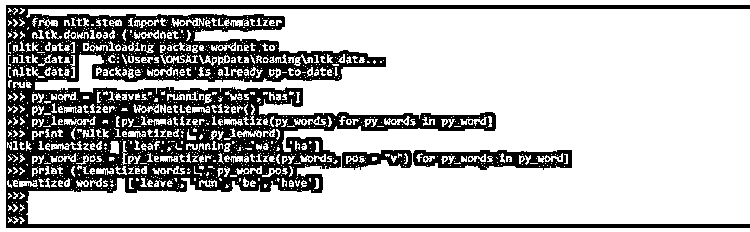


### NLTK 引理器的示例

下面提到了不同的例子:

#### 示例#1

下面是一个 nltk lemmatizer 的例子。下面的例子显示了一个单词的词条。

**代码:**

```
import nltk
from nltk.stem import WordNetLemmatizer
py_lem = WordNetLemmatizer()
py_word = "Cats"
py_lemma = py_lem.lemmatize (py_word)
print (py_word, "=>", py_lemma)
```

**输出:**

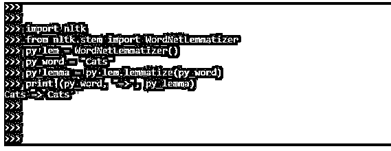


#### 实施例 2

下面的例子显示了动词的词汇化。

**代码:**

```
import nltk
from nltk.stem import WordNetLemmatizer
py_lem = WordNetLemmatizer()
py_word = "reputed"
py_lemma = py_lem.lemmatize (py_word, 'v')
print (py_word, "=>", py_lemma)
```

**输出:**

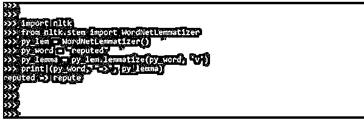


#### 实施例 3

下面的例子显示了如下的形容词的词汇化。

**代码:**

```
import nltk
from nltk.stem import WordNetLemmatizer
py_lem = WordNetLemmatizer()
py_word = "worst"
py_lemma = py_lem.lemmatize (py_word, 'a')
print (py_word, "=>", py_lemma)
```

**输出:**

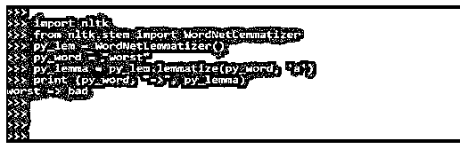


#### 实施例 4

下面的例子向你展示了副词的词形变化。

**代码:**

```
import nltk
from nltk.stem import WordNetLemmatizer
py_lem = WordNetLemmatizer()
py_word = "computer"
py_lemma = py_lem.lemmatize (py_word, 'r')
print (py_word, "=>", py_lemma)
```

**输出:**

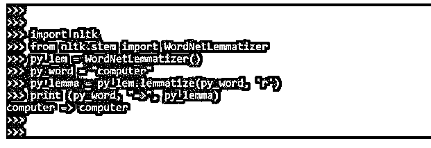


### 结论

NLTK 词汇化指的是将一个单词的变形版本分组，以便它们可以作为单个单词进行分析。NLTK lemmatizer 将一个单词的几种变形形式组合成一个项目进行分析。与词干化类似，词汇化增加了单词上下文。

### 推荐文章

这是 NLTK Lemmatizer 的指南。这里我们讨论介绍，创建文本，例子，以及如何使用单词 NLTK lemmatizer。您也可以看看以下文章，了解更多信息–

1.  [Python 用户定义的异常](https://www.educba.com/python-user-defined-exception/)
2.  [Python Reduce](https://www.educba.com/python-reduce/)
3.  [Timsort Python](https://www.educba.com/timsort-python/)
4.  [Python Z 测试](https://www.educba.com/python-z-test/)


