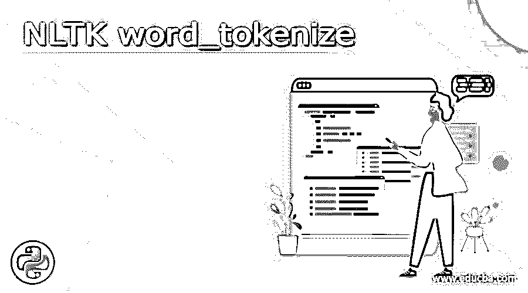
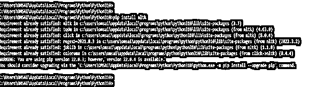
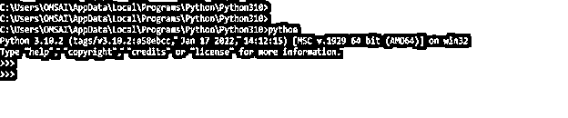
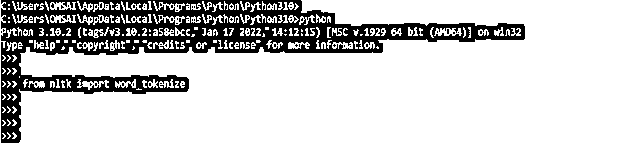
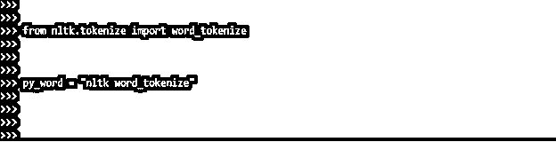
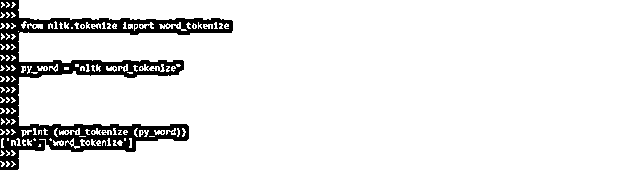
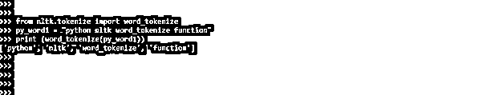
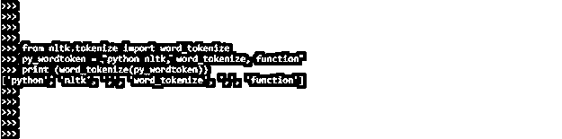
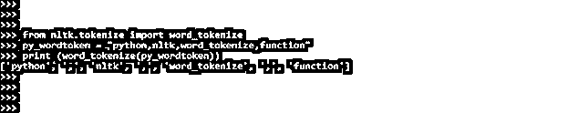

# NLTK 单词标记化

> 原文：<https://www.educba.com/nltk-word_tokenize/>




## NLTK word_tokenize 简介

Nltk word_tokenize 用于使用 word tokenize 方法从字符串中提取标记。它实际上返回一个单词的音节。单音节或双音节可以在一个单词中找到。使用 NLTK 建议的措辞返回文本的标记化版本。它是将大量文本分解成称为标记的小块的过程。Word_tokenize 函数在 NLTK 中很重要。

### 什么是 NLTK word_tokenize？

*   Nltk word_ tokenize 对于模式识别极其重要，它被用作词干化和词汇化的起点。标记化也可以用来用非敏感数据替换敏感数据。
*   文本分类、智能聊天机器人和其他应用需要自然语言处理。要达到上述目的，理解文本的模式是至关重要的。
*   为了将语句分解成单词，我们使用单词标记化方法。为了在机器学习应用中更好地解释文本，可以将单词标记化的结果翻译成数据帧。它还可以用作文本清理过程(如词干处理)的起点。

### 如何使用 NLTK word_tokenize？

*   为了训练和提供预测，机器学习模型需要数字数据。文本到数字数据的转换需要单词标记化。
*   包含了 NLTK 库的单词标记化模块。两个句子用来开始变量“文本”
*   将文本变量传递到单词 tokenize 模块后，输出被打印出来。结果显示了模块如何使用标点符号来拆分单词。
*   Sent tokenize 是这个的子模块。为了确定这个比例，我们需要 NLTK 句子和单词分词器。
*   记号化是在自然语言处理中将大量文本分解成称为记号的较小部分的过程。
*   文本分类、智能聊天机器人和其他应用需要自然语言处理。
*   NLTK 标记化句子模块由子模块组成，是自然语言工具包的重要组成部分。
*   为了将一个语句分解成单词，我们使用单词标记化方法。对于机器学习应用中的增强文本解释，NLTK 中单词标记化器的输出可以被转换成数据帧。
*   Sent tokenize 是一个子模块，可用于上述目的。Python NLTK 句子标记器是机器学习的关键组件。
*   要使用单词 nltk word_tokenize，我们需要遵循以下步骤。

1)使用 pip 命令安装 nltk–第一步是使用 pip 命令安装 nltk。下面是使用 pip 命令安装 nltk 的例子。在下图中，我们可以看到我们已经安装了 nltk，因此它将显示已经满足的需求。

<small>网页开发、编程语言、软件测试&其他</small>

```
pip install nltk
```




2)安装完 pip 命令后，我们登录到 python shell 中使用 python 命令执行如下代码。

```
python
```




3)在登录到 python shell 之后，在这一步中，我们将使用 nltk 库导入 word_tokenize 模块。下面的例子显示了 word_tokenize 模块的导入如下。

```
from nltk import word_tokenize
```




4)在本步骤中导入 word_tokenize 模块后，我们将创建 word_tokenize 类的引用变量并提供用户输入。在下面的例子中，我们正在创建引用变量的 word_tokenize 类，并提供如下输入变量。

```
py_word = "nltk word_tokenize"
```




5)在本步骤中提供用户输入后，我们将使用 word_tokenize 模块打印我们使用 print 方法的输出。以下示例显示了用户 word_tokenize 模块打印输出。

```
print (word_tokenize (py_word))
```




### NLTK word_tokenize 函数

在 word_tokenize 函数中，sent tokenize 是 tokenize nltk 的子模块。单词标记化函数是 nltk 标记化模块中最重要的。

为了确定比率，我们将需要单词标记化功能。输出对机器学习很有用。令牌指的是每个组件。

为了对单词进行分词，我们使用了 the word tokenize 函数。它利用了 nltk 模块实例。

Word_tokenize 函数在 NLP 中将文本分成一系列标记。令牌对于识别有价值的模式和替换敏感的数据组件非常有用。

使用 NLTK 进行单词标记化的优点是空格标记化和基于词典的标记化。文本规范化过程包括所有类型的单词标记化。语言理解算法的准确性通过规范化词条来提高。

在标记化之前，Word_tokenize 函数可以轻松地从语料库中删除停用词。单词被分解成子单词，帮助我们更好地掌握内容。

使用 NLTK，word_tokenize 函数更快，需要的编码更少。除了空白标记化之外，基于字典和基于规则的标记化实现起来也很简单。

对于像“尽管”这样的复合词，NLTK 提供了一个多词表达式标记器。NLTK 中的 RegexpTokenizer 使用正则表达式标记短语。

以下示例显示了 nltk word_tokenize 的功能。在下面的例子中，我们首先使用 nltk.tokenize 包导入 word_tokenize 模块。然后，我们提供来自用户的输入。在下一行中提供输入后，我们调用 word_tokenize 函数来使用 word_tokenize 函数打印输出。

**代码:**

```
from nltk.tokenize import word_tokenize
py_word1 = "python nltk word_tokenize function"
print (word_tokenize(py_word1))
```




### 例子

*   下面的例子显示了 nltk word_tokenize 函数如下。在 word_tokenize 函数中，像逗号这样的特殊字符也被视为标记。在下面的例子的第一行，我们正在导入 word_tokenize 模块。我们在输入中使用了" "，因此我们可以看到它将被视为一个单独的标记。

**代码:**

```
from nltk.tokenize import word_tokenize
py_wordtoken = "python nltk, word_tokenize, function"
print (word_tokenize(py_wordtoken))
```




*   在下面的例子中，我们对单词进行标记。我们通过 word_tokenize 函数使用单个单词对其进行标记化。在下面的例子中，我们用逗号分隔了一个单词，所以 word_tokenize 函数会把它当作一个单独的标记。它会将一个单词分成多个标记，因为我们在一个单词中使用了命令。

**代码:**

```
from nltk.tokenize import word_tokenize
py_wordtoken = "python,nltk,word_tokenize,function"
print (word_tokenize(py_wordtoken))
```




### 结论

Nltk word_ tokenize 对于模式识别非常重要，它被用作词干分析和词汇化的起点。Nltk word_tokenize 用于使用 word tokenize 方法从字符串中提取标记。它实际上返回一个单词的音节。

### 推荐文章

这是一个 NLTK word_tokenize 的指南。这里我们讨论定义，什么是 NLTK word_tokenize，如何使用 NLTK word_tokenize，有实现的例子。您也可以看看以下文章，了解更多信息–

1.  [安装 NLTK](https://www.educba.com/install-nltk/)
2.  [蟒蛇版](https://www.educba.com/anaconda-version/)
3.  [机器学习库](https://www.educba.com/machine-learning-libraries/)
4.  [数据科学工具](https://www.educba.com/data-science-tools/)


