# NLTK 词汇网

> 原文：<https://www.educba.com/nltk-wordnet/>


## NLTK WordNet 的定义

Nltk wordnet 是一个主要为 NLP 建立的英语词汇数据库(字典)。Synset 是 NLTK 中使用的一种特定类型的简单接口，它允许用户在 WordNet 中搜索单词。同义词集例子是同义词的集合，表达相同的意思。有些词只有一个同义词集，而有些词有多个同义词集。WordNet 是一个专门的英语词典，其结构比典型的同义词词典更复杂。

### 什么是 NLTK WordNet？

*   Wordnet 是一个基于 NLTK 语料库阅读器的英语词汇数据库。它可以用来查找单词定义、同义词和反义词。
*   最好把它描述成一本注重语义的英语词典。导入命令用于将其导入系统。因为 Wordnet 是一个语料库，所以它是从 ntlk.corpus 目录中提取的。
*   同义词和反义词列表都是空白的，稍后会追加它们。synsets 模块搜索同义词的活动单词，并将它们添加到同义词列表中。在 python 编程语言中非常有用。

### 如何使用 NLTK WordNet？

WordNet 是一个 Python 字典，是 NLTK 的一部分。这是一个旨在简化 NLP 的大型库。

<small>网页开发、编程语言、软件测试&其他</small>

*   要使用单词 nltk 语料库，我们需要遵循以下步骤。

1)使用 pip 命令安装 nltk–第一步是使用 pip 命令安装 nltk。下面是使用 pip 命令安装 nltk 的例子。

```
pip install nltk
```

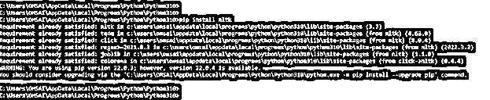


2)安装 pip 命令后，我们登录到 python shell，使用 python 命令执行代码如下。

```
python
```

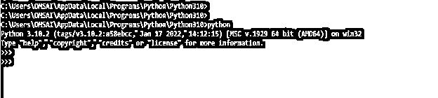


3)在登录到 python shell 之后，在这一步中，我们将使用 nltk.corpus 库导入 wordnet 模块。下面的例子显示了 wordnet 模块的导入如下。

```
from nltk.corpus import wordnet
```

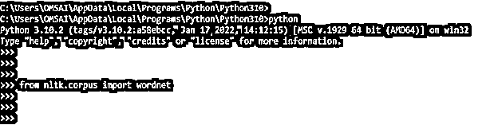


4)同义词集是 WordNet 中相关词的集合。每个 Synset 都有一个名称。词条是在同素集中找到的单词。函数 wordnet.Synsetss ('word ')提供了一个数组，其中包含与作为参数输入的单词相关联的所有 synset。下面的例子显示了如何通过 wordnet 使用 synsets。

```
print(wordnet.synsets('cat'))
```

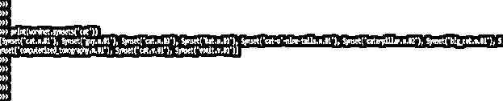


*   在上面的例子中，我们通过使用同义词组使用了“猫”这个词。synsets 方法返回该技术产生的四个 synset，其中四个是名为 cat 的名词。研究结果还表明，猫这个词有十种不同的意思或情况。

5)在这一步中我们使用的单个 Synset 可以通过使用定义来进一步考察它所包含的引理。该方法的典型定义是它返回一个字符串。为此有两种选择。我们可以访问 synsets 中的一个条目(' word ')。

```
py_arr = wordnet.synsets("cat")
print(py_arr[0].definition())
```

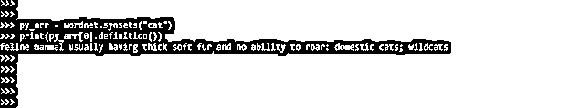


6)在这一步中，我们在将 synset 的名称、词性和编号传递给一个 Synset 后使用定义。在下面的例子中，我们将“cat”这个词与 synset 一起使用，如下所示。

```
wordnet.synset('cat.n.02').definition()
```


7)在这一步中，我们将使用一个同素集的所有引理。类似于 lemma_names()用于返回数组的所有 lemma 名称。以下示例显示了带有 synset 的 lemma_names，如下所示。

```
print (py_arr[0].lemma_names())
```


8)在这一步，我们使用的是下位词。在继承上，可以比作孩子的班级。

```
print(wordnet.synset('cat.n.02').hyponyms())
```

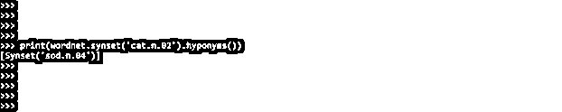


9)在这一步我们使用上位词。同素异形词可以扩展成上位词。Hypernyms 返回一个数组，其中包含 Synset 中的所有 Hypernyms。

```
print (wordnet.synset ('cat.n.01').hypernyms())
```

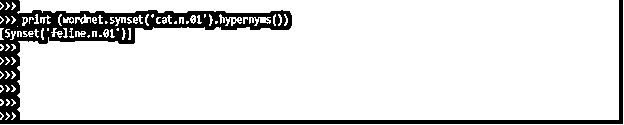


### NLTK WordNet 示例

*   WordNet 可以与 nltk 的一个模块结合使用，以查找单词定义、同义词和反义词等。

1)下面的例子显示 nltk wordnet 如下。

**代码:**

```
from nltk.corpus import wordnet
py_arr = wordnet.synsets("python")
print (py_arr[0].name())
print (py_arr[0].lemmas()[0].name())
print (py_arr[0].definition())
print (py_arr[0].examples())
```

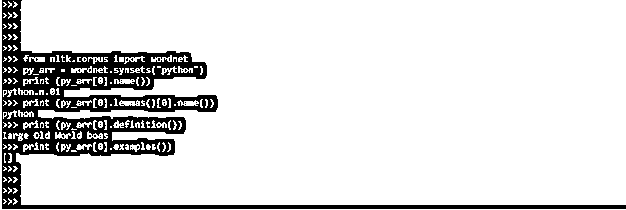


*   在上面的例子中，在第一行，我们已经使用 nltk.corpus 模块导入了 wordnet 模块。在第二行中，我们使用 python 单词来查找 synsets。在第四行，我们已经定义了一个 synset 的例子。

2)下面的示例显示了使用 synsets 的定义、示例和命名函数。在 nltk wordnet 中，词条是同义词，我们可以识别反义词。

**代码:**

```
from nltk.corpus import wordnet
py_syn = wordnet.synsets('python')[0]
print ("nltk wordnet : ", py_syn.name())
print ("\n Meaning of synnset: ", py_syn.definition())
print ("\n Examples of synset : ", py_syn.examples())
```

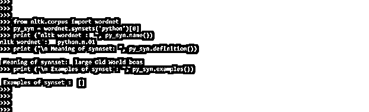


*   在上面的例子的第一行，我们已经使用 nltk.corpus 模块导入了 wordnet 模块。在第二行中，我们将对象名创建为 py_syn。此外，我们将 synsets 方法与 word 一起用作 python。在第三行中，我们用 py_syn 的对象定义了 name 函数。然后，我们使用 definition 方法打印 synsets 值。在输出中，我们可以看到通过使用 definition 方法将显示 synsets 的含义。

3)synset 以类似继承树的方式排列。直到一个词根上位词。上位词是对它们的相似性进行分组和分类的一种手段。下面的例子显示了下位词和上位词的用法。

**代码:**

```
from nltk.corpus import wordnet
py_syn = wordnet.synsets ('python') [0]
print ("Name of synset : ", py_syn.name ())
print ("\n Term of synsets : ", py_syn.hypernyms ())
print ("\n Specific term synset : ", py_syn.hypernyms()[0].hyponyms())
py_syn.root_hypernyms ()
print ("\n Hypernyms of synset: ", py_syn.root_hypernyms())
```

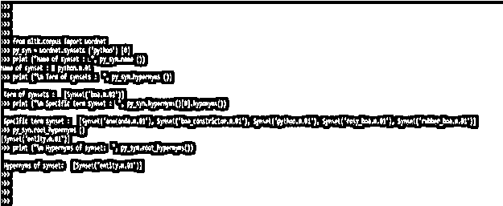


4)下面的例子显示了使用 synset 的词性如下。

**代码:**

```
py_syn = wordnet.synsets('Python')[0]
print ("Nltk wordnet : ", py_syn.pos())
py_syn = wordnet.synsets('nltk')[0]
print ("Nltk wordnet : ", py_syn.pos())
py_syn = wordnet.synsets('wordnet')[0]
print ("Nltk wordnet : ", py_syn.pos())
py_syn = wordnet.synsets('example')[0]
print ("Nltk wordnet : ", py_syn.pos())
```

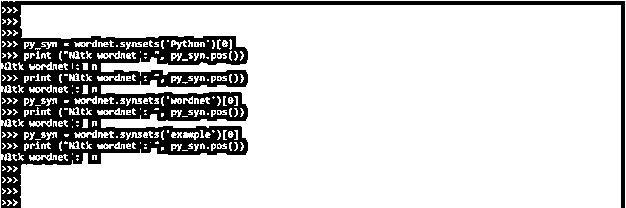


### 结论

Wordnet 是基于 NLTK 语料库阅读器的英语词汇数据库。Nltk wordnet 是一个主要为 NLP 建立的英语词汇数据库(字典)。Synset 是 NLTK 中使用的一种特定类型的简单接口，它允许用户在 WordNet 中搜索单词。

### 推荐文章

这是一个 NLTK WordNet 的指南。在这里，我们讨论的定义，什么是 NLTK WordNet，与实现的例子。您也可以看看以下文章，了解更多信息–

1.  [安装 NLTK](https://www.educba.com/install-nltk/)
2.  [机器学习库](https://www.educba.com/machine-learning-libraries/)
3.  [数据科学工具](https://www.educba.com/data-science-tools/)
4.  [如何安装 TensorFlow](https://www.educba.com/install-tensorflow/)


