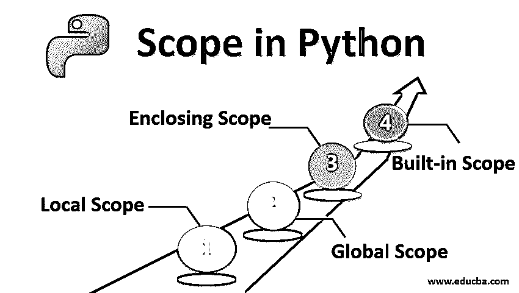
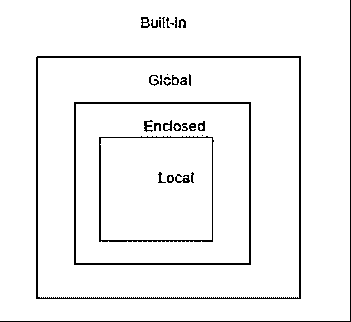
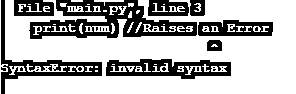
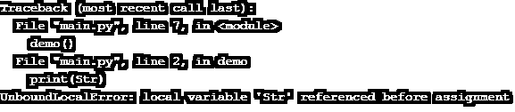

# Python 中的范围

> 原文：<https://www.educba.com/scope-in-python/>




## Python 中作用域的介绍

范围定义了 python 对象的可访问性。要访问代码中的特定变量，必须定义作用域，因为它不能从程序中的任何地方访问。变量可见的特定编码区域称为作用域。变量对整个代码不可见；他们的可见性会受到限制。作用域验证哪个变量可以被“看到”。作用域定义了一组规则，告诉我们如何以及在哪里搜索一个变量。搜索变量是为了检索值或赋值。命名空间是变量或方法的唯一标识。名称空间告诉 python 解释器对象的名称和它试图访问它的位置。

根据 LEGB 规则搜索命名空间以进行范围解析。LEGB 代表:L:本地，E:封闭，G:全局，B:内置。LEGB 的顺序很重要。首先在局部搜索变量，然后是封闭变量，然后是全局变量，最后是内置变量。

<small>网页开发、编程语言、软件测试&其他</small>

### Python 中的范围类型

以下是 python 中最常见的 4 种范围类型:




让我们学习如何声明一个变量以及如何访问它的作用域:

#### 1.局部范围

函数中定义的变量是变量的局部范围。这些变量在函数体中定义。让我们借助一个例子来理解这个概念。在这个例子 1 中，我们取了一个变量 num。Num = 0 是在函数外部定义的，所以它不是局部变量。按照我们的定义，在函数体内声明的变量是局部变量。这里 num=1 是一个局部变量，在函数 demo 中声明并打印。如果我们运行这段代码，输出如下。

**例#1:**

**代码:**

```
num=0
def demo():
    #print(num)
    num=1
    print("The Number is:",num)
demo()
```

**输出:**


Num 是函数的局部变量。当我们在函数中使用 num 变量值，然后在本地声明它时，它会引发一个错误。

参考示例 2:这里第一个 print 语句引发了一个 python 错误，因为我们试图在赋值之前访问它。

**例 2:**

**代码:**

```
num=0
def demo():
    print(num)
    num=1
    print("The Number is:",num)
demo()
```

**输出:**




#### 2.全球范围

可以从程序中的任何地方读取的变量称为全局范围。这些变量可以在函数内部和外部访问。当我们想在程序的其余部分使用同一个变量时，我们将它声明为全局变量。

在下面的例子 1 中，我们声明了一个变量 Str，它在函数之外。调用函数 demo，它打印变量 Str 的值。要在函数中使用全局变量，不需要使用 global 关键字。

**例#1:**

**代码:**

```
def demo():
    print(Str)
# Global  
Str = "You are clever"
demo()
```

**输出:**


在下面的例子 2 中，我们试图改变函数内部的全局变量 Str 的值；这就是它引发异常的原因。如果我们在函数内部修改变量或者给变量赋值，那么我们必须写 global。如果你想告诉一个 python 解释器你想要使用一个全局变量，那么使用关键字“global”。如果它没有被声明为全局变量，那么 python 会将在函数内部创建或修改的变量视为局部变量。在第一行中抛出了一个异常，因为 python 假设我们需要将赋值作为一个局部变量，这是因为函数 demo()内部的 str 赋值。

**例 2:**

**代码:**

```
def demo():  
    print(Str) 
    Str = "You are smart"
    print(Str) 
# Global scope 
Str = "You are Clever" 
demo() 
print(Str) 
```

**输出:**




当我们想改变函数中全局变量的值时，就要使用 global 关键字。

下面的实施例 3 解决了上面遇到的问题。

**例#3:**

**代码:**

```
def demo():  
    print(Str) 
    Str = "You are smart"
    print(Str) 
# Global scope 
Str = "You are Clever" 
demo() 
print(Str) 
```

**输出:**


#### 3.非局部或封闭范围

非局部变量是在嵌套函数中定义的变量。这意味着变量既不能在局部范围内，也不能在全局范围内。为了创建一个非局部变量，使用了非局部关键字。在下面的代码中，我们创建了一个外部函数，并且有一个嵌套函数 inner()。在 outer()函数的作用域中定义了 inner()函数。如果我们更改了 inner()函数中定义的非局部变量，那么更改会反映在 outer 函数中。

**例#1:**

**代码:**

```
def func_outer():
    x = "local"
    def func_inner():
        nonlocal x
        x = "nonlocal"
        print("inner:", x)
    func_inner()
    print("outer:", x)
func_outer()
```

**输出:**


如果我们只想使用外层函数的值，而不想做任何改变，那么注释(非局部 a)行。

**例 2:**

**代码:**

```
def func_outer():
    a = "local"
    def func_inner():
        #nonlocal a
        a = "nonlocal"
        print("inner:", a)
    func_inner()
    print("outer:", a)
func_outer()
```

**输出:**


#### 4.内置范围

如果变量没有在局部、封闭或全局范围内定义，那么 python 会在内置范围内寻找它。在下面的例子中，从数学模块 pi 导入 1，pi 的值没有在全局、局部和封闭中定义。然后 Python 在内置范围内查找 pi 值并打印该值。因此，已经存在于内置作用域中的名称不应该用作标识符。

**例#1:**

**代码:**

```
# Built-in Scope 
from math import pi 
# pi = 'Not defined in global pi'
def func_outer(): 
    # pi = 'Not defined in outer pi' 
    def inner(): 
        # pi = 'not defined in inner pi' 
        print(pi) 
    inner() 
func_outer()
```

**输出:**


### 结论–Python 中的范围

在本文中，我们学习了 python 变量作用域。我们学习了四种类型的作用域——全局作用域、局部作用域、封闭作用域和内置作用域。我们还学习了何时使用全局和非局部关键字。我希望你理解这个概念。

### 推荐文章

这是 Python 中作用域的指南。这里我们讨论 Python 中的作用域类型及其示例，以及代码实现和输出。您也可以浏览我们的其他相关文章，了解更多信息——

1.  [Python 中的元组](https://www.educba.com/tuples-in-python/)
2.  [Python 中的封装](https://www.educba.com/encapsulation-in-python/)
3.  [Python 替代品](https://www.educba.com/python-alternatives/)
4.  [Python 中的继承](https://www.educba.com/inheritance-in-python/)


