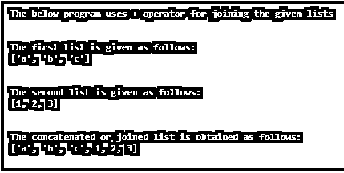
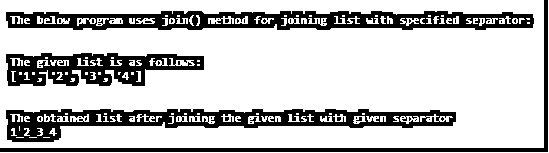
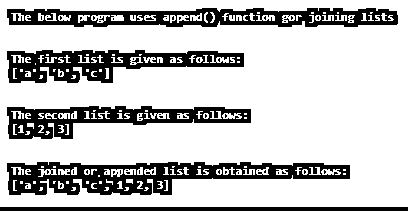
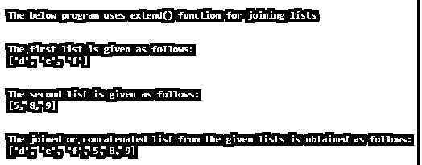

# Python 连接列表

> 原文：<https://www.educba.com/python-join-list/>


## Python 连接列表简介

在本文中，我们将讨论如何在 Python 中连接列表。在 Python 中，连接列表意味着连接、添加或连接列表。为此在 Python 中引入了 join()方法。这个 join()方法用于通过使用分隔符或分隔符来连接给定列表的每个元素。通常，join()方法是使用字符串分隔符或分隔符的字符串方法，该方法返回序列中的元素，该序列是通过提供字符串分隔符或分隔符来连接元素而获得的。在 Python 中，可以使用“+”运算符、append()函数、extend()函数或 join()函数以多种方式创建连接列表。这些连接列表的方法可以在下面的文章中看到。

### Python 连接列表的使用示例

在本文中，用 Python 连接或串联列表意味着连接或添加或串联任何数据类型的给定列表。要做到这一点，有不同的方法。让我们看看下面的例子。

<small>网页开发、编程语言、软件测试&其他</small>

现在让我们看看如何使用“+”操作符连接列表，这是连接给定列表的最简单的方法。让我们考虑下面的例子:

#### 示例#1

**代码:**

```
print("The below program uses + operator for joining the given lists")
print("\n")
l1 = ["a", "b" , "c"]
print("The first list is given as follows:")
print(l1)
print("\n")
l2 = [1, 2, 3]
print("The second list is given as follows:")
print(l2)
print("\n")
res = l1 + l2
print("The concatenated or joined list is obtained as follows:")
print(res) 
```

**输出:**




在上面的程序中，我们可以看到两个不同的列表，一个是字符数据类型，另一个是数字数据类型。这两个列表使用“+”操作符连接，这可以在语句“res = l1 + l2”中看到，其中连接或连接列表被获得并存储在变量“res”中。输出如上图截图所示。

现在让我们看看当指定给定的分隔符来形成不同于原始列表的列表时，如何使用 join()方法来连接列表。让我们考虑下面的一个例子:

#### 实施例 2

**代码:**

```
print("The below program uses join() method for joining list with specified separator:")
print("\n")
l = ['1', '2', '3', '4']
print("The given list is as follows:")
print(l)
print("\n")
sptr = '_'
print("The obtained list after joining the given list with given separator")
print(sptr.join(l)) 
```

**输出:**




在上面的程序中，我们可以看到使用 join()方法将给定的列表与给定的分隔符“_”连接起来。输出如上图截图所示。因此 join()方法是一个字符串方法，通常不在列表中使用。但是这个 join()方法是在 Python 中使用的，因为它可以用于任何可迭代的数据结构，如列表、元组等，最后，这个方法返回字符串，因此 join()方法被称为字符串方法。最好避免使用 join()方法，因为它可以反向用于容易混淆的拆分，我们还应该注意，它仅用于字符串文字，并且仅在需要将任何特殊字符添加到给定列表中时使用，因为它将该特殊字符指定为分隔符或分隔符以获得正确的列表。

现在让我们看看如何使用 Python 中的 append 函数来连接列表。在这里，我们使用 append()函数，该函数用于追加给定的两个列表中的所有元素。让我们考虑下面的例子。

#### 实施例 3

**代码:**

```
print("The below program uses append() function for joining lists")
print("\n")
l1 = ["a", "b" , "c"]
print("The first list is given as follows:")
print(l1)
print("\n")
l2 = [1, 2, 3]
print("The second list is given as follows:")
print(l2)
print("\n")
for i in l2:
    l1.append(i)
print("The joined or appended list is obtained as follows:")
print(l1) 
```

**输出:**




在上面的程序中，我们可以看到我们有两个不同的列表，有两种不同的数据类型。为了连接这些列表，我们使用了 append()函数。这个函数将第二个列表附加到第一个列表，这是通过将第二个列表的第一个元素连接到第一个列表的最后一个元素来完成的。输出如上图截图所示。因此，这个函数也可以用于连接给定的列表。

现在让我们看看如何使用 extend()函数将元素从一个列表添加到另一个列表。这个函数也类似于 append()函数。让我们考虑下面的例子。

#### 实施例 4

**代码:**

```
print("The below program uses extend() function for joining lists")
print("\n")
l1 = ["d", "e" , "f"]
print("The first list is given as follows:")
print(l1)
print("\n")
l2 = [5, 8, 9]
print("The second list is given as follows:")
print(l2)
print("\n")
l1.extend(l2)
print("The joined or concatenated list from the given lists is obtained as follows:")
print(l1) 
```

**输出:**




在上面的程序中，我们可以看到我们又有了两个不同数据类型的不同列表。在这里，我们使用 extend()函数来连接给定的列表。该函数将第二个列表中的所有元素添加到第一个列表的末尾。

### 结论

在本文中，我们已经看到了 Python 中加入列表的含义以及可以通过哪些方式来实现。我们还看到“+”操作符用于连接给定的列表。我们还看到了 join()方法是如何使用的，以及为什么它不能用于连接两个不同的列表，而只能用于指定了分隔符或定界符的字符串。我们还看到了如何使用 append()函数连接列表，最后，我们看到了使用 extend()函数连接列表。

### 推荐文章

这是一个 Python 连接列表的指南。这里我们讨论 Python 连接列表的工作原理和例子，以及代码和输出。你也可以看看下面的文章来了解更多-

1.  [Python 标识符](https://www.educba.com/python-identifiers/)
2.  [Python 排序函数](https://www.educba.com/python-sorted-function/)
3.  [Python eval()](https://www.educba.com/python-eval/)
4.  [Python 中的装饰器](https://www.educba.com/decorator-in-python/)


