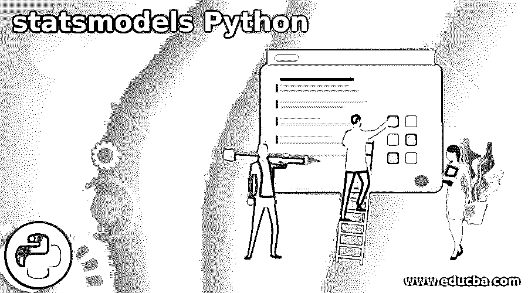
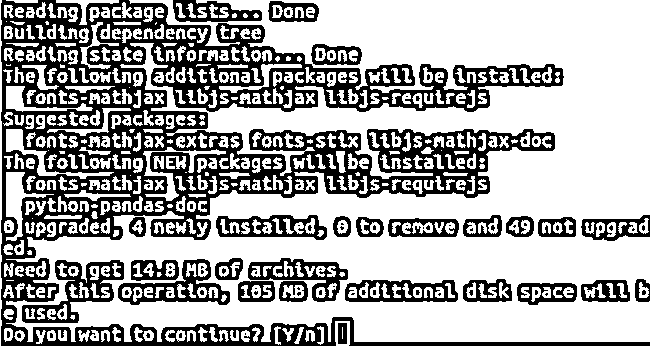
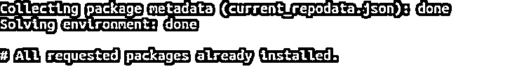
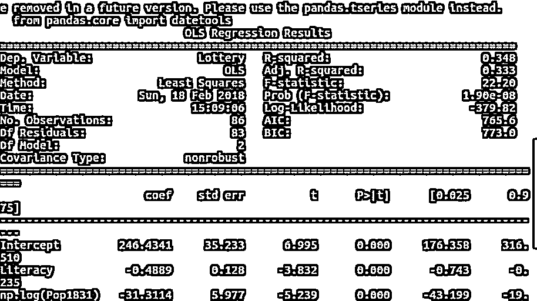
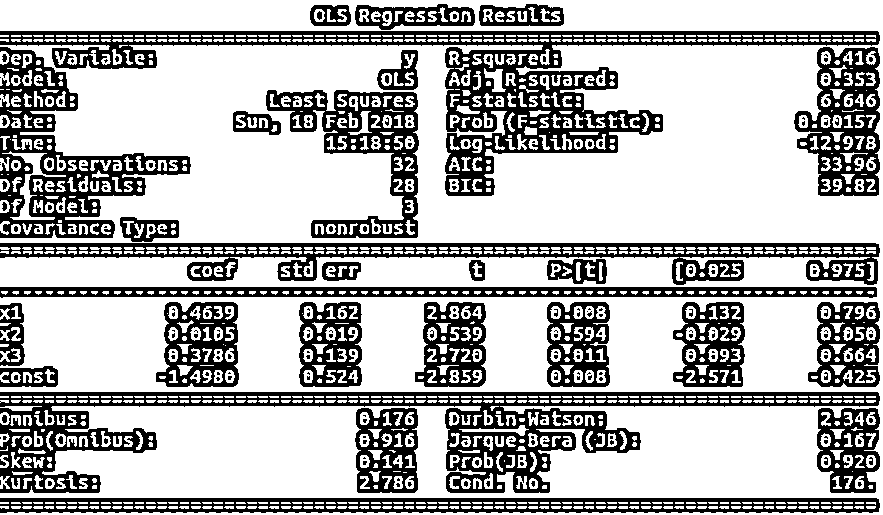
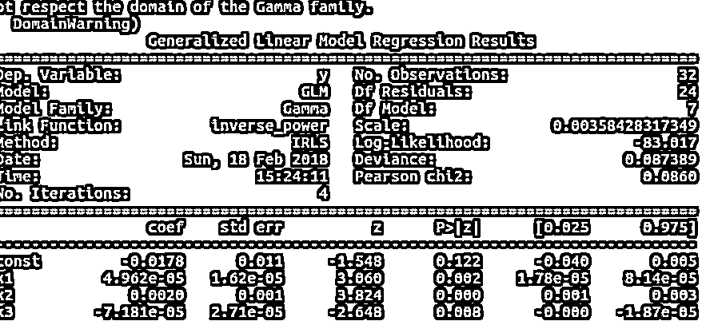

# 状态模式 Python

> 原文：<https://www.educba.com/statsmodels-python/>




## Statsmodels Python 简介

通过使用 Python 中名为 statsmodels 的包，我们可以探索数据，估计各种统计模型，甚至对模型进行统计测试。Statsmodel 是 Python 编程的包，属于处理科学领域的模块堆栈，并在未来的技术中实现，包括数据分析、统计和数据科学。它可以被认为是名为 SciPy 的 stats 模块的补充包。

本文将介绍 statsmodels 的概述，为什么有必要使用 Statsmodel，安装步骤，如何使用它，线性回归 statsmodels，并通过一个示例来了解它的实现。

<small>网页开发、编程语言、软件测试&其他</small>

### Statsmodels Python 概述

这个库或包是在 SciPy 和 NumPy 包的基础上创建的，它也通过使用 pandas 进行数据处理，并为类似 R-like 的公式提供 patsy 接口。matplotlib 是使用图形函数的库。许多其他 Python 包认为这是创建统计库的基础。

Scipy.stats 是 Scipy 包的模块，最初是由 Jonathan Taylor 编写的，但后来它被删除了，并创建了一个全新的包。在谷歌 2009 年代码之夏中，进行了许多改进、严格的测试和修正，最后，推出了带有 statsmodels 的包。

即使是现在，随着 statsmodel 团队的不断发展，许多统计模型、绘图工具和新模型正在出现并引入市场。

### 为什么选择 StatsModels？

我们可以用其他平台不允许的方式处理统计数据，因为 statsmodel 本身就是在牢记核心统计数据的目的的情况下创建的。它更倾向于 R，是分析统计数据的完美工具。大多数用 R 编程的开发人员都可以利用这一点，并且可以使用这个包轻松地迁移到 Python。

### 安装 stats 模型

我们可以通过执行某些命令来安装 statsmodel 的库。我们必须确保满足以下先决条件

*   Numpy 1.6 包或更高版本
*   熊猫 0.12 包或更高版本
*   Cython 0.24 包或更高版本
*   Patsy 0.2.1 包或更高版本
*   Scipy 0.11 软件包或更高版本
*   Python 2.6 包或更高版本

如果您的机器上安装了上述所有包，那么您可以使用终端命令来安装 statsmodel。为此，打开终端，通过使用 pip，您需要在终端上输入以下命令

`Sudo pip install statsmodel`

执行上述命令将产生以下输出–




作为上述方法的替代方法，您可以尝试使用 Conda 安装 statsmodel，命令将是–

`Sudo conda install statsmodel`

在终端上执行命令可能会导致以下结果




按照上面的安装步骤，statsmodel 包就可以使用了。

**使用统计模型**

一旦安装了 statsmodel，您就可以在 Python 程序中使用 statsmodel 包，只需使用下面的 import 语句在文件顶部导入该包即可

`Import statsmodel`

之后，您可以在那个 Python 程序中使用 statsmodel 的功能和特性。

### Statsmodels Python 示例

让我们考虑一个简单的例子来帮助您更好地理解软件包的使用。我们将遵循的步骤是导入必要的包，加载我们想要使用的数据，创建回归模型，并对其进行拟合。在我们的例子中，我们将使用自然对数为 1 的回归变量。最后一步将涉及对获得的结果进行检查。我们将编写以下 Python 代码

```
//importing the required packages
import numpy as np
import statsmodels.api as statsEducba
import statsmodels.formula.api as statsEducbaModel
// Providing the dataset for loading
sampleEducbaData= statsEducba.datasets.get_rdataset ("Educba", "Payal").data
// Fitting the model by using regression with the log of 1
sampleOutputRes = statsEducbaModel.ols('Lottery ~ Literacy + np.log(Pop1831)', data = sampleEducbaData).fit()
// showing the final summary of output containing analysis
print (sampleOutputRes.summary())
)
```

执行上述代码的输出如下图所示




### 线性回归统计模型

在您学习了使用 statsmodel 的基础知识之后，是时候转向更复杂的部分了，我们将在 statsmodel 包的帮助下在源数据中实现线性回归。我们将遵循上述示例中提到的相同步骤，为 OLS 模型添加一个额外的部分。让我们直接跳到代码，然后试着理解它

```
// importing the necessary packages
import numpy as educbaSampleNumpy
import stateducbaSampleStatsodels.api as educbaSampleStats
// Loading the source data set
educba_data = educbaSampleStats.datasets.spector.load()
// Adding constants to the data file
educba_data.exog = educbaSampleStats.add_constant(educba_data.exog, prepend=False)
//Fitting the model which is in OLS 
educbaModel = educbaSampleStats.OLS(educba_data.endog, educba_data.exog)
res = educbaModel.fit()
// Summarize the statistical results and printing the same on console 
print(res.summary()) 
```

我们可以很容易地从输出中读出结果的细节。执行上述代码会产生以下输出–




让我们再举一个例子，它将实现广义线性模型，也表示为 GLMs，支持带有一个估计参数的指数族。它可以通过观察下面的例子简单地实现——

```
// Importing required library of statsmodel
import statsmodels.api as educba_stat
// Loading the data 
educba_sample_data = educba_stat.datasets.scotland.load()
// Creating the data file along with addition of constants to it
educba_sample_data.exog = educba_stat.add_constant(educba_sample_data.exog)
// Using the link function provided by default try to initialize the gamma family model
educba_GAMA = educba_stat.GLM(educba_sample_data.endog, educba_sample_data.exog, family=educba_stat.families.Gamma())
// Fit the model
educba_gamma_results = educba_GAMA.fit()
// print the summary
print(educba_gamma_results.summary()) 
```

以上代码的输出如下图所示




### 结论

我们可以使用 statsmodel 来执行统计分析，只需几行代码就可以轻松地创建新的模型，为我们提供一个显而易见且易于理解的汇总输出。

### 推荐文章

这是一个 Statsmodels Python 的指南。这里我们讨论 statsmodels 的概述，为什么有必要使用 statsmodel，安装步骤和线性回归 statsmodels。您也可以看看以下文章，了解更多信息–

1.  [Python dateutil](https://www.educba.com/python-dateutil/)
2.  [Python strftime](https://www.educba.com/python-strftime/)
3.  [Python 私有方法](https://www.educba.com/python-private-method/)
4.  [Python HTTP 服务器](https://www.educba.com/python-http-server/)


